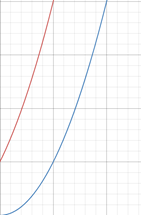
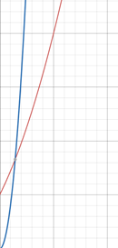
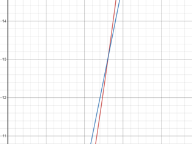

# What is Algorithm ?

## Definition

Thuật toán là một tập các chỉ thị (instruction) theo từng bước để làm một công việc nào đó. Có thể lấy ví dụ trong đời sống hằng ngày khi chúng ta xếp quần áo. Quần áo của gia đình có thể lẫn lộn của nhiều người, nên đầu tiên chúng ta phân ra thành quần áo của mỗi người trước, sau đó chúng ta mới bắt đầu xếp. Việc phân loại quần áo như vậy làm tiết kiệm thời gian lúc xếp quần áo của chúng ta, là một sự hữu ích điển hình của thuật toán.

## Real life example

Một ví dụ đơn giản là ta muốn tìm kiếm một cuốn sách trong dãy rất nhiều sách trong thư viện. Các sách đã được sắp theo từng phân ngành và bảng chữ cái. Thì thủ thư sẽ đi đến phân ngành đó, tìm đúng chữ cái đó rồi duyệt từng quyển cho đến khi tìm được cuốn cần tìm. Giả sử nếu thủ thư có một chiếc máy tính, và có lưu dữ liệu của các đầu sách. Công việc lúc này của thủ thư sẽ vô cùng nhàn rỗi khi có trong tay các thuật toán tìm kiếm sử dụng bằng máy tính thay vì người. Nếu như dữ liệu đã được sắp xếp, ở đây là theo bảng chữ cái, người thủ thư chỉ cần sử dụng Binary Search (Tìm kiếm nhị phân) để tìm kiếm. Thuật toán này sẽ chia đôi danh sách ra, sau đó tìm khoảng danh sách mà có thể có cuốn sách cần tìm rồi cứ thế chia đôi đến khi tìm được.

## Benefits

Các thuật toán sẽ tiết kiệm công sức và chi phí của con người lên rất nhiều lần, thậm chí các thuật toán cũng có thể cải tiến hơn. Một độ cải tiến gấp hai lần giữa Binary Search và Linear Search (Tìm kiếm tuyến tính) cũng có thể có được lợi ích lớn. Giả dụ chúng ta đổi 1 đô la ra 20000 việt nam đồng. Nhà đổi tiền sẽ lấy tỉ giá 23000 đồng 1 đô la. Do đó khi bán ra đô la số lượng lớn, 100 đô la chẳng hạn, nhà đổi tiền sẽ thu lợi cho mình 300000 việt nam đồng. Các thuật toán cũng vậy, nếu như thuật toán này tiết kiệm chi phí gấp 2 lần thuật toán kia, khi áp dụng vào dữ liệu có 10 tỷ phần tử sẽ tiết kiệm rất rất nhiều chi phí. Mặc dù với số lượng phần tử nhỏ là không đáng kể, tuy nhiên khi khối lượng dữ liệu lớn thì việc có được một thuật toán nhanh và tiết kiệm lại là một giải pháp tối ưu.

## Google

Thuật toán Page Rank tìm kiếm của Google cũng là một thuật toán ứng dụng trong đời sống, ý tưởng không phải là kiểm tra từng trang Web có chứa tần số xuất hiện từ khóa cần tìm nhiều nhất rồi đưa cho người dùng. Ý tưởng của thuật toán này ở đây là kiểm tra các đường liên kết đến trang Web đó. Nếu như trang Web đó có New York Times hay Nhà Trắng liên kết đến thì độ uy tín của nó sẽ rất cao. Thông thường kết quả đầu tiên hiện ra sẽ là các trang Web có nhiều liên kết chất lượng.

# What is Big O Notation ?

## Fun test

Năm 2009, một công ty ở Nam Phi có mạng internet rất chậm và họ cảm thấy rất bực bội. Họ thiết lập một thí nghiệm nho nhỏ. Họ chọn hai địa điểm làm các nơi chuyển đổi dữ liệu và nối dây mạng giữa hai địa điểm này, có khoảng cách là 50 dặm. Tạm gọi hai địa điểm ấy là A và B. Công ty này nén một lượng lớn dữ liệu, dung lượng là 1000GB chẳng hạn. Họ truyền dữ liệu 1000GB này qua đường truyền giữa A và B. Ngoài ra, họ cũng nén 1000GB dữ liệu vào các USB rồi gắn vào con bồ câu để nó đi từ A đến B. So sánh giữa hai quá trình thì họ thấy con chim nó truyền dữ liệu nhanh hơn so với đường truyền internet. Oh no, chẳng lẽ internet lại thua dưới cánh của một con chim hay sao ?

## Explaination

Câu chuyện này chỉ đơn giản là một chuyện vui nho nhỏ, lúc này con chim có ký hiệu O lớn là hằng số, O(1). Tuy nhiên, đường truyền internet lại có ký hiệu O lớn là tuyến tính, hay đơn thức O(n). Con chim khi vận chuyển dữ liệu 1GB, 10GB, 100GB, 1TB hay thậm chí 1000TB thì cũng tốn thời gian nhất định (thời gian hằng số) để di chuyển, chẳng hạn 4-5 giờ. Trong khi đó, Internet có tốc độ truyền tải dữ liệu phụ thuộc vào độ lớn dữ liệu chuyển đi, dữ liệu có dung lượng càng lớn thì tốc độ truyền tải càng lâu. Với 1000TB thì có thể mất rất nhiều thời gian để đi từ A tới B.

## Why do we need big O ?

Nếu chúng ta sử dụng hai cỗ máy khác nhau, một cái A rất mạnh, một cái B rất yếu. Cùng chạy một thuật toán C nhất định. Thì kết quả về thời gian chạy của máy A sẽ phải khác với máy B. Do vậy nếu chúng ta dùng cách đo thời gian chạy của một thuật toán PHỤ THUỘC trên một máy tính nào đó, thì sẽ không đủ để làm tiêu chuẩn đánh giá độ nhanh chậm của thuật toán.

Nói theo nghĩa khác, một thuật toán sẽ phải được đo lường thông qua một cách nào đó không phụ thuộc vào chiếc máy tính đang chạy nó. Gọi là **Machine Independent**.

Một kịch bản khác, thuật toán không thể đo lường chính xác nếu như dùng hai ngôn ngữ khác nhau để implement nó. Chẳng hạn như ta dùng C++ để implement thuật toán Binary Search, và cũng dùng Python để implement thuật toán tương tự. Với các ngôn ngữ khác nhau, thời gian chạy thuật toán có thể có sự sai khác. Vì vậy mà chúng ta cần đo lường chúng theo cách độc lập với ngôn ngữ, gọi là **Language Independent**.

Từ đó, cách đo lường sử dụng Big O notation ra đời.

## Definition

Big O Notation (Ký hiệu O lớn) là một số để đo lường mức độ hiệu quả của thuật toán. Mức độ hiệu quả chính là độ phức tạp thời gian và độ phức tạp không gian. Độ phức tạp thời gian là để chỉ thời gian và độ phức tạp không gian là để chỉ bộ nhớ. Thời gian thực thi và bộ nhớ thực thi chính là hai yếu tố cần thiết góp phần vào mức độ hiệu quả của thuật toán. Ngoài ra, ký hiệu O lớn dùng để mô tả mức độ tăng lên của thời gian hoặc không gian thực thi bởi chương trình, khi đối số đầu vào tiến về một số nào đó. Ký hiệu O lớn ta có thể gọi chung là độ phức tạp thuật toán.

Ở ví dụ trên thời gian thực thi của con chim là hằng số, dẫu cho dữ liệu đầu vào có tiến về bao nhiêu. Thời gian thực thi của internet lại là tuyến tính, nó sẽ là một đường thẳng tiến về một số cụ thể phụ thuộc vào lượng dữ liệu đầu vào.

## Formal Definition

Một Big O là một hàm số biểu thị mức độ tăng lên của thời gian hay các bước thực hiện thuật toán. Xét hai hàm số $F(n)$ và $G(n)$ cùng hằng số $C > 0$.

$$
F = O(G) 
$$

khi và chỉ khi

$$
F(n) \leq C.G(n)
$$

Tức là hàm Big O chỉ tồn tại khi hằng số C tồn tại.

Ví dụ, có một hàm số thực hiện các phép so sánh phụ thuộc vào dữ liệu đầu vào với số lần so sánh là

$$
F(n) = (x + 1)^2
$$

Khai triển ta được

$$
F(n) = x^2 + 2x + 1
$$

Nếu theo quy luật áp đảo khi n trở nên rất lớn, bậc lớn nhất sẽ là Big O của hàm số. Nghĩa là $F = O(n^2)$. Suy ra $G(n)$ là $n^2$.

Khi vẽ hai đồ thị này lên hình, ta sẽ có hình ảnh như sau:

<center>
    
</center>

Với đường màu đỏ là $F(n)$ và màu xanh là $G(n)$. Dễ dàng tìm được một hằng số C bất kỳ làm cho $G(n) \geq F(n)$ khi n tiến ra vô cùng. Hằng số đó có thể là 20, cho ra kết quả như hình dưới đây.

<center>
    
</center>

Ta có thể dùng công thức giới hạn để chứng minh hàm Big O tồn tại.

$$
\lim_{n\rightarrow\infty}{\frac{G(n)}{F(n)}}\ =\ \lim_{n\rightarrow\infty}{\frac{n^2}{n^2+\ 2n\ +\ 1}}\ =\ 1\ =\ C\ >\ 0
$$

Do $C > 0$ nên hàm Big O tồn tại.

Ta tự hỏi rằng tại sao không phải là $O(n)$. Cũng dùng một giới hạn để chứng minh điều này

$$
\lim_{n\rightarrow\infty}{\frac{G(n)}{F(n)}}\ =\ \lim_{n\rightarrow\infty}{\frac{n}{n^2+\ 2n\ +\ 1}}\ =\ 0\ =\ C
$$

Do C không lớn hơn 0 nên hàm Big O không tồn tại. Ngụ ý rằng, hàm $G(n) = n$ không có cách nào có thể nhanh hơn hàm $F(n)$ khi n tiến ra vô cùng được, nên vì thế hàm $F(n)$ sẽ áp đảo và độ phức tạp sẽ là $O(n)$.

<center>
    
</center>

Có thể thấy hình trên, ban đầu $G(n) = n$ có thể lớn hơn, nhưng khi n tiến về vô cùng, cụ thể là từ $n = 13$ trở đi, hàm $G(n)$ luôn tăng chậm hơn hàm $F(n)$.

## Measurement

Để tính toán độ phức tạp của một thuật toán, ta cần tuân thủ theo các bước sau:

### Hiểu cách mà thuật toán vận hành:

Mục đích của thuật toán.

Dữ liệu đầu vào, dữ liệu đầu ra.

### Xác định một đơn vị chuẩn cơ bản để thuật toán dựa trên đó mà đếm, có thể là:

Các dòng xuất thông tin.

Vòng lặp/phép gán.

Lời gọi đệ quy (đây là đơn vị cơ bản cho các hàm đệ quy).

Đồng thời tập trung vào trường hợp tệ nhất.

### Ghi nhận lại các lần đếm từ bước hai trở đi và tìm ra quy luật tăng lên của nó. Sau đó kết luận bậc của Big O cho thuật toán.

## Cases

Độ phức tạp thuật toán chia thành ba trường hợp: Worst Case – xấu nhất, Best Case – tốt nhất và Average Case – trung bình. Thông thường thường người ta sẽ lưu tâm đến Worst Case hoặc Average Case vì Best Case không có ý nghĩa gì với chúng ta khi xét về độ hiệu quả của thuật toán.

## Order of Big O

<center>
    
</center>

# Big O Notation Rules

Có bốn quy luật về độ phức tạp thuật toán như sau:

## Quy luật 1

_Nếu như một thuật toán thực hiện một dãy gồm n bước thực thi, thì độ phức tạp sẽ là $O(n)$._

Giả dụ ta có một thuật toán tìm kiếm số nhỏ nhất tuyến tính sau đây.

```c++
void findMin(int* a,int n)
{
    int min=a[0];
    for(int i=0; i<n; i++)
    {
        if(a[i]<min){
            min=a[i];
        }
    }
    cout<<min<<endl;
}
```

Vòng lặp thực hiện quét qua n phần tử của mảng, độ phức tạp của nó hiển nhiên sẽ là O(n). Giả sử ta tìm kiếm một số cụ thể nào đó, ví dụ số x, trong mảng a, thì độ phức tạp thuật toán sẽ phụ thuộc vào vị trí của x. Nếu x càng ở gần đầu mảng (nếu ta duyệt từ đầu mảng), thì độ phức tạp sẽ giảm so với Worst Case.

## Quy luật 2

_Nếu như thuật toán thực hiện một tác vụ tốn a bước, sau đó thực hiện một tác vụ khác tốn b bước. Thì tổng độ phức tạp thuật toán sẽ à $O(a+b)$ bước._

```c++
void findMin(int* a,int n)
{
    int min=a[0];//O(1)
    for(int i=0; i<n; i++)//O(n)
    {
        if(a[i]<min){
            min=a[i];
        }
    }
    cout<<min<<endl;//O(1)
}
```

Ví dụ trong chương trình trên, các dòng khai báo bên ngoài vòng lặp tính là một bước, nó sẽ có độ phức tạp hằng số O(1). Vậy tổng độ phức tạp của hàm _findMin_; là $O(1+n+1)$, tức là $O(n+2)$. Ngoài ra, còn có trường hợp đặc biệt nếu chương trình thực hiện a, b bước với $a = b$, thì độ phức tạp sẽ chỉ là $O(a)$ hoặc $O(b)$.

```c++
void findMin(int* a,int* b,int n)
{
    for(int i=0; i<n; i++)//O(n)
    {
        cout<<a[i]<<" ";
    }
    for(int i=0; i<n; i++)//O(n)
    {
        cout<<b[i]<<" ";
    }
}
```

Đoạn code sau khi tối ưu hóa sẽ trở thành:

```c++
void findMin(int* a,int* b,int n)
{
    for(int i=0; i<n; i++)//O(n)
    {
        cout<<a[i]<<" ";
        cout<<b[i]<<" ";
    }
}
```

Lưu ý rằng độ phức tạp trong trường hợp này không phải $O(2n)$ mà chỉ đơn giản là $O(n)$.

## Quy luật 3

_Nếu một thuật toán có độ phức tạp là $O(a+b)$ và a lớn hơn rất nhiều so với b, thì độ phức tạp có thể đơn giản thành O(a)._

Trong ví dụ đầu tiên thì độ phức tạp là $O(n+2)$. Trong trường hợp n quá lớn so với 2 $(n >> 2)$ thì chúng ta có thể đơn giản thuật toán thành $O(n)$.

Mở rộng ra, nếu ta có một chương trình có tổng độ phức tạp là $O(n^2+n)$, rõ ràng ta có bất đẳng thức:

$O(n) \leq O(n^2+n) \leq O(n^2+n^2)$. Nếu n là một số lớn ($n^2 >> n$) thì $O(n^2+n)$ có thể đơn giản thành $O(n)$.

## Quy luật 4

Nếu một thuật toán có độ phức tạp là $O(a)$, và mỗi bước i từ 1 đến a lại có b bước nhỏ nữa. Thì độ phức tạp thuật toán tổng cộng là $O(a * b)$.

```c++
void findMin(int** a,int n)
{
    int**a= new int*[n]; //O(1)
    for(int i=0; i<n; i++)//O(n*n)
    {
        for(int j=0;j<n;j++){
            cout<<a[i][j]<<endl;
        }
    }
}
```

Ví dụ này, có hai vòng lặp lồng nhau. Với mỗi vòng lặp của chỉ số i lại có n vòng lặp của chỉ số j. Do cả a và b đều là n nên độ phức tạp thuật toán tổng cộng, bao gồm cả dòng cấp phát bộ nhớ đầu, sẽ là $O(n^2+1)$. Trong trường hợp dữ liệu đầu vào là lớn, $O(n^2+1)$ có thể rút gọn thành $O(n^2)$.

