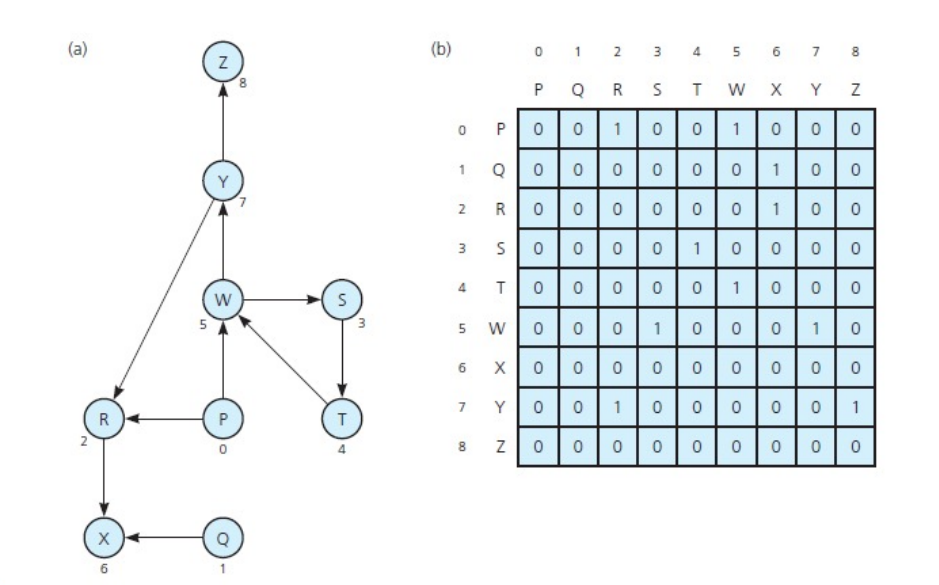
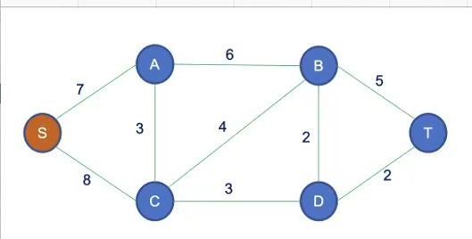
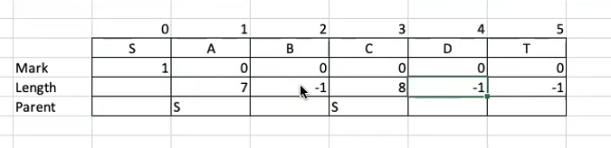
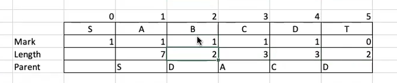

<link rel="stylesheet" href="main.css">
<div class="bg">
      <center><h1 class="bigtitle">Graph</h1></center>
</div>

# Terminologies

**Loop** - khuyên

**Cycle** - Đồ thị chu trình, là chu trình mà đi qua mỗi cạnh không quá một lần (không cần đi qua tất cả các cạnh).

**Acyclic graph** - Đồ thị không có Cycle.

**Trivial Graph** - Đồ thị tầm thường, chỉ có một node.

**Connected Graph** - Đồ thị liên thông, mọi node đều có đường đi đến $N - 1$ node còn lại. Nói cách khác là giữa hai node bất kỳ luôn tồn tại ít nhất một đường đi.

Phạm vi đồ thị xét đến trong DSA chỉ là đơn đồ thị, có thể có đa đồ thị.

# Graph Representation

## Adjacency Matrix

**Ma trận kề**

Nếu đồ thị có trọng số thì mỗi phần tử trong mảng lưu trọng số của cạnh nối hai đỉnh, trường hợp không có cạnh nối thì lưu vô cùng. Ngược lại không có trọng số thì lưu giá trị 0 hoặc 1.




**Điểm mạnh**

- Dễ dàng truy xuất thông tin nhờ vào tính chất random accessibility của mảng.

**Điểm yếu**

- Tốn nhiều bộ nhớ khi đồ thị có nhiều đỉnh và ít cạnh (đồ thị thưa - Sparse Graph).
- Tốn chi phí để tìm các đỉnh kề của cạnh bất kỳ $O(n)$.

## Adjacency List

**Danh sách kề**

Với $N$ đỉnh trong đồ thị sẽ có một mảng gồm $N$ danh sách liên kết. Mỗi danh sách liên kết tượng trưng cho các cạnh kề của đỉnh bất kỳ.

- Nếu đồ thị có trọng số thì mỗi node sẽ có biến lưu thêm trọng số.
- Nếu đồ thị là đa đồ thị và tồn tại cặp cạnh song song có trọng số khác nhau thì có thể có hai node giống tên đỉnh nhưng khác trọng số trên cùng một danh sách liên kết.

Trong bài toán cụ thể, chẳng hạn như tìm đường đi ngắn nhất hoặc cây khung ngắn nhất, thì có thể sắp xếp các đỉnh theo trong khi tạo danh sách kề. Làm như vậy thì chi phi tìm đường đi ngắn nhất hoặc cây khung ngắn nhất sẽ giảm đi.


**Điểm mạnh**

- Tiết kiệm bộ nhớ khi đồ thị là thưa
- Tiết kiệm chi phí để tìm các đỉnh kề của đỉnh bất kỳ do các đỉnh kề nhau nằm chung một danh sách liên kết.

**Điểm yếu**

- Truy xuất khó khăn do phải duyệt tuần tự.

**Điểm chung**

- Thêm đỉnh hoặc cạnh ở hai dạng biểu diễn tốn chi phí như nhau.

## Edge List

**Danh sách cạnh**.
Dùng trong trường hợp đồ thị thưa

# Graph Traversal

## DFS - Depth First Search

**Duyệt theo chiều sâu**

### Idea

Đi xa nhất có thể trước khi trở về, có thể gọi là backtracking? Giống với duyệt trước của cây nhị phân.

Có thể dùng để tìm thành phần liên thông. Idea là trong mỗi lần duyệt (mỗi lần đào) thì ta sẽ đánh dấu các đỉnh đó thuộc một thành phần liên thông. Khi trả về thì sẽ tiếp tục đánh dấu để tìm ra một thành phần liên thông khác.

Việc đánh dấu này có thể sử dụng mảng. Nếu sau khi duyệt hết đồ thị mà mảng được đánh dấu là 1 hết (cùng thành phần liên thông), thì đồ thị đó là đồ thị liên thông.

DFS nếu được điều chỉnh cũng có thể dùng để chứng minh đồ thị có chu trình hay không (Cycle Detection). Vì DFS có quay lại các đỉnh đã đi qua còn BFS thì lan rộng ra mà không làm việc đó.

### Code

Thuật toán được xây dựng dựa trên đồ thị vô hướng

- Dùng Stack:

```c++
void DFS(NODE **list, int n)
{
    int *visited = new int[n]{0};
    stack<int> s;
    s.push(0);
    int prev;

    while (s.size() > 0)
    {
        int curr = s.top();
        if (visited[curr] == 0)
        {
            cout << curr << "  ";
            visited[curr] = 1;
        }
        prev = curr;

        NODE *move = list[curr];
        while (move != nullptr)
        {
            if (visited[move->vertex] == 0)
            {
                s.push(move->vertex);
                break;
            }
            move = move->adjacent;
        }
        // Không có sự thay đổi stack (bắt đầu quay lui)
        if (prev == s.top())
        {
            s.pop();
        }
    }
    cout << endl;
}
```

- Đệ quy

## BFS - Breath First Search

**Duyệt theo chiều rộng**

### Idea

Đi đến những đỉnh kề với đỉnh bất kỳ sao cho không tồn tại chu trình.

### Code

- Dùng Queue (Idea giống Level Order):

```c++
void BFS(NODE** list, int n)
{
    int *visited = new int[n]{0};
    queue<int> q;
    q.push(0);

    while(q.size() > 0)
    {
        int curr = q.front();
        if(visited[curr]!= 0)
        {
            cout << curr<<" ";
            visited[curr] = 1;
        }

        NODE* move =list[curr];
        while(move!=nullptr)
        {
            if(visited[move->vertex]!=0)
                q.push(move->vertex);
            move = move->adjacent;
        }
    }
}
```

# Spanning Tree

Cây khung là một đồ thị không có chu trình và liên thông. Với đồ thị có $N$ đỉnh thì cây khung sẽ có $N - 1$ cạnh.

- Một đồ thị sẽ **có thể có nhiều cây khung** nhưng chúng đều phải có cùng số đỉnh và số cạnh.

- Cây khung là đồ thị liên thông tối thiểu, nếu bỏ đi bất kỳ cạnh nào thì đồ thị không còn liên thông.

- Nó còn là đồ thị không có chu trình lớn nhất, nghĩa là giữa hai cạnh bất kỳ nếu ta thêm một cạnh thì sẽ tạo thành một chu trình.

> Có thể tìm cây khung bằng cách dùng DFS hoặc BFS.

## Minumum Spanning Tree

Cây khung tối thiểu là cây khung mà có tổng trọng số bé nhất trong số các cây khung của đồ thị. Bên cạnh đó cũng **có thể có nhiều cây khung tối thiểu**, và chúng có cùng trọng số.

Cây khung tối thiểu ứng dụng trong đời sống là để xây dựng các mạng lưới mạng viễn thông, dây điện,... với chi phí kết nối ít nhất. Cây khung tối thiểu mang tính toàn cục, hiểu theo nghĩa là chi phí thấp nhất để kết nối tất cả các đỉnh lại với nhau.

> Cây khung tối thiểu khác với đường đi ngắn nhất vì đường đi ngắn nhất chỉ mang tính cục bộ giữa một đỉnh này đến đỉnh khác.


Ví dụ trên, đường đi ngắn nhất có thể đi được từ a đến c theo cây khung tối thiểu là a - f - g - d - c, tổng trọng số là 15. Tuy nhiên đường đi ngắn nhất giữa a và c có trọng số nhỏ hơn. Cụ thể là a - b - c có trọng số là 13.

> Do đó trên cây khung tối thiểu thì không chắc chắn tạo ra đường đi ngắn nhất giữa hai đỉnh.

Để tìm cây khung tối thiểu thì có thể dùng thuật toán Prim hoặc Kruskal. Ở đây ta sẽ bàn về Prim.

## Prim Algorithm

Idea của thuật toán Prim là chia các đỉnh của đồ thị thành hai tập đỉnh gồm tập các đỉnh thuộc cây khung tối thiểu (gọi là tập A) và tập còn lại là các đỉnh chưa thuộc cây khung tối thiểu (gọi là tập B).

Chúng ta sẽ đi xét các đỉnh nằm ngoài tập A và kiểm tra trọng số của chúng đối với đỉnh bất kỳ trong tập A. Nếu trọng số đó là nhỏ nhất thì kết nạp đỉnh đó. Cứ tiếp tục cho đến khi kết nạp được tất cả các đỉnh.

Ở các lần xét để kiểm tra xem đỉnh nào có trọng số nhỏ nhất, nếu xử lý không khéo có thể dẫn đến bùng nổ tổ hợp (lấy mọi đỉnh tập B so sánh với mọi đỉnh tập A). Do đó mà ta cần có một mảng lưu các node vừa được thêm (parent) và một mảng lưu các trọng số nhỏ nhất trong các lần thêm (length). Đồng thời cũng có một mảng đánh dấu node nào đã được thêm (mark).

## Example

Giả sử có đồ thị dưới đây và ta cần tìm cây khung tối thiểu bắt đầu từ đỉnh S.



Ở bước ban đầu thì mảng mark chỉ có đỉnh S. Đỉnh S nối với đỉnh A và C có trọng số lần lượt là 7 và 8. Các đỉnh còn lại không có parent nên trọng số là vô cùng, ta cho giá trị là `-1`.



Ta tìm trong mảng length đường đi có trọng số nhỏ nhất, ở đây là tại A nên ta sẽ đánh dấu A là `1`. Với việc thêm A vào thì chúng ta phải cập nhật khoảng cách ở những chỗ còn lại.

Lúc này sẽ tồn tại cạnh từ A đến B có trọng số là 6, giá trị này nhỏ hơn vô cùng nên cập nhật. Tương tự giữa C và A là 3, nhỏ hơn 8 nên vị trí `length[3] = 3` và `parent[3] = A`. Các đỉnh còn lại chưa có parent nên chưa cập nhật.


Nhận thấy mảng length có giá trị tại C là nhỏ nhất nên sẽ kết nạp vào tập các đỉnh thuộc cây khung tối thiểu, đồng thời `mark[3] = 1`.

Sau khi kết nạp thì cần cập nhật ở những chỗ khác, ta thấy từ C đến B là 4, nhỏ hơn 6 nên sẽ cập nhật `length[2] = 4`, `parent[2] = C`. Tương tự C đến D là 3, nhỏ hơn vô cùng nên cập nhật `length[4] = 3`, `parent[4] = C`. Đỉnh T vẫn chưa cập nhật.


Kết nạp D vào cây khung (C có length là 3 nhưng đã kết nạp rồi). Ta cập nhật `mark[4] = 1`. D đến B là 2, nhỏ hơn 4 nên `length[2] = 2`, `parent[2] = D`. Tiếp theo D đến T là 2, nhỏ hơn vô cùng nên `length[5] = 2`, `parent[5] = D`.



Kết nạp B vào cây khung, `mark[2] = 1`. Xét đường đi từ B đến T là 5, lớn hơn 2 nên sẽ không cập nhật. Cuối cùng thêm đỉnh T vào cây khung, `mark[5] = 1` thì chúng ta hoàn thành thuật toán.


Sau khi kết thúc thuật toán, ta sẽ rút ra các cặp đỉnh từ bảng trên và tạo thành cây khung tối thiểu nối 6 đỉnh với nhau:

> SA (7), DB (2), AC (3), CD (3), DT (5)

Đồng thời ta cũng biết được trọng số của cây khung tối thiểu là

> 7 + 2 + 3 + 3 + 5 = 17

# Prim and Dijkstra

Điểm khác biệt giữa Prim và Dijkstra là điều kiện kết nạp đỉnh. Trong khi Prim chỉ xét khoảng cách giữa hai đỉnh, còn Dijkstra xét đường đi giữa hai đỉnh. Đường đi thì có thể bao gồm nhiều khoảng cách cộng lại với nhau.

Sau khi xây dựng được thuật toán Prim thì sửa điều kiện kết nạp thì có thể xây dựng được thuật toán Dijkstra.
