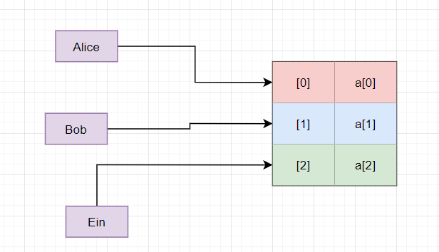
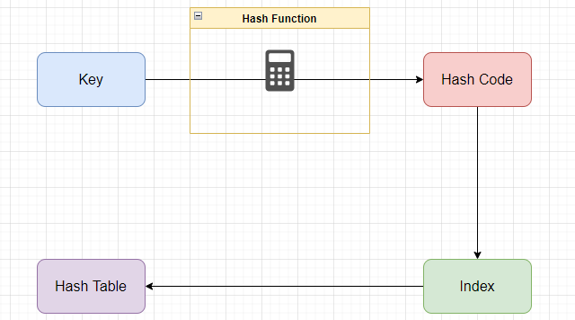
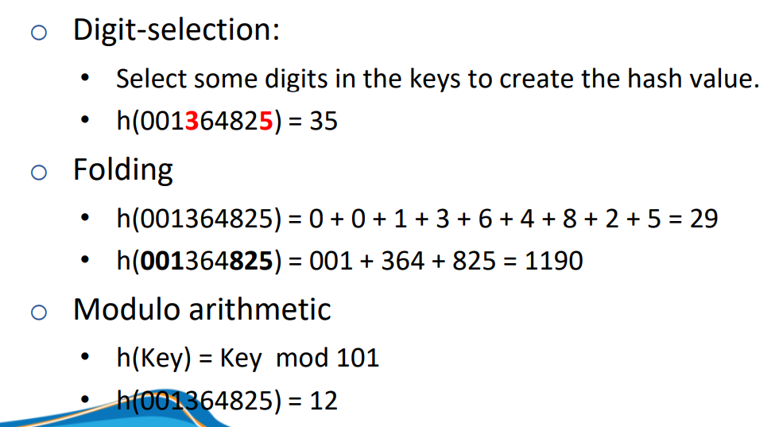
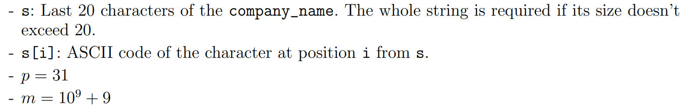
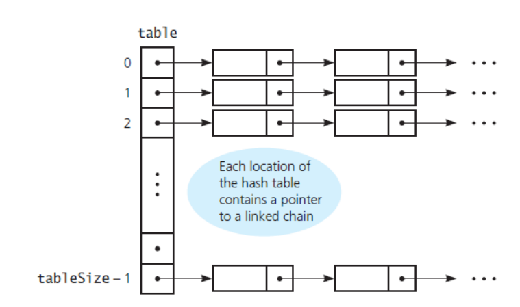
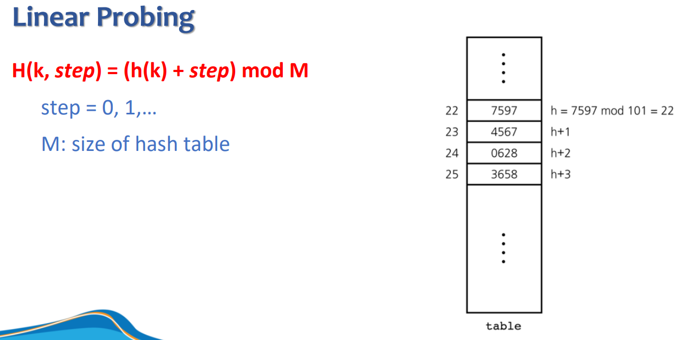

<link rel="stylesheet" href="../main.css">
<div class="bg">
     <center><h1 class="bigtitle">Hash Table</h1></center>
</div>

# Definition

Hash Table là một cấu trúc dữ liệu indexing các phần tử dựa vào key của nó.

Nói cách khác, hash table chính là một mảng mà chỉ số index là ánh xạ của số thực, chuỗi, struct,...

Các dữ liệu được lưu theo cặp gồm một key và một giá trị. Ví dụ đời thực là từ điển, với chữ cái đầu là key và giá trị theo sau là từ ngữ.

Mục đích tạo ra cấu trúc dữ liệu này là để truy xuất dữ liệu dựa trên key một cách nhanh chóng (ngẫu nhiên). Với bài toán tìm một phần tử gắn liền với một thông tin nào đó, ví dụ như tìm một sinh viên có tên Nguyễn Văn A thì việc sử dụng bảng băm (hash table) là rất hiệu quả.

<center>
    
</center>

Miễn là chúng ta có một hàm băm (hash function) tối ưu để chuyển đổi key từ một số thực hay chuỗi thành một mã băm (gọi là hash code). Rồi để từ đó chuyển thành index trong mảng.

Điểm khác biệt giữa bảng băm và mảng là dữ liệu của bảng băm phân bố rời rạc tùy thuộc vào giá trị của hash code. Còn dữ liệu của mảng thì phân bố liên tục kề cạnh nhau trên vùng nhớ.

Do đó chi phí không gian của bảng băm là khá lãng phí. Tuy nhiên ta trade - off để đổi lấy sự hiệu quả về mặt thời gian. Nếu ta cần tiết kiệm độ phức tạp không gian thì nên sử dụng cấu trúc cây hoặc mảng có thứ tự.

Một ví dụ khác:

<center>
    
</center>

Kích thước của bảng băm là dựa trên dự đoán tùy thuộc theo kiểu dữ liệu. Nếu dữ liệu quá lớn thì cần mở rộng bảng băm và tính lại hết tất cả các giá trị index.

# Hashing

Là một thuật toán nào đó để ánh xạ một dữ liệu của key thành một hash code để phục vụ cho việc indexing các phần tử trong bảng băm.

<center>
    
</center>

# Efficiency of Hashing

Hệ số lấp đầy, hay hệ số alpha, được tính như sau:

<center>
    
</center>

Sự ảnh hưởng của hệ số alpha với các chi phí tìm kiếm:

<center>
    
</center>

Các điều kiện cho hệ số alpha:

<center>
    
</center>

Cách xử lý khi tràn bảng băm:

- Tăng kích thước bảng băm.
- Tái băm các phần tử với hàm băm mới.

# Hash Function

Là hàm thực hiện hashing cho một dữ liệu đầu vào và trả về giá trị nào đó. Giá trị trả về của hàm băm có thể là hash code, hash value hoặc hash sum. Nói chung là bất cứ hàm nào chuyển đổi một khóa thành một con số có thể dùng làm index được thì hàm đó làm hàm băm. Tuy nhiên nó cũng cần thỏa các yêu cầu sau:

- Tính toán nhanh.
- Ít xảy ra đụng độ.
- Phân phối đều.

Có thể có các loại hàm băm như sau:

<center>
    
</center>

Trong thực tế thì lại có rất nhiều hàm băm chuyên biệt phục vụ riêng cho các dữ liệu và ngữ cảnh khác nhau.

## Modulo

(A + B) mod M = ((A mod M) + (B mod M)) mod M
(A . B) mod M = ((A mod M) . (B mod M)) mod M
Do tính chất đặc biệt của Modulo mà nó được sử dụng nhiều trong hàm băm, kèm theo những phép toán khác.

## Code

Dưới đây là một hàm hash mẫu có công thức như sau:

<center></center>

<center></center>

```c++
long long HashString(string company_name)
{
    string s;
    int str_size = company_name.length();
    if (str_size <= 20)
        s = company_name;
    else
        s = company_name.substr(str_size - 20, 20);

    long long hash = 0;

    for (int i = 0; i < s.length(); i++)
    {
        char ch = s.at(i);
        int ascii = int(ch);

        hash = hash + ((ascii % m) * (power(p, i) % m)) % m;
    }
    hash = hash % m;
    return hash;
}
```

Chúng ta phải dùng mod nhiều lần để số không quá lớn dẫn đến tràn bộ nhớ và crash chương trình.

# Collision

Hai chuỗi giống nhau có thể cho ra giá trị đầu ra của hàm băm giống nhau. Hoặc hai chuỗi khác nhau cũng có thể cho ra giá trị index giống nhau. Đặc biệt là khi ta thu nhỏ kích thước của Hash Table xuống một số lượng index rất ít nào đó.

Hiện tượng hai hay nhiều hash code (chuỗi đầu ra của hàm băm) có giá trị index giống nhau, gọi là Collision (đụng độ hay xung đột).

Khi có một giới hạn nào đó cho bộ nhớ sử dụng, việc xảy ra đụng độ giữa các key là không thể tránh khỏi.

# Resolving Collision

## Open Hashing and Closed Hashing

Open Hashing nghĩa là sự mở rộng các vị trí khi xảy ra xung đột là không giới hạn. Closed Hashing thì ngược lại, sự dò tìm chỗ trống bị giới hạn trong một mảng m phần tử nào đó.

## Seperate Chaining

Có nhiều cách để giải quyết xung đột, cách đơn giản nhất là dùng danh sách liên kết . Cách này xử lý xung đột bằng cách: bất cứ khi nào hai hay nhiều hash codes có cùng index thì sẽ nối chúng lại với nhau để tạo thành danh sách liên kết.

<center>
    
</center>

Tổng quát hơn gọi là **Seperate Chaining** (chuỗi riêng biệt) là một cách Open Hashing, tức là bất cứ khi nào xảy ra sự xung đột thì tiến hành xây dựng một cấu trúc mới (mảng, danh sách liên kết hoặc cây nhị phân) để chứa các phần tử trùng index.

<center>
    
</center>

**Điểm mạnh** của phương pháp này là có thể không cần biết số lượng phần tử, việc thêm phần tử được xử lý dễ dàng và lượng phần tử thêm vào cũng không giới hạn.

**Điểm yếu** của nó là nếu xảy ra quá nhiều sự đụng độ dẫn đến phải xây dựng danh sách liên kết nào đó quá dài, thì khi tìm kiếm phần tử thì phải tìm kiếm tuyến tính, độ phức tạp có thể lên đến $O(n)$.

## Open Adressing

Ngoài ra còn cách khác gọi là **Open Adressing** (địa chỉ mở), là một cách Closed Hashing. Khi xảy ra xung đột thì tìm một vị trí index khác còn trống để đưa phần tử vào. Phương pháp này còn có tên gọi khác là Probing (dò tìm), ngụ ý cần phải dò tìm chỗ trống để xử lý xung đột.

### Linear Probing

Khi xảy ra đụng độ, chỉ số index sẽ tăng tuần tự lên đến khi có vị trí trống thì thêm phần tử vào.

<center>
    
</center>

Trong trường hợp cần thêm phần tử vào vị trí `x`, nhưng chỉ còn vị trí trống từ `x - 1` trở về trước. Khi đó chi phí dò tìm có thể tăng lên thành $O(n)$ vì cần duyệt lại cả mảng.

Nếu sử dụng dò tìm không cho ra một phân bố đều (Uniform Distribution), các dữ liệu phân bố thành cụm (skewed) (vì dò tuần tự), thì chi phí để dò tìm vị trí mà thoát khỏi các cụm đó sẽ trở thành tuyến tính, tức $O(n)$.

**Code**

Một ví dụ của dò tìm tuyến tính cho bảng băm có giới hạn là 2000 phần tử. Nếu bảng băm đầy thì trả về giá trị -1.

```c++
void linearProbing(Company *hash_table, long long &hash)
{
    if (hash >= size)
        hash = hash % size;

    //Tìm tuyến tính đến khi nào có chỗ trống
    int count = 1;
    while (hash_table[hash].name != "")
    {
        hash = ((hash % size) + 1) % size;

        count += 1;
        if (count > 2001)
        {
            cout << "Hash Table is full" << endl;
            hash = -1;
            break;
        }
    }
}
```

### Quadratic Probing

Để khắc phục vấn đề dữ liệu bị phân bố thành cụm thì chúng ta sẽ thay đổi bước nhảy của nó. Ở đây ta bình phương bước nhảy để có thể nhanh chóng thoát khỏi các cụm dữ liệu.

<center>
    
</center>

### Double hashing

Ngoài ra, cũng có thể hashing hai lần, lần đầu để tạo ra index và lần thứ hai để tạo ra bước nhảy. Với mỗi khóa được thêm vào thì nó sẽ có một bước nhảy khác nhau.
Lưu ý là hàm băm thứ hai vẫn dựa trên khóa, không dựa trên index. Điều kiện của hàm băm thứ hai là phải khác 0 với mọi k để không bị đứng tại chỗ (lặp vô tận).

<center>
    
</center>

# Create Hash Table

**Code**
Đoạn code ví dụ bên dưới tạo một bảng băm có kiểu dữ liệu là cấu trúc Company và sử dụng phương pháp dò tìm tuyến tính.

```c++
Company *CreateHashTable(vector<Company> list_company)
{
    Company *hash_table = new Company[size];

    for (int i = 0; i < list_company.size(); i++)
    {
        long long hash = HashString(list_company[i].name);
        linearProbing(hash_table, hash);

        if (hash != -1)
            hash_table[hash] = list_company[i];
        else
            return hash_table;
    }

    return hash_table;
}
```

# Searching

Cần chú ý rằng, khi ta thêm phần tử bị nhảy như thế nào, thì lúc ta tìm kiếm cũng nhảy như thế ấy. Tức là ta lặp lại thao tác thêm một lần nữa.

**Code**

Dưới đây là ví dụ cho đoạn code tìm kiếm trong bảng băm có 2000 phần tử và sử dụng thuật toán dò tìm tuyến tính.

```c++
Company *Search(Company *hash_table, string company_name)
{
    long long hash = HashString(company_name);

    if (hash >= size)
        hash = hash % size;

    int count = 1;
    while (count < 2001)
    {
        if (hash_table[hash].name != "")
        {
            if (hash_table[hash].name == company_name)
            {
                cout << "Index: " << hash << endl;
                Company *result = &hash_table[hash];
                return result;
            }
        }

        hash = ((hash % size) + 1) % size;
        count += 1;
    }

    cout << "Company cannot be found" << endl;
    return nullptr;
}
```

## Big Question

Khi tìm kiếm một phần tử, ta có thể gặp vấn đề không tồn tại phần tử cần tìm. Vậy làm sao ta biết không tồn tại phần tử? Ta có thể nhận biết khi ô đang tìm kiếm là ô trống, vì nếu phần tử có tồn tại thì ô đó phải có phần tử.

Như vậy thì tiếp tục xảy ra một vấn đề, nếu chúng ta có 3 khóa A, B và C ở các vị trí tăng dần trong mảng và ba khóa này có kết quả đầu ra hàm băm là như nhau. Trong quá trình sử dụng ta xóa khóa B đi. Thì khi tìm kiếm khóa C, làm sao ta biết khóa C tồn tại khi ta đến vị trí khóa B thì đã bị xóa đi rồi.

Câu trả lời là gắn một cái cờ cho slot của khóa B hồi nãy. Cờ này sẽ có ba trạng thái: thật sự rỗng, đang có khóa và đã từng có khóa. Như vậy các vị trí trong bảng băm nên được đặt một trong ba trạng thái trên.

Trong trường hợp linear probing, nếu bảng băm có tất cả các phần tử đều đã được đánh dấu thì sao? Lúc ấy để tránh việc lặp vô tận thì ta dùng biến đếm. Nếu như số lần lặp bằng số phần tử của bảng băm thì tức là đã tìm hết bảng mà không thấy và cần dừng tìm kiếm.

Ở các trường hợp khác, bước nhảy không phải tuyến tính thì cần đếm số lần nhảy.

# Complexity

**Worst Case**

Trong trường hợp khi xảy ra quá nhiều xung đột khiến hash table phải xây dựng nhiều danh sách liên kết. Dẫn đến chi phí cho các thao tác là $O(n)$.

**Best Case**

Trong trường hợp không xảy ra bất kỳ sự xung đột nào, các phần tử có thể truy cập ngẫu nhiên nhờ vào tính chất của mảng. Độ phức tạp khi đó trở thành $O(1)$.
