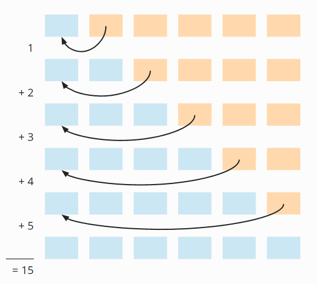
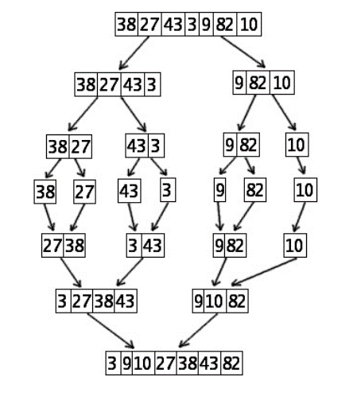
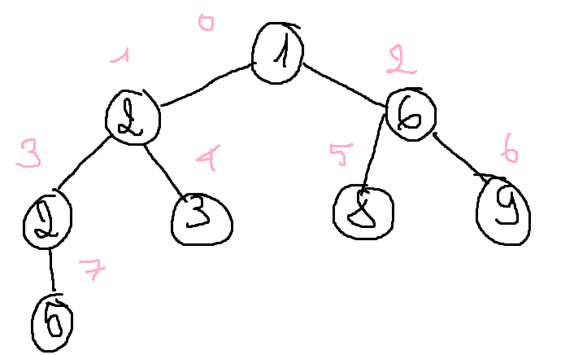
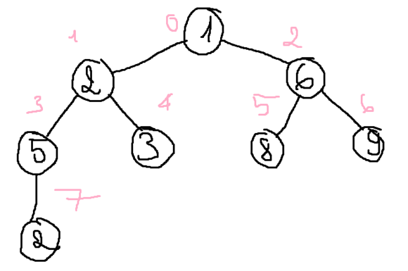
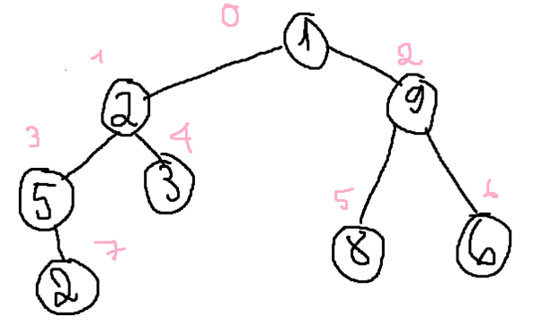
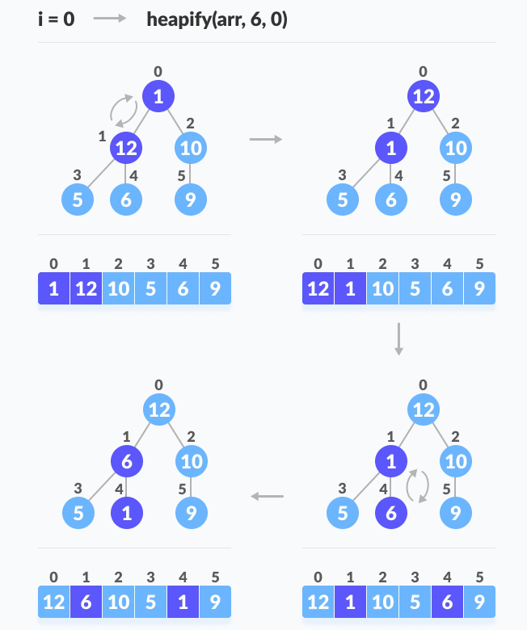
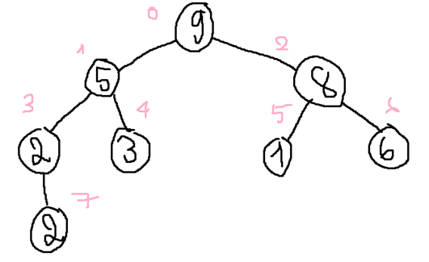
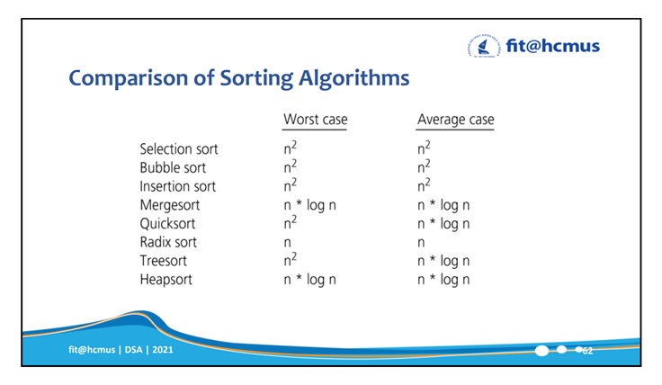

<style>
    img
    {
        display:block;
        float:none;
        margin-left:auto;
        margin-right:auto;
        width:60%;
    }
    p{
        text-align: justify;
    }
    ul{
        margin-left:5px;
    }
</style>

# Các thuật toán sắp xếp

Các thuật toán sắp xếp gồm hai loại: sắp xếp nội (internal sorting), đưa toàn bộ dữ liệu vào bộ nhớ trong. Sắp xếp nội có kích thước dữ liệu không lớn và thời gian thực hiện thuật toán nhanh. Loại thứ hai là sắp xếp ngoại (external sorting), chỉ có một phần dữ liệu được đưa vào bộ nhớ trong, phần còn lại lưu ở bộ nhớ ngoài. Sắp xếp ngoại có kích thước dữ liệu rất lớn và thời gian thực hiện chậm.

**Internal memory** – bộ nhớ trong, chính xác là RAM. Sẽ mất dữ liệu khi tắt máy. Truy xuất dữ liệu ngẫu nhiên.

**External memory** – bộ nhớ ngoài, ngoài RAM hoặc Register. Điển hình là HDD hoặc SSD. Không mất dữ liệu khi tắt máy. Truy xuất dữ liệu trực tiếp phụ thuộc vào vị trí vật lý của dữ liệu.

**Inplace** : Không dùng bộ nhớ trung gian.

**Stable** : Một thuật toán được gọi là stable khi chúng giữ nguyên thứ tự của các phần tử tương tự tính chất với nhau. Chẳng hạn như ta có dãy

$$
1,7,4,5a,5b,5c,7,6
$$

Sau khi sắp xếp xong, thuật toán Stable sẽ không đảo thứ tự giữa 5a, 5b và 5c. Còn các thuật toán Unstable có thể đảo thành 5a, 5c, 5b hoặc 5c, 5b, 5a gì đấy.

Một ví dụ khác là:

$$
1,9,82,2,19,27
$$

Một thuật toán Stable, sau khi sắp xếp dãy trên xong, thứ tự giữa 82 và 2 là không đổi, do chúng có cùng tính chất là giống nhau hàng đơn vị (82 và 02).

Ngoại trừ Radix Sort thì còn lại đều là **Comparison-based Sorting Algorithm**. Tất cả các thuật toán Comparision-based mang tính tổng quát (General Purpose) thì lower bound là O(nlog(n)). Còn Radix Sort, mang tính đặc dụng hơn (Specific Purpose), thì có lower bound là O(n).

Chúng ta phải xem xét các thuật toán dựa trên một ngữ cảnh nhất định.

# Internal Sorting

Có bốn loại internal sorting đó là

- Đổi chỗ (Exchange Sort) gồm Bubble Sort, Shaker Sort, Interchange Sort, Quick Sort,..
- Chèn (Insertion Sort) gồm Simple Insertion Sort, Binary Insertion Sort, Shell Sort,…
- Trộn (Merge Sort) gồm Merge Sort, Natural Merge Sort,…
- Lựa chọn (Selection Sort) gồm Simple Selection Sort, Heap Sort,…

Trong đó Shell Sort, Heap Sort, Quick Sort, Merge Sort và Radix Sort là các thuật toán phức tạp nhưng chi phí thấp. Các thuật toán còn lại đơn giản nhưng chi phí cao.

# Interchange Sort

**Nghịch thế** là một cặp giá trị $(a_i,a_j)$ khi $a_i$ và $a_j$ không thỏa điều kiện sắp thứ tự. Ví dụ nếu mảng một chiều có các phần tử tăng dần mà có một cặp $(a_i,a_j)$ nào đó giảm dần thì cặp đó được gọi là **nghịch thế**.

## Ý tưởng

Thuật toán Interchange Sort sẽ duyệt qua tất cả các cặp giá trị trong mảng và hoán vị hai giá trị trong một cặp nếu cặp giá trị đó là **nghịch thế**.

## Đầu vào – Đầu ra

- Input: Mảng A gồm n phần tử chưa sắp xếp.
- Output: Mảng A đã sắp xếp.

Thuật toán nào không nêu cụ thể đầu vào đầu ra ngầm hiểu có đầu vào đầu ra là một mảng chưa sắp xếp.

## Phân tích độ phức tạp thuật toán

Ở mỗi lần lặp theo biến, có n - i lần so sánh (do các số phía trước đã sắp xếp).

Như vậy ta có tổng số lần so sánh là:

```math
\sum_{i = 1}^{n - 1}(n - i) = \frac{n(n - 1)}{2}
```

Trong trường hợp tốt nhất, chuỗi đã được sắp xếp thì chỉ so sánh mà không thực hiện hoán vị.

Còn trong trường hợp xấu nhất khi chuỗi bị đảo ngược thì mỗi lần so sánh đều phải hoán vị.

> Dựa vào số lần thực hiện các toán tử cơ bản như so sánh và hoán vị, ta kết luận được độ phức tạp thuật toán của một thuật toán bất kỳ. Riêng trường hợp trung bình thì thường khá khó để tính và phải dựa trên sự hiểu biết cùng thông tin về phân bố của dữ liệu đầu vào.

## Độ phức tạp thuật toán

| Cases        | Complexity |
| :----------- | :--------- |
| Best case    | $O(n^2)$   |
| Worst case   | $O(n^2)$   |
| Average case | $O(n^2)$   |

Space Complexity: $O(1)$.

## Giải thuật mẫu

```c++
void interchangeSort(int* a,int n)
{
    // Do xét cặp nên chỉ xét đến phần tử kế cuối
    for (int i = 0; i < n - 1; i++)
    {
        // So sánh với các phần tử còn lại khác chính nó
        for (int j = i + 1; j < n;j++){

            // Theo thứ tự tăng dần
            if(a[j] > a[i])
            {
                int temp = a[i];
                a[i] = a[j];
                a[j] = temp;
            }
        }
    }
}
```

# Selection Sort

## Ý tưởng

Lặp qua các vị trí từ 0 đến n - 1. Ở mỗi lần lặp i tìm phần tử cực trị (nhỏ nhất hoặc lớn nhất) trong khoảng từ i đến n - 1. Sau đó thay thế phần tử $a_i$ với phần tử cực trị vừa tìm. Trong trường hợp xếp mảng tăng dần thì phần tử cực trị là phần tử nhỏ nhất.

## Phân tích thuật toán

Điểm thú vị của selection là có thể sort trong khoảng từ 0 đến k (k < n). Ví dụ khi tuyển sinh, ta chỉ tuyển 500 học sinh đầu trong 1000 học sinh. Chúng ta sắp xếp theo tên của các học sinh, khi sắp xếp đến số lượng 500 thì ngừng, không cần duyệt qua toàn bộ dữ liệu đầu vào. Vậy Selection Sort nó có thể ngừng sort tại vị trí mong muốn nào đó trong quá trình sort, giúp tiết kiệm chi phí.

**Điểm mạnh**
Dễ hiểu, dễ cài đặt, dùng trong **(prototype?)**. Tức là khi mình build một hàm lớn, cần sắp xếp dữ liệu, chúng ta chọn Selection Sort để làm điều đó. Sau này, khi chúng ta cần tối ưu hóa thời gian thực hiện thì thay thế bằng các thuật toán khác mà không làm ảnh hưởng đến kết quả xử lý.

Đồng thời selection sort còn làm việc rất tốt với các mảng dữ liệu nhỏ và phân bố ngẫu nhiên. Là một thuật toán inplace tiết kiệm bộ nhớ.

**Điểm yếu**
Mảng dữ liệu lớn và phân bố có gần như có thứ tự sẽ làm cho thuật toán chạy chậm và không hiệu quả.

## Phân tích độ phức tạp thuật toán

Tham khảo [opengenus](https://iq.opengenus.org/time-complexity-of-selection-sort/).

Lúc ban đầu mảng có hai phần, phần được sắp xếp và phần chưa sắp xếp, gọi kích thước của chúng lần lượt là S1 và S2. Ở mỗi lần lặp, kích thước S1 tăng lên 1 và S2 giảm đi 1. Do đó S2 = n - S1.

Độ phức tạp thời gian cho việc tìm cực trị của mảng chưa sắp xếp có kích thước S2 là $O(S2)$.
Với vòng lặp i bất kỳ, S1 sẽ là i - 1, do đó S2 = n - S1 = n - i + 1.

Như vậy độ phức tạp của việc tìm phần tử cực trị sẽ là $O(n - i + 1)$ và $O(1)$ cho công việc hoán vị.

Tổng độ phức tạp sẽ là

$$
\sum_{i = 1}^{n + 1} O(n - i + 1) + \sum_{i = 1}^{n + 1} O(1)
$$

Do ở bước i thì S1 = i - 1, mà ta lặp đến khi nào S1 = n nên sẽ có n + 1 bước.

Ta có

$$
\sum_{i = 1}^{n + 1} O(1) = 1 + 1 + 1 + ... = n + 1 = O(n)
$$

Và

$$
\sum_{i = 1}^{n + 1} O(n - i + 1) = n + (n - 1) + ... + 1 + 0\\
= 1 + 2 + ... + n
= \frac{n(n + 1)}{2} = O(n^2)
$$

Do quy luật áp đảo mà độ phức tạp tổng cộng sẽ là $O(n^2)$.

**Worst case**
Giả sử mảng đã sắp có thứ tự $a_1, a_2,... a_n$. Và đẩy $a_1$ về cuối, ta có mảng $a_2, a_3,..., a_n, a_1$. Lúc này thuật toán sẽ rơi vào trường hợp xấu nhất khi mà chỉ xảy ra đúng một lần hoán vị.
Worst case có:

$\cfrac{n(n\ +\ 1)}{2}$ số lần so sánh.

$n$ lần hoán vị trong tổng số các vòng lặp.

Do đó mà độ phức tạp là $O(n^2)$.

**Best case**
Trường hợp tốt nhất có thể xem như không xảy ra bất kỳ sự hoán vị nào, tức là khi mảng đã được sắp xếp.
Best case có:

$\cfrac{n(n\ +\ 1)}{2}$ số lần so sánh.

0 lần hoán vị trong tổng số các lần lặp.

**Average case**
Pân tích chi tiết độ phức tạp trung bình ở [đây](https://iq.opengenus.org/time-complexity-of-selection-sort/).

## Độ phức tạp thuật toán

| Cases        | Complexity |
| :----------- | :--------- |
| Best case    | $O(n^2)$   |
| Worst case   | $O(n^2)$   |
| Average case | $O(n^2)$   |

Space Complexity: $O(1)$.

## Giải thuật mẫu

```c++
void selectionSort(int *a, int n)
{
    // Phần tử kế cuối đã tự sắp xếp
    for(int i = 0;i < n - 1; i++)
    {
        // Tìm phần tử nhỏ nhất trong mảng chưa sắp xếp
        int min = i;
        for(int j = i + 1; j < n; j++)
        {
            if(a[j] < a[min])

                min = j;
        }
        swap(a[i], a[min]);
    }
}
```

# Bubble Sort

## Ý tưởng

Xuất phát từ đầu dãy hoặc cuối dãy, đổi chỗ các cặp phần tử liền kề để đưa phần tử nhỏ hơn trong cặp phần tử đó về đúng đầu dãy hiện hành. Sau đó sẽ không xét đến nó ở bước tiếp theo, do vậy ở lần xử lý thứ i thì vị trí đầu dãy là i.

Cần phân biệt rõ ràng với Interchange Sort vì thuật toán Bubble Sort không so sánh tất cả các cặp tồn tại mà chỉ so sánh các cặp nghịch thế liền kề với nhau.

## Phân tích thuật toán

**Điểm mạnh**
Là một thuật toán dễ cài đặt, dễ hiểu và hoạt động tốt cho mảng có số lượng phần tử nhỏ.

**Điểm yếu**
Không hiệu quả đối với mảng có số lượng phần tử lớn, thường thì Bubble Sort được dùng trong giảng dạy hơn là áp dụng thực tiễn.

## Phân tích độ phức tạp thuật toán

Tham khảo [happycoders](https://www.happycoders.eu/algorithms/bubble-sort/#Bubble_Sort_Time_Complexity).

Bubble Sort không dễ chứng minh và phân tích trực tiếp như Selection Sort và Insertion Sort. Vì vậy ta sẽ chia nó ra ba trường hợp để phân tích

**Best case**
Do thuật toán sử dụng cờ lệnh và biết được khi nào mảng đã được sắp xếp, nên khi mảng đầu vào là dãy đã được sắp xếp thì cũng chính là trường hợp tốt nhất của thuật toán.

Lúc này thuật toán sẽ quét qua từng phần tử rồi dừng nên độ phức tạp sẽ là tuyến tính $O(n)$.

**Worst case**
Trường hợp xấu nhất xảy ra khi dữ liệu mà ta muốn sắp bị đảo ngược, chẳng hạn giảm dần khi ta muốn sắp tăng dần. Lúc này, với mỗi vòng lặp i, ta cần n - i lần hoán vị để đưa phần tử thứ i về đúng vị trí cuối mảng.


Và ta có n vòng lặp như vậy, số lần thực hiện hoán vị của hai vòng lặp lồng nhau này là:

$$
    \frac{n(n - 1)}{2}
$$

(Có thể xem lại bài phân tích thuật toán để biết lý do).
Do đó mà độ phức tạp sẽ là $O(n^2)$.

**Average case**
Phân tích chi tiết ở [đây](https://de.wikipedia.org/wiki/Bubblesort#Durchschnittlicher_Fall).

## Độ phức tạp thuật toán

| Cases        | Complexity |
| :----------- | :--------- |
| Best case    | $O(n)$     |
| Worst case   | $O(n^2)$   |
| Average case | $O(n^2)$   |

Space Complexity: $O(1)$.

## Giải thuật mẫu

```c++
void bubbleSort(int *a,int n)
{
    for (int i = 0; i < n - 1; i++)
    {
        bool isSorted = true;// Tạo ra một cờ lệnh

        //Do chúng ta so sánh hai phần tử j và j + 1,nên: j + 1 < n
        //Sau mỗi vòng lặp thì giảm đi một phần tử nên trừ đi i: j + 1 < n - i
        //Chuyển vế đổi dấu ta có điều kiện là j < n - i - 1

        //Tức là cuối mảng sau mỗi lần lặp xem như đã sắp xếp.
        for(int j = 0; j < n - i - 1; j++){
            if(a[j] < a[j + 1])
            {
                swap(a[j], a[j + 1]);
                isSorted = false;
            }
        }

        //Nếu như không có sự thay đổi nào thì dừng sắp xếp.
        if(isSorted) return;
    }
}
```

# Shaker Sort (Cocktail Sort)

## Ý tưởng

Trong mỗi lần sắp xếp, duyệt mảng theo 2 lượt từ hai phía khác nhau.
Lượt đi: đẩy phần tử nhỏ về đầu mảng.
Lượt về: đẩy phần tử lớn về cuối mảng.
Ghi nhận lại các đoạn đã sắp xếp nhằm tiết kiệm các phép so sánh thừa.

## Phân tích thuật toán

Shaker Sort là một dạng nâng cao của Bubble Sort nên nó có thể nhận diện được mảng đã sắp xếp. Đồng thời Shaker Sort sẽ tối ưu hơn Bubble Sort trong trường hợp dãy đã gần như có thứ tự.

Ví dụ {2,3,4,5,1} thì Shaker Sort cần 2 lần đi và về, Bubble Sort cần 4 lần duyệt. Tuy nhiên trong trường hợp mảng phân bố ngẫu nhiên thì Shaker Sort có thời gian thực hiện ngang với Bubble Sort

## Độ phức tạp thuật toán

Best case và Worst case xảy ra với mảng đầu vào tương tự như Bubble Sort.

| Cases        | Complexity |
| :----------- | :--------- |
| Best case    | $O(n)$     |
| Worst case   | $O(n^2)$   |
| Average case | $O(n^2)$   |

Space Complexity: $O(1)$.

## Giải thuật mẫu

```c++
void shakerSort(int *a, int n)
{
    int left = 0, right = n - 1, k = n - 1;
    while(left < right)
    {
        // Đi từ phải qua đẩy nhỏ nhất về đầu mảng
        for(int i = right; i > left; i--)
        {
            if(a[i] <  a[i - 1]){
                swap(a[i], a[i - 1]);
                k = i;//Lưu lại vị trí có hoán vị
            }
        }

        // Giảm kích thước mảng về vị trí có hoán vị
        left = k; // Vì trước đó xem như đã sắp xếp

        // Đi từ trái qua đẩy lớn nhất về cuối mảng
        for(int i = left; i < right; i++)
        {
            if(a[i] > a[i + 1]){
                swap(a[i], a[i + 1]);
                k = i;
            }
        }

        right = k; // Sau đó xem như đã sắp xếp
    }
}
```

# Insertion Sort

## Ý tưởng

Thuật toán Insertion Sort sắp xếp dựa trên tư tưởng là không gian cần sắp xếp đã được sắp xếp một đoạn và ta chỉ cần thêm giá trị mới vào không gian này sao cho không gian mới được sắp xếp.

Giả sử i phần tử đầu tiên $a_0, a_1,…,a_n-1$ đã có thứ tự.

Tìm cách chèn phần tử $a_i$ vào vị trí thích hợp của đoạn đã được sắp để có đoạn mới $a_0, a_1,…,a_i$ trở nên có thứ tự.

**Các bước thực hiện**:

Có n – 1 lần chèn tương đương n - 1 lần lặp, ở mỗi lần chèn ta cần:

1. Tuần tự dời các phần tử từ vị trí i về trước tiến về i một vị trí.
2. Tìm kiếm vị trí chèn hợp lệ (vị trí j + 1).
3. Đưa phần tử cần chèn vào vị trí j + 1.

> Có thể hình dung Insertion Sort giống như khi chúng ta chơi tiến lên, chúng ta cần sắp bài vào sau khi được chia để có thể ra quân một cách nhanh chóng.


## Phân tích độ phức tạp thuật toán

Tham khảo ở [happycoders](https://www.happycoders.eu/algorithms/insertion-sort/).

Giả sử cần sắp xếp một mảng có sáu phần tử, ở vòng lặp đầu tiên, có hai khả năng xảy ra là dời chỗ một lần và không dời chỗ lần nào. Nên trung bình sẽ có 0.5 lần dời chỗ.


Vòng lặp thứ hai thì có ba khả năng từ 0 đến 2 lần dời chỗ, ta lấy 0 + 2 rồi chia 2 được trung bình 1 lần dời chỗ.


Xét tương tự cho đến vòng lặp thứ 5, ta sẽ có trung bình 2.5 lần dời chỗ.


Tổng quát hơn, với 6 phần tử thì ta có 5 lần lặp, mỗi lần lặp thì nửa số phần tử đã được sắp xếp, đồng thời ta chèn phần tử vào giữa mảng của một nửa phần tử đã sắp xếp đó. Ta có:

$$
6 \times 5 \times 1/2 \times 1/2 = 30 \times 1/4 = 7.5
$$

Thay 6 thành n và 5 thành n - 1, ta có:

$$
n \times (n - 1) \times 1/4
$$

Như vậy độ phức tạp của việc dời chỗ là $O(n^2)$.

Xét phép so sánh trong mỗi lần lặp, số lần so sánh là số lần dời chỗ cộng thêm một (bằng nhau trong trường hợp đã dời đến vị trí cuối cùng của đầu mảng bên trái và không cần so sánh lần tiếp theo). Như vậy độ phức tạp của phép so sánh cũng là $O(n^2)$.

Số lần hoán vị có khả năng xảy ra tương ứng với lượng phần tử còn lại ở bên phải. Do đó sẽ có n - 1 lần hoán vị ở mức tối đa. Do đó độ phức tạp của phép hoán vị sẽ là $O(n)$.

Kết luận độ phức tạp trong Average case của Insertion Sort là $O(n^2)$.

**Worst case**
Trường hợp xấu nhất xảy ra khi mảng được sắp xếp nhưng bị đảo ngược. Lúc này ở mỗi lần lặp, thuật toán cần dời chỗ i phần tử để chèn phần tử vào vị trí ngoài cùng nhất bên trái của mảng.



Lúc đó sẽ có $\cfrac{n(n - 1)}{2}$ lần dời chỗ dẫn đến độ phức tạp là $O(n^2)$.

**Best case**
Trường hợp tốt nhất xảy ra khi mảng đã sắp xếp, lúc đó chỉ cần một lần so sánh trong mỗi vòng lặp và không có phép hoán vị nào. Dẫn đến tổng phép so sánh là n - 1 (bỏ qua phần tử đầu). Do đó độ phức tạp là tuyến tính $O(1)$.

## Độ phức tạp thuật toán

| Cases        | Complexity |
| :----------- | :--------- |
| Best case    | $O(n)$     |
| Worst case   | $O(n^2)$   |
| Average case | $O(n^2)$   |

Space Complexity: $O(1)$.

## Giải thuật mẫu

```c++
void insertionSort(int *a,int n)
{
    for(int i = 1; i < n; i++){

        int x = a[i];
        int j;
        for(j = i - 1; j >= 0  && a[j] > x; j--){

            //So sánh với phần tử trước đó (i - 1), nếu bé hơn thì bắt đầu dời chỗ.
            //Dời chỗ cho đến khi gặp phần tử nhỏ hơn phần tử thứ i hồi nãy (x).
            a[j + 1] = a[j];
        }

        //Sau đó chèn phần tử i hồi nãy (x) vào vị trí đã tìm ở vòng lặp trên.
        a[j + 1] = x;
    }
}
```

# Quick Sort

## Ý tưởng

Gồm hai phần: _phân hoạch_ và _sắp xếp_, dựa trên ý tưởng chia để trị.

- **Bước 1** : Chọn tùy ý một phần tử a[pivot] trong dãy là phần tử nút trục (pivot), ý tưởng trình bày ở đây chọn ở giữa.

- **Bước 2** : Tạo vòng lặp phát hiện và hiệu chỉnh cặp phần tử a[i], a[j] nằm sai chỗ. Tức là tìm phần tử nhỏ hơn pivot và lớn hơn pivot để swap với nhau.
  Mục đích là để chuyển các phần tử nhỏ hơn pivot về bên trái pivot và lớn hơn pivot về bên phải pivot. Hay nói cách khác là thiết lập điểm phân hoạch.

- **Bước 3** Phân hoạch bằng đệ qui:
  Gọi đệ qui đoạn bên trái pivot và đoạn bên phải pivot.
  Bên trong các hàm đệ qui tiếp tục thực hiện từ bước 1 đến bước 2.

> Bước gọi đệ qui cho các mảng nhỏ hơn chính là bước trị, khi đi vào bước trị thì tiếp tục CẢ HAI bước chia và trị.

## Phân tích

**Lưu ý** : Việc chọn pivot là ngẫu nhiên, có thể chọn đầu, cuối hoặc ở giữa. Tuy nhiên chọn pivot ở đầu hoặc cuối trong một số trường hợp mảng gần như được sắp sẽ dẫn đến Worst case. Do đó chọn pivot ở giữa là chấp nhận được trong phần lớp các trường hợp. Mặc dù vậy, nếu chọn pivot ở cuối (hoặc đầu) thì việc phân hoạch có đôi chút sửa đổi. Có thể tham khảo ở [đây](https://nguyenvanhieu.vn/thuat-toan-sap-xep-quick-sort/).

Ngoài ra, không phải lúc nào cũng nên chọn phần tử có GIÁ TRỊ trung bình (average). Vì giá trị trung bình này không đại diện cho sự phân phối đồng đều của các phần tử trong mảng. Mà phần tử tốt nhất là phần tử trung vị (median) (vị trí ở giữa). Dẫu vậy, tìm trung vị của một dãy không hề đơn giản, nên chúng ta không tiếp cận theo hướng này.

Do đó, chúng ta lost - tolerant chọn ba phần tử đầu, cuối và giữa. Nếu dính vào trường hợp xấu nhất thì phải chấp nhận mặc dù xác suất xảy ra worst case là rất thấp. Thêm nữa, có thể sử dụng một trick là: so sánh ba phần tử đầu, cuối và giữa rồi lấy Median của ba vị trí này và chọn làm pivot.

> **Sự khác biệt giữa Quick và Merge** : Merge mấu chốt ở bước trộn, bước chia rất đơn giản. Tuy nhiên bước chia của Quick Sort rất phức tạp và quan trọng nhưng bước trộn lại cực kì đơn giản.

## Đầu vào – Đầu ra

- Input: Mảng A gồm n phần tử chưa sắp xếp, vị trí bên trái và vị trí bên phải của mảng hoặc mảng con cần sắp xếp.
- Output: Mảng A đã sắp xếp.

## Phân tích độ phức tạp thuật toán

Tham khảo [opengenus](https://iq.opengenus.org/time-and-space-complexity-of-quick-sort/) và [khan academy](https://www.khanacademy.org/computing/computer-science/algorithms/quick-sort/a/analysis-of-quicksort).

**Best case**
Trường hợp này xảy ra khi các mảng phân hoạch có kích thước đồng đều nhất có thể, kích thước của chúng bằng nhau hoặc hơn kém nhau một phần tử. Đồng thời pivot luôn có khả năng là phần tử giữa mảng sau khi phân hoạch.

Trường hợp bằng nhau xảy ra khi số phần tử trong phân hoạch là lẻ và pivot nằm ngay vị trí ở giữa sau khi thực hiện phân hoạch. Lúc đó mỗi phân hoạch sẽ có $\cfrac{n - 1}{2}$ phần tử.

Trường hợp hơn kém một phần tử xảy ra khi số phần tử trong phân hoạch là chẵn và hai phân hoạch có kích thước lần lượt là $n/2$ và $n/2 - 1$.

Cả hai trường hợp trên thì kích thước của các phân hoạch tối đa là n/2, và cây phân hoạch tương tự như cây phân hoạch của Merge Sort (cây nhị phân đầy đủ). Nói cách khác, chiều cao của cây là tối thiểu và tiết kiệm được nhiều chi phí duyệt qua các mức thừa.


Giả sử T(n) là độ phức tạp thời gian cho trường hợp tốt nhất và n là số phần tử của mảng.
Ở bước đầu tiên khi ta chia mảng làm đôi:

$$
T(n) = 2 * T(n/2) + c * n
$$

$2 * T(n/2)$ vì ta chia mảng thành hai mảng con bằng nhau (xét trường hợp mảng lẻ).
Còn **c** là một hằng số nào đó bé hơn 1 đặc trưng cho số lần duyệt qua các phần tử ở mỗi mức (không phải lúc nào cũng duyệt hết n phần tử).

Bước thứ hai, ta lại chia hai mảng con này thành 4 mảng con khác:

$$
T(n) = 2 * (2 * T(n/4) + c* n/2) + c * n\\
= 4* T(n/4) + 2* c* n
$$

Một cách tổng quát, ở bước thứ k, ta có:

$$
T(n) = 2^k * T(n/(2^k)) + k * c * n
$$

Mà k đồng thời cũng là số lần chia mảng, nên $2^k = n$ (giống vòng lặp có bước nhảy là 2 ở bài phân tích độ phức tạp thuật toán). Do đó $k = \log_2(n)$. Suy ra

$$
T(n) = n * T(1) + n * log_2(n)
$$

Vậy độ phức tạp thuật toán trong trường hợp tốt nhất là $O(nlog_2(n))$.

**Worst case**
Worst case xảy ra khi mảng đã được sắp xếp tăng dần hoặc giảm dần, đồng thời ta chọn pivot là phần tử ở hai đầu mảng. Lúc đó cây phân hoạch trở thành một cây mất cân bằng và suy biến về một cây thẳng đứng, khiến cho chiều cao của cây là tối đa (n).


Ở mỗi lần chia ta phải duyệt qua $c * n$ phần tử, đồng thời có n lần chia như vậy, dễ thấy độ phức tạp của trường hợp xấu nhất là bình phương.

Ta giả sử T(n) là độ phức tạp thời gian của thuật toán.

Ở lần đầu tiên chia mảng, ta chỉ loại bỏ bớt phần tử pivot nên mảng còn n - 1 phần tử, và cần duyệt qua $c * n$ phần tử trong mảng đó để phân hoạch.

$$
T(n) = T(n - 1) + c * n
$$

Ở lần chia thứ hai và thứ ba:

$$
T(n) = T(n - 2) + c * (n - 1) + c * n\\
= T(n - 2) + 2 * c * n - c\\
T(n) = T(n - 3)  + 3 * c * n - 2 * c - c
$$

Tổng quát hóa:

$$
\begin{align*}
T(n) &= T(n - k) + k * c * n - (k - 1) * c\ ... - 2 * c - c\\
&= T(n - k) + k * c * n - c * ((k - 1) + ... + 3 + 2 + 1)\\
&= T(n - k) + k * n * c - c * (k(k - 1)/2)
\end{align*}
$$

Do có n lần chia tương ứng với k lần lặp, cho $n = k$, ta có:

$$
T(n) = T(0) + c * n * n - c * (n(n - 1)/2)
$$

Loại bỏ hằng số, ta có

$$
T(n) = n*n  - n*(n - 1)/2
$$

Suy ra độ phức tạp thuật toán trong trường hợp xấu nhất là $O(n^2)$.

**Average case**
Phân tích chi tiết ở [opengenus](https://iq.opengenus.org/time-and-space-complexity-of-quick-sort/) và [khan academy](https://www.khanacademy.org/computing/computer-science/algorithms/quick-sort/a/analysis-of-quicksort).

## Độ phức tạp thuật toán

| Cases        | Complexity     |
| :----------- | :------------- |
| Best case    | $O(nlog_2(n))$ |
| Worst case   | $O(n^2)$       |
| Average case | $O(nlog_2(n))$ |

Space Complexity: $O(1)$.

## Giải thuật mẫu

Trường hợp chọn pivot ở giữa

```c++
void quickSort(int *a,int left, int right)
{
    //Chọn phần tử ở giữa làm phần tử pivot (nút trục)
    int pivot = a[(left + right) / 2];
    int i = left, j = right;

    //Đưa các phần tử về đúng phía so với pivot
    while(i < j)
    {
        while(a[i] < pivot) i++;
        while(a[j] > pivot) j--;
        if(i <= j)
            swap(a[i++],a[j--]);
    }

    //Gọi đệ qui phân hoạch và sắp xếp
    if(j > left) quickSort(a, left, j);
    if(i < right) quickSort(a, i, right);
}
```

Trường hợp chọn pivot ở cuối

```c++
int partition(int arr[], int left, int right)
{
    int pivot = arr[right]; // pivot
    int i = left;
    int j = right - 1;

    while (i < j)
    {
        while (i <= j && arr[i] < pivot)
            i++; // Tìm phần tử >= arr[pivot]
        while (j >= i && arr[j] > pivot)
            j--; // Tìm phần tử <= arr[pivot]
        if (i <= j)
            swap(arr[i++], arr[j--]);
    }

    swap(arr[i], arr[right]);
    return i; // Trả về chỉ số dùng để phân hoạch
}
```

```c++
void quickSort(int arr[], int left, int right)
{
    if (left < right)
    {
        // Tìm vị trí của pivot
        // (do trước và sau khi phân hoạch pivot có thể thay đổi vị trí)
        int pi = partition(arr, left, right);

        // Gọi đệ qui sắp xếp cho hai phân hoạch hai bên pivot
        // (pivot nếu đã tìm được thì cố định ở vị trí đó luôn)
        quickSort(arr, left, pi - 1);
        quickSort(arr, pi + 1, right);
    }
}
```

# Merge Sort

## Ý tưởng

Thuật toán Merge Sort được chia thành hai phần.
 
Phần đầu tiên, chia các mảng thành hai không gian con, nếu các không gian con này có nhiều hơn một phần tử thì tiếp tục chia đôi. Ngược lại có duy nhất một phần tử (trong trường hợp dãy lẻ) hoặc không có phần tử nào thì bắt đầu trộn lại (gọi đệ qui).

Phần thứ hai chính là quá trình trộn, trong quá trình trộn sẽ kết hợp sắp xếp mảng.

Trộn 2 mảng con **đã được sắp xếp** thực hiện như sau:

1. Chọn phần tử min ở vị trí đầu của một trong hai mảng, xếp vào mảng cần trộn.
2. Phần tử nào đã xếp vào thì xóa đi, vị trí đầu của mảng là phần tử tiếp theo.
3. Nếu chưa đến cuối mảng thì lặp lại bước 1. Nếu đã đến cuối của một mảng (luôn xảy ra một mảng đã sắp hết và một mảng thì chưa), thì thêm toàn bộ mảng kia vào mảng cần sắp.

<center>
    
</center>

## Phân tích

Không tối ưu bộ nhớ vì dùng mảng tạm trong quá trình trộn. Nhanh hơn Quick Sort vì thời gian thực hiện Merge Sort có bậc nhỏ hơn $O(nlog_2(n))$, còn trong trường hợp tốt nhất Quick Sort mới có độ phức tạp là $O(nlog_2(n))$. Thường dùng Merge Sort để sắp khối dữ liệu lớn ở bộ nhớ ngoài.

Một phiên bản khác của Merge Sort không dùng đến việc chia mảng là Bottom - Up Merge Sort. Thuật toán này sẽ trộn các phần tử liền kề với nhau rồi mở rộng ra. Chẳng hạn như nó sẽ trộn 2 phần tử liên tiếp thành mảng con 2 phần tử. Sau đó nó sẽ trộn tiếp 2 mảng gồm 2 phần tử với nhau thành mảng 4 phần tử. Cứ như thế cho đến khi trộn hết mảng cũng là lúc mảng đã được sắp xếp.

Ngoài ra còn có Natural Merge Sort, thuật toán này sẽ không chia trực tiếp mà chẳng cần quan tâm đến thứ tự đã sắp xếp như Merge Sort. Ở đây nó sẽ xem xét các đường chạy (dãy đã có thứ tự). Trong khi Merge Sort cứng nhắc về số lần phân hoạch dựa vào chiều dài dãy là k, thì Natural Merge Sort sẽ dựa vào số đường chạy và mảng được sắp xếp là mảng chỉ có một đường chạy. Thực tế, người ta sử dụng Natural nhiều hơn trong trường hợp dãy đã sắp xếp một phần nào đó.

Một scenario điển hình là sắp xếp dữ liệu có kích thước lớn, người ta sẽ đưa nó vào bộ nhớ trong sắp xếp một phần rồi đem ra bộ nhớ ngoài để sử dụng Natural Merge Sort.

Do tính chất Non - inplace, thuật toán Merge Sort thường cần dùng bộ nhớ tạm trong quá trình thực thi, vì vậy mà thuật toán này sẽ sử dụng trong các cấu trúc dữ liệu khác mảng chẳng hạn như Linked List hoặc File.

## Đầu vào – Đầu ra

- Input: Mảng A gồm n phần tử chưa sắp xếp, vị trí bên trái và vị trí bên phải của mảng hoặc phân hoạch.
- Output: Mảng A đã sắp xếp.

## Độ phức tạp thuật toán

Độ phức tạp của phần merge là $O(n + m) = O(n)$ (n, m là kích thước hai mảng con cần trộn), và phần chia là $O(log_2n)$.

Best case, Worst case, Average case: $O(nlog_2(n))$.

## Giải thuật mẫu

### Phần chia mảng

```c++
void mergeSort(int *a,int left, int right)
{
    if(left <= right) return;
    //Tìm vị trí giữa mảng để chia

    int mid = (left + right) / 2;
    mergeSort(a,left,mid);
    mergeSort(a,mid + 1,right);
    merge(a,left,mid,right);
}
```

### Phần trộn mảng

```c++
void merge(int *a, intleft, intmid, intright)
{
    int *temp = new int[right - left + 1];
    //Mảng thứ nhất từ left đến mid, mảng thứ hai từ mid + 1 đến right
    int k = 0;
    int i = left;
    int j = mid + 1;

    //?Khi hai mảng con chưa xét đến phần tử cuối
    while (i <= mid && j <=right)
    {
        //?So sánh phần tử đầu mỗi mảng và cho vào mảng phụ
        if (a[i] <= a[j])
        {
            temp[k++] =a[i++];
        }
        else
        {
            temp[k++] =a[j++];
        }
    }

    //?Chép các phần tử còn lại (nếu còn)
    while (i <= mid)
    {
        temp[k++] =a[i++];
    }
    while (j <= right)
    {
        temp[k++] =a[j++];
    }

    //?Chép mảng phụ lại vào mảng chính
    for (int i = left; i <= right; i++)
    {
        //Index của a tính từ left
        a[i] =temp[i - left];
    }
}
```

# Heap Sort

## Ý tưởng

Thuật toán Heap Sort được chia làm hai phần.

**Phần đầu tiên** là xây dựng Max Heap từ mảng đầu vào.

Heap là gì? Heap là cây nhị phân hoàn chỉnh.

Cây nhị phân hoàn chỉnh là gì? Cây nhị phân là cây mỗi nốt đều có 0 hoặc 2 con.

<center>
    
</center>

Hai phần tử con của một phần tử i bất kỳ là 2i+1 và 2i+2 (nếu phần tử đầu là 0) hoặc 2i và 2i+1 (nếu phần tử đầu là 1), là các phần tử **liên đới**.

Max Heap là Heap mà mỗi nốt đều lớn hơn các nốt con của nó. Phần này chính là đi xây dựng Max Heap từ phần tử giữa mảng. Theo hình trên thì các số chính là vị trí index trong mảng. Các số này được xây dựng trên việc duyệt cây theo các mức.

Ví dụ Max Heap 11 phần tử: 9, 8, 7, 5, 6, 3, 2, 4, 1, 1, 2. Có thể thấy với mỗi phần tử thứ i, nó sẽ lớn hơn các phần tử ở vị trí 2i+1 và 2i+2. Min Heap 7 phần tử 1, 2, 2, 3, 4, 5, 7.

Ví dụ có mảng [1, 2, 6, 2, 3, 8, 9, 5], thì cây đồ thị sẽ là:

<center>
    
</center>

Ở ví dụ trên, đầu tiên sẽ vun đống phần tử giữa mảng, index sẽ là
n/2 – 1 = 8/2 – 1 = 3.
Mà a[3] là 2.
Chúng ta sẽ hoán vị một phần tử với node con của nó nếu giá trị của node đó bé hơn node con. Và nếu cả hai node con đều lớn hơn, ta sẽ hoán vị với node con lớn nhất. Theo ví dụ trên thì ta có một hoán vị là (2-5).

Các phần tử bị hoán vị phải được vun đống ở vị trí mà nó hoán vị đến. Việc này để vun đống lại Heap sau khi có sự ảnh hưởng gây ra bởi việc swap. ở trên ta sẽ xét vun đống tại a[7], nhưng không có gì xảy ra vì nốt này không có con.

<center>
    
</center>

Tiếp theo sẽ xét vun đống tiến dần về đầu mảng, ta xét a[2] = 6. Sẽ có hoán vị (6-9). Xét đệ quy tại a[6] nhưng không có gì xảy ra do nốt không có con.

<center>
    
</center>

Xét a[1] = 2, ta sẽ hoán vị (2-5) và xét a[3], nhưng do 2 = 2 nên không vun đống tiếp.

<center>
    
</center>

Cuối cùng ta xét a[0] = 1, hoán vị (1-9, 1-8). Được kết quả là:

<center>
    
</center>

Mảng của chúng ta sau khi vun đống: [9, 5, 8, 2, 3, 1, 6, 2].

**Phần thứ hai** là sắp xếp. Ở phần này, khi đã xây dựng được Max Heap, chúng ta sẽ sắp xếp.

Ở phần sắp xếp này, chúng ta sẽ đổi chỗ phần tử đầu và phần tử cuối mảng. Sau đó sẽ xóa đi phần tử cuối mảng và tiếp tục Heapify (vun đống) như ở bước 1 (phần tử đầu hồi nãy có giá trị lớn nhất). Nhưng không cần Heapify toàn bộ, chỉ **xét phần tử đầu tiên** và build Heap ở đó do các phần tử còn lại đã được Heapify rồi.

Heap Sort là một thuật toán **cải tiến của Selection Sort**. Nhờ sử dụng cấu trúc Heap mà Heap Sort có số lần so sánh ít hơn Selection, nó chỉ tốn O(nlog(n)) chi phí so sánh.

## Phân tích

**Advantage** là một thuật toán hiệu quả, sử dụng ít bộ nhớ và ổn định. Ngoài ra thì cũng có thể tìm top k trong n như Selection Sort.

Heap Sort dựa vào việc so sánh để sắp xếp. Và sự so sánh này trên cấu trúc Heap không bị ảnh hưởng bởi kiểu dữ liệu (int, float, bool, char,...). Ngoài ra, đối với chuỗi ký tự, còn có **Dictionary-based.**

Ví dụ "been" > "ant", "been" < "boy", "Been" < "been".
**Disadvantage** là một loại Unstable Sort, nếu dữ liệu quá lớn thì sẽ không hoạt động hiệu quả bằng Merge Sort.

## Đầu vào – Đầu ra

- Input: Mảng A gồm n phần tử chưa sắp xếp.
- Output: Mảng A đã sắp xếp.

## Độ phức tạp thuật toán

**Best case:** $O(nlog_2(n))$

**Worst case:** $O(nlog_2(n))$

**Average case:** $O(nlog_2(n))$

=> Consistency

## Giải thuật mẫu

### Phần Heapify (vun đống)

```c++
void heapify(int* arr, int n, int i)
{
    int largest = i; // Initialize largest as root
    int l = 2 * i + 1; // left = 2*i + 1
    int r = 2 * i + 2; // right = 2*i + 2

    if (l < n && arr[l] > arr[largest])
        largest = l;

    if (r < n && arr[r] > arr[largest])
        largest = r;

    if (largest != i) {
        swap(arr[i], arr[largest]);

        heapify(arr, n, largest);
    }
}
```

### Phần sắp xếp

```c++
// main function to do heap sort
void heapSort(int* arr, int n)
{
    // Build heap (rearrange array) from middle to beginning of the array
    for (int i = n / 2 - 1; i >= 0; i--)
        heapify(arr, n, i);

    // One by one extract an element from heap
    for (int i = n - 1; i > 0; i--) {
        // Move current root to end
        swap(arr[0], arr[i]);

        // call max heapify on the reduced heap
        heapify(arr, i, 0);
    }
}
```

# Conclusion

Ta cần phân tích một chút lý do tại sao ba thuật toán Quick, Merge và Heap lại là $O(n.log_2n)$.

Nếu để ý, dễ dàng thấy được rằng cả ba thuật toán này đều có các bước chia đôi không gian sắp xếp ra để thao tác. Các bước để chia đôi một danh sách bất kỳ là $log_2n$. Lý do là vì hàm $log_2n$ là hàm biểu thị cho một số nào đó, cần thiết để chia một danh sách n phần tử thành cơ số của nó (cơ số 2).

Và cũng nói luôn, trong khoa học máy tính, chúng ta chỉ xét cơ số hai đối với hàm logarith. Ngược lại với nó là hàm mũ, nó biểu thị cho số lần để nhân tích lũy các cơ số lên để thành một số n nào đó. Nói cách khác, $log_2n$ biểu thị cho số lần cần thiết để chia danh sách ban đầu thành nhiều phần nhỏ cho tiện việc xử lý.

Tiếp sau đó là việc xử lý. Trong hầu hết các công việc xử lý, như hàm Merge, thuật toán bắt buộc phải chạm tới từng phần tử trong bất kỳ lần trộn nào. Tức là công việc trộn này tốn O(n) thời gian để thực hiện. Quick sort cũng vậy, ở mỗi bước chúng ta đều phải duyệt các phần tử để đổi chỗ cho nhau. Tương tự đối với Heap sort.

Do vậy, với mỗi lần chia danh sách ban đầu ra làm hai, chúng ta phải duyệt qua n phần tử. Từ đó mà độ phức tạp tổng cộng sẽ là $O(n.log_2n)$.

# Radix Sort

## Ý tưởng

**Radix – cơ số**: Thuật toán này sắp xếp dựa trên cơ số (2, 8, 10, 16), mỗi cơ số có một cách biểu diễn riêng cho các giá trị phụ thuộc vào số lượng ký số (số ký tự để biểu diễn giá trị). Và mỗi bucket trong Radix Sort sẽ lưu các giá trị theo một loại ký số riêng biệt. Do đó nếu giá trị không thể hiện dưới dạng một số cơ số nhất định nào đó (chẳng hạn số thực) thì việc sắp xếp sẽ khá khó khăn.

**Điểm mạnh** của Radix Sort là nhanh, chỉ phụ thuộc vào số lượng ký số. Chẳng hạn có n phần tử nhưng phần tử có chiều dài ký số lớn nhất là 7, thì chỉ cần 7 lần sắp xếp.

**Điểm yếu** là số lượng bộ nhớ cần dùng rất lớn, nếu cơ số là 10, thì mảng sử dụng để lưu ký số là 10. Hơn nữa, nếu có n phần tử trong số các bucket, thì mảng cần sử dụng sẽ là 10\*n.

**Ứng dụng** thường gặp của Radix Sort là sắp xếp thư từ dựa trên mã bưu chính (Postal Code hoặc ZIP Code)

Thay vì sort GIÁ TRỊ, chúng ta sẽ sort theo CHỮ SỐ của cơ số. Radix Sort có thể sử dụng Counting Sort làm hàm con của nó. Radix Sort là một thuật toán stable.

Chẳng hạn ta có một dãy số dưới đây:

$$
129,450,356,118,928,323,875,223
$$

Đầu tiên, chúng ta dùng Counting Sort, sắp xếp các số dựa vào hàng đơn vị, số nào có hàng đơn vị lớn hơn thì đem ra sau, nhỏ hơn thì đem về trước.

Ta gạch dưới các chữ số hàng đơn vị.

$$
129, 450, 356, 118, 928, 323, 875, 223
$$

Sắp xếp dựa trên hàng đơn vị.

$$
450, 323, 223, 875, 356, 118, 928, 129
$$

Chúng ta có thể thấy thứ tự giữa các số có cùng hàng đơn vị vẫn không đổi. Sau đó ta gạch dưới các chữ số hàng chục và tiếp tục sắp xếp.

$$
118, 323, 223, 928, 129, 450, 356, 875
$$

Tiếp tục đối với hàng trăm.

$$
118, 129, 223, 323, 356, 450, 875, 928
$$

Kết quả thu được chính là mảng đã sắp xếp.

## Đầu vào - Đầu ra

Tương tự các loại Sort không cần chia mảng.

## Độ phức tạp thuật toán

Xét riêng Counting Sort, cần tốn n lần duyệt qua n phần tử. Đồng thời các key cần xem xét phụ thuộc vào hệ cơ số, nếu hệ cơ số là 10 thì k = 10 (các số chạy từ 0 đến 9), như ở ví dụ trên.

Tổng độ phức tạp thuật toán của mỗi lần thực hiện Counting Sort là O(n+k). Và chúng ta thực hiện Counting Sort phụ thuộc vào số chữ số tối đa của phần tử. Nếu phần tử có 3 chữ số như ví dụ trên thì Counting Sort thực hiện 3 lần, d chữ số thì thực hiện d lần.

Vậy độ phức tạp tổng quát là $O(d*(n+k))$.

Xét trong các trường hợp cụ thể khi giới hạn $k \leq nc$ và b là n. Thì độ phức tạp là $O(n)$.

## Giải thuật mẫu

### Phần Counting Sort

```c++
void countSort(int arr[], int n, int exp)
{
    int *output = new int[n]; // output array
    int i, count[10] = { 0 };

    for (i = 0; i < n; i++)
        count[(arr[i] / exp) % 10]++;

    for (i = 1; i < 10; i++)
        count[i] += count[i - 1];

    for (i = n - 1; i >= 0; i--) {
        output[count[(arr[i] / exp) % 10] - 1] = arr[i];
        count[(arr[i] / exp) % 10]--;
    }

    for (i = 0; i < n; i++)
        arr[i] = output[i];
}
```

### Phần Radix Sort

```c++
int getMax(int arr[], int n)
{
    int mx = arr[0];
    for (int i = 1; i < n; i++)
        if (arr[i] > mx)
            mx = arr[i];
    return mx;
}
void radixsort(int arr[], int n)
{
    int m = getMax(arr, n);

    for (int exp = 1; m / exp > 0; exp *= 10)
        countSort(arr, n, exp);
}
```

# So sánh giữa các thuật toán


