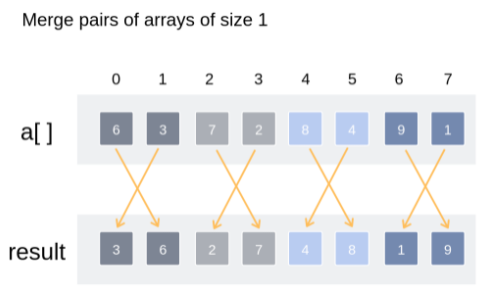
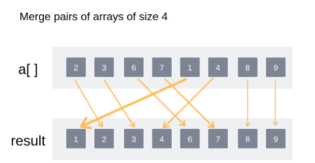
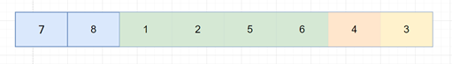
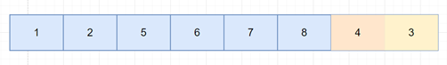
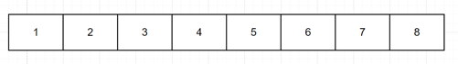

<link rel="stylesheet" href="main.css">
<div class="bg">
     <center><h1 class="bigtitle">Merge Sort</h1></center>
</div>

# Idea

Thuật toán Merge Sort là một thuật toán ứng dụng phương pháp chia để trị, thuật toán này gồm hai phần.

Phần đầu tiên, chia các mảng thành hai không gian con, nếu các không gian con này có nhiều hơn một phần tử thì tiếp tục chia đôi. Ngược lại có duy nhất một phần tử hoặc không có phần tử nào (trong trường hợp dãy lẻ) thì bắt đầu trộn lại (gọi đệ qui).

Phần thứ hai chính là quá trình trộn, trong quá trình trộn sẽ kết hợp sắp xếp mảng.
Trộn 2 mảng con được thực hiện như sau:

1. Chọn phần tử min ở vị trí đầu của một trong hai mảng, xếp vào mảng cần trộn.
2. Phần tử nào đã xếp vào thì xóa đi, vị trí đầu của mảng là phần tử tiếp theo.
3. Nếu chưa đến cuối mảng thì lặp lại bước 1. Nếu đã đến cuối của một mảng (luôn xảy ra một mảng đã sắp hết và một mảng thì chưa), thì thêm toàn bộ mảng kia vào mảng cần sắp.


# Input

Mảng A gồm n phần tử chưa sắp xếp, vị trí bên trái và vị trí bên phải của mảng hoặc phân hoạch.

# Properties

Không tối ưu bộ nhớ vì dùng mảng tạm trong quá trình trộn. Nhanh hơn Quick Sort vì thời gian thực hiện Merge Sort có bậc là $O(nlog_2(n))$, còn trong trường hợp tốt nhất hoặc trung bình Quick Sort mới có độ phức tạp là $O(nlog_2(n))$. Thường dùng Merge Sort để sắp lượng dữ liệu lớn ở bộ nhớ ngoài.

Do tính chất Non - inplace, thuật toán Merge Sort thường cần dùng bộ nhớ tạm trong quá trình thực thi, vì vậy mà thuật toán này thường được sử dụng trong các cấu trúc dữ liệu khác mảng chẳng hạn như Linked List hoặc File.

**Điểm mạnh**

- Stable Sort.
- Có độ phức tạp ở ba case là như nhau nên mang tính ổn định.
- Tốc độ nhanh đối với những dữ liệu có kích thước lớn.
- Ứng dụng trong External Sorting.

**Điểm yếu**

- Sử dụng bộ nhớ phụ, nếu dùng Linked List thì có thể giảm bớt vấn đề này (giảm ra sao ?).
- Đối với lượng dữ liệu nhỏ thì không hiệu quả.
- Không thể nhận biết mảng đã sắp xếp.

> Khi nào thì sử dụng?

- Khi cấu trúc dữ liệu không hỗ trợ truy cập ngẫu nhiên (dùng linked list).
- Sắp xếp ở bộ nhớ ngoài, khi truy cập trực tiếp hao phí rất nhiều so với truy cập tuần tự ?.
- Cần tính ổn định.

# Complexity Analysis

Ta đã biết trong các bài toán chia đôi không gian thuật toán làm hai như Binary Search hoặc Quick Sort thì độ phức tạp của việc chia ra như vậy là $O(log_2(n))$. Nói cách khác, ta cần $k = O(log_2(n)$ bước để chia một mảng n phần tử thành các mảng có 1 phần tử. Ngược lại cũng cần $k = O(log_2(n))$ lần nhân đôi một phần tử để trở thành mảng có n phần tử.

Từ đó ta có được độ phức tạp của bước chia mảng trong Merge Sort là $O(log_2(n))$.

Ngoài ra, khi trộn mảng, ta phải duyệt qua từng phần tử của hai mảng con bất kỳ. Như vậy độ phức tạp phần trộn là $O(n + m)$, với n và m là kích thước của hai mảng con.

Nói cách khác, nếu gọi T(n) là độ phức tạp thời gian của thuật toán, ta có lần chia đầu tiên sẽ là

$$
T(n) = 2 * T(n/2) + n
$$

$2 * T(n/2)$ là độ phức tạp cho hai mảng con có kích thước bằng hoặc chênh nhau một phần tử.
n là số lần duyệt qua n phần tử trong mỗi lần trộn. Do có k lần chia cũng như k lần trộn nên ta gộp chúng lại với nhau.

Lần chia thứ hai

$$
T(n) = 2 * (2 * T(n/4) + n/2) + n\\
= 4 * T(n/4) + 2 * n
$$

Lần chia thứ ba

$$
T(n) = 4 * (2 * T(n/8) + n/4) + 2 * n\\
= 8 * T(n/8) + 3 * n
$$

Tổng quát cho lần chia thứ k

$$
T(n) = 2^k * T(n/2^k)  + k * n
$$

Ta có số lần chia là $k = log_2(n)$ (luôn chia đôi), thay vào biểu thức trên, có được:

$$
T(n) = n * T(1)  + n * log_2(n)\\
= n * (log_2(n) + 1)
$$

Kết luận Complexity là $O(nlog_2(n))$.

Ba trường hợp của Merge Sort là như nhau bởi vì Merge Sort luôn chia đôi mảng và quét hết qua n phần tử trong các lần trộn ở mỗi mức.

Độ phức tạp không gian cũng thế, ở ba trường hợp đều là độ phức tạp tuyến tính.

# Complexity

| Cases        | Complexity     |
| :----------- | :------------- |
| Best case    | $O(nlog_2(n))$ |
| Worst case   | $O(nlog_2(n))$ |
| Average case | $O(nlog_2(n))$ |

Space Complexity: $O(n)$.

# Code

## Divide

```c++
void mergeSort(int *a,int left, int right)
{
    if(left <= right) return;

    //Tìm vị trí giữa mảng để chia
    int mid = (left + right) / 2;
    mergeSort(a,left,mid);
    mergeSort(a,mid + 1,right);
    merge(a,left,mid,right);
}
```

## Merge

```c++
void merge(int *a, intleft, intmid, intright)
{
    int *temp = new int[right - left + 1];
    //Mảng thứ nhất từ left đến mid, mảng thứ hai từ mid + 1 đến right
    int k = 0;
    int i = left;
    int j = mid + 1;

    //?Khi hai mảng con chưa xét đến phần tử cuối
    while (i <= mid && j <=right)
    {
        //?So sánh phần tử đầu mỗi mảng và cho vào mảng phụ
        if (a[i] <= a[j])
        {
            temp[k++] =a[i++];
        }
        else
        {
            temp[k++] =a[j++];
        }
    }

    //?Chép các phần tử còn lại (nếu còn)
    while (i <= mid)
    {
        temp[k++] =a[i++];
    }
    while (j <= right)
    {
        temp[k++] =a[j++];
    }

    //?Chép mảng phụ lại vào mảng chính
    for (int i = left; i <= right; i++)
    {
        //Index của a tính từ left
        a[i] =temp[i - left];
    }
}
```

# Variants

## Bottom - Up

Một phiên bản khác của Merge Sort không dùng đến việc chia mảng là Bottom - Up Merge Sort. Thuật toán này sẽ trộn các phần tử liền kề với nhau rồi mở rộng ra. Chẳng hạn như nó sẽ trộn 2 phần tử liên tiếp thành mảng con 2 phần tử. Sau đó nó sẽ trộn tiếp 2 mảng gồm 2 phần tử với nhau thành mảng 4 phần tử. Cứ như thế cho đến khi trộn hết mảng cũng là lúc mảng đã được sắp xếp.





(Hình ảnh tham khảo [interviewbit](https://www.interviewbit.com/tutorial/merge-sort-algorithm/))

## Natural Merge Sort

Tham khảo [wikipedia](https://en.wikipedia.org/wiki/Merge_sort#Natural_merge_sort).

Ngoài ra còn có Natural Merge Sort, thuật toán này sẽ không chia trực tiếp mà chẳng cần quan tâm đến thứ tự đã sắp xếp như Merge Sort. Ở đây nó sẽ xem xét các đường chạy (dãy đã có thứ tự). Trong khi Merge Sort cứng nhắc về số lần phân hoạch dựa vào chiều dài dãy là k, thì Natural Merge Sort sẽ dựa vào số đường chạy và mảng được sắp xếp là mảng chỉ có một đường chạy. Thực tế, người ta sử dụng Natural nhiều hơn trong trường hợp dãy đã sắp xếp một phần nào đó.

Bởi vì Merge Sort thông thường không nhận biết được một dãy đã sắp xếp nên trong thực tế người ta không dùng Merge Sort thuần để ứng dụng. Thay vào đó họ sử dụng Natural Merge Sort tận dụng các đường chạy để tối ưu thuật toán.
Đường chạy là một dãy tăng không giảm. Ví dụ dãy 7 8 1 2 5 6 4 3 sẽ có bốn đường chạy là (7, 8), (1, 2, 5, 6), (4) và (3). Khi chọn ra được các đường chạy trong cùng một mảng, chúng ta sẽ tiến hành trộn tuần tự các đường chạy đó lại với nhau. Ví dụ sắp xếp cho dãy trên, ta có:



Trộn hai đường chạy đầu tiên lại với nhau



Tiếp tục trộn


Cuối cùng ta được dãy đã sắp xếp


Thay vì phân ra quá nhiều mảng con, phiên bản này của Merge Sort chỉ phân ra k đường chạy nhất định rồi trộn chúng lại với nhau.

Một scenario điển hình là sắp xếp dữ liệu có kích thước lớn, người ta sẽ đưa nó vào bộ nhớ trong sắp xếp một phần rồi đem ra bộ nhớ ngoài để sử dụng Natural Merge Sort.
