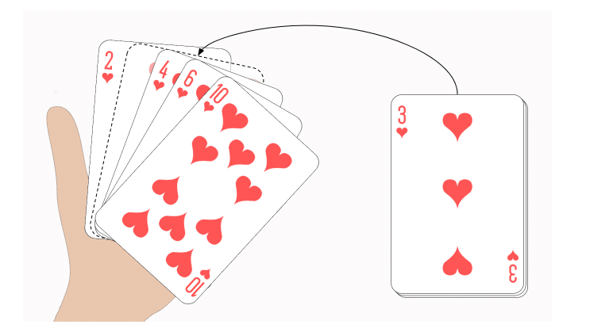

<link rel="stylesheet" href="../../main.css">
<div class="bg">
     <center><h1 class="bigtitle">Insertion Sort</h1></center>
</div>

# Table of contents

- [Table of contents](#table-of-contents)
- [Idea](#idea)
- [Complexity Analysis](#complexity-analysis)
- [Complexity](#complexity)
- [Code](#code)

# Idea

Thuật toán Insertion Sort sắp xếp dựa trên tư tưởng là không gian cần sắp xếp đã được sắp xếp một đoạn và ta chỉ cần thêm giá trị mới vào không gian này sao cho không gian mới được sắp xếp.

Giả sử i phần tử đầu tiên $a_0, a_1,…,a_n-1$ đã có thứ tự.

Tìm cách chèn phần tử $a_i$ vào vị trí thích hợp của đoạn đã được sắp để có đoạn mới $a_0, a_1,…,a_i$ trở nên có thứ tự.

**Các bước thực hiện**:

Có n – 1 lần chèn tương đương n - 1 lần lặp, ở mỗi lần chèn ta cần:

1. Tuần tự dời các phần tử từ vị trí i về trước tiến về i một vị trí.
2. Tìm kiếm vị trí chèn hợp lệ (vị trí j + 1).
3. Đưa phần tử cần chèn vào vị trí j + 1.

> Có thể hình dung Insertion Sort giống như khi chúng ta chơi tiến lên, chúng ta cần sắp bài vào sau khi được chia để có thể ra quân một cách nhanh chóng.



> Khi nào nên sử dụng?

- Mảng đầu vào nhỏ hoặc gần như có thứ tự.
- Cần sự stable cho dữ liệu vì đây là thuật toán Stable.
- Bộ nhớ sử dụng bị hạn chế

# Complexity Analysis

Tham khảo ở [happycoders](https://www.happycoders.eu/algorithms/insertion-sort/).

Giả sử cần sắp xếp một mảng có sáu phần tử, ở vòng lặp đầu tiên, có hai khả năng xảy ra là dời chỗ một lần và không dời chỗ lần nào. Nên trung bình sẽ có 0.5 lần dời chỗ.


Vòng lặp thứ hai thì có ba khả năng từ 0 đến 2 lần dời chỗ, ta lấy 0 + 2 rồi chia 2 được trung bình 1 lần dời chỗ.


Xét tương tự cho đến vòng lặp thứ 5, ta sẽ có trung bình 2.5 lần dời chỗ.


Tổng quát hơn, với 6 phần tử thì ta có 5 lần lặp, mỗi lần lặp thì nửa số phần tử đã được sắp xếp, đồng thời ta chèn phần tử vào giữa mảng của một nửa phần tử đã sắp xếp đó. Ta có:

$$
6 \times 5 \times 1/2 \times 1/2 = 30 \times 1/4 = 7.5
$$

Thay 6 thành n và 5 thành n - 1, ta có:

$$
n \times (n - 1) \times 1/4
$$

Như vậy độ phức tạp của việc dời chỗ là $O(n^2)$.

Xét phép so sánh trong mỗi lần lặp, số lần so sánh là số lần dời chỗ cộng thêm một (bằng nhau trong trường hợp đã dời đến vị trí cuối cùng của đầu mảng bên trái và không cần so sánh lần tiếp theo). Như vậy độ phức tạp của phép so sánh cũng là $O(n^2)$.

Số lần hoán vị có khả năng xảy ra tương ứng với lượng phần tử còn lại ở bên phải. Do đó sẽ có n - 1 lần hoán vị ở mức tối đa. Do đó độ phức tạp của phép hoán vị sẽ là $O(n)$.

Kết luận độ phức tạp trong Average case của Insertion Sort là $O(n^2)$.

**Worst case**
Trường hợp xấu nhất xảy ra khi mảng được sắp xếp nhưng bị đảo ngược. Lúc này ở mỗi lần lặp, thuật toán cần dời chỗ i phần tử để chèn phần tử vào vị trí ngoài cùng nhất bên trái của mảng.


Lúc đó sẽ có $\cfrac{n(n - 1)}{2}$ lần dời chỗ dẫn đến độ phức tạp là $O(n^2)$.

**Best case**
Trường hợp tốt nhất xảy ra khi mảng đã sắp xếp, lúc đó chỉ cần một lần so sánh trong mỗi vòng lặp và không có phép hoán vị nào. Dẫn đến tổng phép so sánh là n - 1 (bỏ qua phần tử đầu). Do đó độ phức tạp là tuyến tính $O(n)$.

# Complexity

| Cases        | Complexity |
| :----------- | :--------- |
| Best case    | $O(n)$     |
| Worst case   | $O(n^2)$   |
| Average case | $O(n^2)$   |

Space Complexity: $O(1)$.

# Code

```c++
void insertionSort(int *a,int n)
{
    for(int i = 1; i < n; i++){

        int x = a[i];
        int j;
        for(j = i - 1; j >= 0  && a[j] > x; j--){

            //So sánh với phần tử trước đó (i - 1), nếu bé hơn thì bắt đầu dời chỗ.
            //Dời chỗ cho đến khi gặp phần tử nhỏ hơn phần tử thứ i hồi nãy (x).
            a[j + 1] = a[j];
        }

        //Sau đó chèn phần tử i hồi nãy (x) vào vị trí đã tìm ở vòng lặp trên.
        a[j + 1] = x;
    }
}
```
