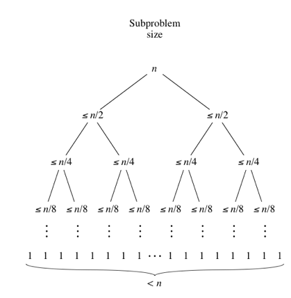
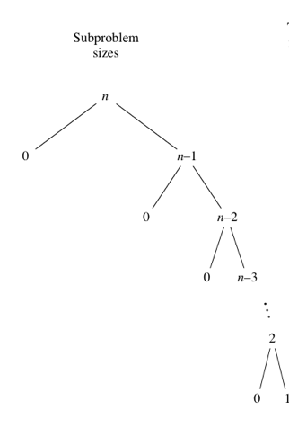

<link rel="stylesheet" href="../../main.css">
<div class="bg">
     <center><h1 class="bigtitle">Quick Sort</h1></center>
</div>

# Table of contents

- [Table of contents](#table-of-contents)
- [Idea](#idea)
- [Input](#input)
- [Properties](#properties)
- [Complexity Analysis](#complexity-analysis)
- [Complexity](#complexity)
- [Code](#code)

# Idea

Gồm hai phần: _phân hoạch_ và _sắp xếp_, dựa trên Idea chia để trị.

- **Bước 1** : Chọn tùy ý một phần tử a[pivot] trong dãy là phần tử nút trục (pivot), Idea trình bày ở đây chọn ở giữa.

- **Bước 2** : Tạo vòng lặp phát hiện và hiệu chỉnh cặp phần tử a[i], a[j] nằm sai chỗ. Tức là tìm phần tử nhỏ hơn pivot và lớn hơn pivot để swap với nhau.
  Mục đích là để chuyển các phần tử nhỏ hơn pivot về bên trái pivot và lớn hơn pivot về bên phải pivot. Hay nói cách khác là thiết lập điểm phân hoạch.

- **Bước 3** Phân hoạch bằng đệ qui:
  Gọi đệ qui đoạn bên trái pivot và đoạn bên phải pivot.
  Bên trong các hàm đệ qui tiếp tục thực hiện từ bước 1 đến bước 2.

> Bước gọi đệ qui cho các mảng nhỏ hơn chính là bước trị, khi đi vào bước trị thì tiếp tục CẢ HAI bước chia và trị.

# Input

Mảng A gồm n phần tử chưa sắp xếp, vị trí bên trái và vị trí bên phải của mảng hoặc mảng con cần sắp xếp.

# Properties

**Lưu ý** : Việc chọn pivot là ngẫu nhiên, có thể chọn đầu, cuối hoặc ở giữa. Tuy nhiên chọn pivot ở đầu hoặc cuối trong một số trường hợp mảng gần như được sắp sẽ dẫn đến Worst case. Do đó chọn pivot ở giữa là chấp nhận được trong phần lớp các trường hợp. Mặc dù vậy, nếu chọn pivot ở cuối (hoặc đầu) thì việc phân hoạch có đôi chút sửa đổi. Có thể tham khảo ở [đây](https://nguyenvanhieu.vn/thuat-toan-sap-xep-quick-sort/).

Ngoài ra, không phải lúc nào cũng nên chọn phần tử có GIÁ TRỊ trung bình (average). Vì giá trị trung bình này không đại diện cho sự phân phối đồng đều của các phần tử trong mảng. Mà phần tử tốt nhất là phần tử trung vị (median) (vị trí ở giữa). Dẫu vậy, tìm trung vị của một dãy không hề đơn giản, nên chúng ta không tiếp cận theo hướng này.

Do đó, chúng ta lost - tolerant chọn ba phần tử đầu, cuối và giữa. Nếu dính vào trường hợp xấu nhất thì phải chấp nhận mặc dù xác suất xảy ra worst case là rất thấp. Thêm nữa, có thể sử dụng một trick là: so sánh ba phần tử đầu, cuối và giữa rồi lấy Median của ba vị trí này và chọn làm pivot.

> **Sự khác biệt giữa Quick và Merge** : Merge mấu chốt ở bước trộn, bước chia rất đơn giản. Tuy nhiên bước chia của Quick Sort rất phức tạp và quan trọng nhưng bước trộn lại cực kì đơn giản.

> **[Median of Medians](https://en.wikipedia.org/wiki/Median_of_medians)**: Là một phương pháp để chọn pivot nhằm tránh rơi vào trường hợp Worst Case của Quick Sort.

**Điểm mạnh**

- Không sử dụng bộ nhớ phụ.
- Stack sử dụng khá nhỏ.
- Là một thuật toán sử dụng hàm có đệ quy đuôi, đệ quy đuôi là đệ quy mà lời gọi đệ quy là thứ cuối cùng mà hàm thực hiện. Hàm sử dụng đệ quy đuôi có thể được tối ưu hóa bởi compiler nên nó hiệu quả hơn hàm không dùng đệ quy đuôi

**Điểm yếu**

- Unstable Sort
- Trường hợp xấu nhất có thể dẫn đến độ phức tạp bình phương.
- Khá khó để cài đặt, đặc biệt là cài đặt mà không dùng đệ quy.

> Khi nào nên sử dụng?

- Hiệu quả với kích thước dữ liệu mà bộ nhớ chứa được (bộ nhớ trong), hoạt động tốt hơn đối với kích thước dữ liệu nhỏ.
- Kích thước dữ liệu lớn thì không tốt bằng Merge Sort.

# Complexity Analysis

Tham khảo [opengenus](https://iq.opengenus.org/time-and-space-complexity-of-quick-sort/) và [khan academy](https://www.khanacademy.org/computing/computer-science/algorithms/quick-sort/a/analysis-of-quicksort).

**Best case**
Trường hợp này xảy ra khi các mảng phân hoạch có kích thước đồng đều nhất có thể, kích thước của chúng bằng nhau hoặc hơn kém nhau một phần tử. Đồng thời pivot luôn có khả năng là phần tử giữa mảng sau khi phân hoạch.

Trường hợp bằng nhau xảy ra khi số phần tử trong phân hoạch là lẻ và pivot nằm ngay vị trí ở giữa sau khi thực hiện phân hoạch. Lúc đó mỗi phân hoạch sẽ có $\cfrac{n - 1}{2}$ phần tử.

Trường hợp hơn kém một phần tử xảy ra khi số phần tử trong phân hoạch là chẵn và hai phân hoạch có kích thước lần lượt là $n/2$ và $n/2 - 1$.

Cả hai trường hợp trên thì kích thước của các phân hoạch tối đa là n/2, và cây phân hoạch tương tự như cây phân hoạch của Merge Sort (cây nhị phân đầy đủ). Nói cách khác, chiều cao của cây là tối thiểu và tiết kiệm được nhiều chi phí duyệt qua các mức thừa.



Giả sử T(n) là độ phức tạp thời gian cho trường hợp tốt nhất và n là số phần tử của mảng.
Ở bước đầu tiên khi ta chia mảng làm đôi:

$$
T(n) = 2 * T(n/2) + c * n
$$

$2 * T(n/2)$ vì ta chia mảng thành hai mảng con bằng nhau (xét trường hợp mảng lẻ).
Còn **c** là một hằng số nào đó bé hơn 1 đặc trưng cho số lần duyệt qua các phần tử ở mỗi mức (không phải lúc nào cũng duyệt hết n phần tử).

Bước thứ hai, ta lại chia hai mảng con này thành 4 mảng con khác:

$$
T(n) = 2 * (2 * T(n/4) + c* n/2) + c * n\\
= 4* T(n/4) + 2* c* n
$$

Một cách tổng quát, ở bước thứ k, ta có:

$$
T(n) = 2^k * T(n/(2^k)) + k * c * n
$$

Mà k đồng thời cũng là số lần chia mảng, nên $2^k = n$ (giống vòng lặp có bước nhảy là 2 ở bài Complexity Analysis). Do đó $k = \log_2(n)$. Suy ra

$$
T(n) = n * T(1) + n * log_2(n)
$$

Vậy Complexity trong trường hợp tốt nhất là $O(nlog_2(n))$.

**Worst case**
Worst case xảy ra khi mảng đã được sắp xếp tăng dần hoặc giảm dần, đồng thời ta chọn pivot là phần tử ở hai đầu mảng. Lúc đó cây phân hoạch trở thành một cây mất cân bằng và suy biến về một cây thẳng đứng, khiến cho chiều cao của cây là tối đa (n).



Ở mỗi lần chia ta phải duyệt qua $c * n$ phần tử, đồng thời có n lần chia như vậy, dễ thấy độ phức tạp của trường hợp xấu nhất là bình phương.

Ta giả sử T(n) là độ phức tạp thời gian của thuật toán.

Ở lần đầu tiên chia mảng, ta chỉ loại bỏ bớt phần tử pivot nên mảng còn n - 1 phần tử, và cần duyệt qua $c * n$ phần tử trong mảng đó để phân hoạch.

$$
T(n) = T(n - 1) + c * n
$$

Ở lần chia thứ hai và thứ ba:

$$
T(n) = T(n - 2) + c * (n - 1) + c * n\\
= T(n - 2) + 2 * c * n - c\\
T(n) = T(n - 3)  + 3 * c * n - 2 * c - c
$$

Tổng quát hóa:

$$
\begin{align*}
T(n) &= T(n - k) + k * c * n - (k - 1) * c\ ... - 2 * c - c\\
&= T(n - k) + k * c * n - c * ((k - 1) + ... + 3 + 2 + 1)\\
&= T(n - k) + k * n * c - c * (k(k - 1)/2)
\end{align*}
$$

Do có n lần chia tương ứng với k lần lặp, cho $n = k$, ta có:

$$
T(n) = T(0) + c * n * n - c * (n(n - 1)/2)
$$

Loại bỏ hằng số, ta có

$$
T(n) = n*n  - n*(n - 1)/2
$$

Suy ra Complexity trong trường hợp xấu nhất là $O(n^2)$.

**Average case**
Phân tích chi tiết ở [opengenus](https://iq.opengenus.org/time-and-space-complexity-of-quick-sort/) và [khan academy](https://www.khanacademy.org/computing/computer-science/algorithms/quick-sort/a/analysis-of-quicksort).

**Space Complexity**

Ta xây dựng các mảng phân hoạch của Quick Sort thành cây phân hoạch như ở trên. Số lần lưu Stack tối đa cũng chính là chiều cao của cây nhị phân (sẽ được ghi chú trong bài cấu trúc cây nhị phân).

Mà chiều cao này là $log_2(n)$. Suy ra độ phức tạp không gian sẽ là $O(log_2(n))$.

Tuy nhiên Quick Sort vẫn là thuật toán In-Place không sử dụng bộ nhớ thêm (ngoại trừ Stack đệ quy).

# Complexity

Time Complexity:

| Cases        | Complexity     |
| :----------- | :------------- |
| Best case    | $O(nlog_2(n))$ |
| Worst case   | $O(n^2)$       |
| Average case | $O(nlog_2(n))$ |

Space Complexity:

| Cases      | Complexity    |
| :--------- | :------------ |
| Best case  | $O(log_2(n))$ |
| Worst case | $O(n)$        |

# Code

Trường hợp chọn pivot ở giữa

```c++
void quickSort(int *a,int left, int right)
{
    //Chọn phần tử ở giữa làm phần tử pivot (nút trục)
    int pivot = a[(left + right) / 2];
    int i = left, j = right;

    //Đưa các phần tử về đúng phía so với pivot
    while(i < j)
    {
        while(a[i] < pivot) i++;
        while(a[j] > pivot) j--;
        if(i <= j)
            swap(a[i++],a[j--]);
    }

    //Gọi đệ qui phân hoạch và sắp xếp
    if(j > left) quickSort(a, left, j);
    if(i < right) quickSort(a, i, right);
}
```

Trường hợp chọn pivot ở cuối

```c++
int partition(int arr[], int left, int right)
{
    int pivot = arr[right]; // pivot
    int i = left;
    int j = right - 1;

    while (i < j)
    {
        while (i <= j && arr[i] < pivot)
            i++; // Tìm phần tử >= arr[pivot]
        while (j >= i && arr[j] > pivot)
            j--; // Tìm phần tử <= arr[pivot]
        if (i <= j)
            swap(arr[i++], arr[j--]);
    }

    swap(arr[i], arr[right]);
    return i; // Trả về chỉ số dùng để phân hoạch
}
```

```c++
void quickSort(int arr[], int left, int right)
{
    if (left < right)
    {
        // Tìm vị trí của pivot
        // (do trước và sau khi phân hoạch pivot có thể thay đổi vị trí)
        int pi = partition(arr, left, right);

        // Gọi đệ qui sắp xếp cho hai phân hoạch hai bên pivot
        // (pivot nếu đã tìm được thì cố định ở vị trí đó luôn)
        quickSort(arr, left, pi - 1);
        quickSort(arr, pi + 1, right);
    }
}
```
