# Definition

## 2 - node, 3 - node, 4 - node

**Node 2** là node có **hai con và lưu giữ một giá trị** (một khóa). Giá trị này lớn hơn giá trị của node con bên trái và nhỏ hơn giá trị của node con bên phải. Nói cách khác, một node 2 là một node trong của cây nhị phân đầy đủ (Luôn có một giá trị và có hai con).

**Node 3** là node có **ba con và lưu giữ hai giá trị**. Ta gọi giá trị của node 3 này là A và B. Giá trị của ba node con của nó là X, Y và Z. Ta có bất đẳng thức:

$$
X < A < Y < B < Z.
$$

X có thể là một node lưu giữ nhiều giá trị, khi đó, toàn bộ giá trị của nó vẫn phải tuân thủ theo bất đẳng thức trên, tức là

$$
    X_1, X_2, ..., X_n < A
$$

Tương tự ta có

$$
    A < Y_1, Y_2, ..., Y_n < B
$$

Và

$$
    B < Z_1, Z_2, ..., Z_n
$$

**Node 4** là node có **bốn con và lưu giữ ba giá trị**, nếu đặt ba giá trị này là A, B và C. Giá trị của bốn node con là X, Y,Z và W, thì ta có bất đẳng thức:

$$
    X < A < Y < B < Z < C < W
$$

Tổng hợp ba loại node:

**Tổng quát lên, node có n khóa thì có n + 1 con.**

## 2-3 and 2-3-4 Tree

Như vậy, một cây 2 - 3 là cây chứa node 2 và node 3. Cây 2 - 3 - 4 là cây chứa node 2, node 3 và node 4.

**Cây 2-3:**

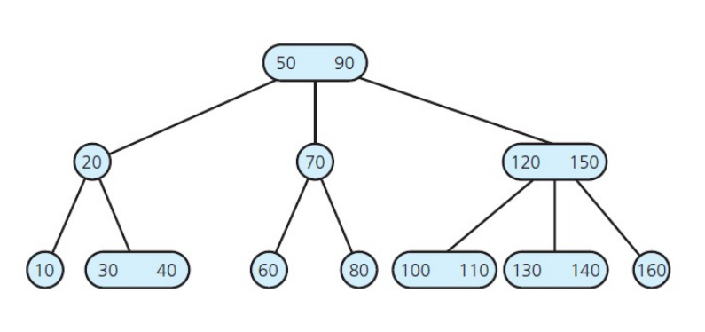

**Cây 2 - 3 - 4:**

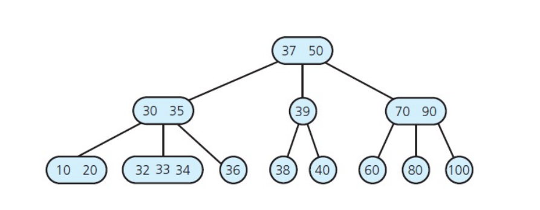

# Properties

- Một cây 2-3 không phải là cây nhị phân, tương tự với cây 2-3-4.
- **Một cây 2-3 và 2-3-4 không bao giờ lớn hơn chiều cao tối thiểu của cây nhị phân.**
  Ví dụ cho cây ở 2-3 trên, số khóa là 16 và chiều cao của nó là 3. Còn ở cây nhị phân, với số khóa là 16 thì chiều cao của nó tối thiểu là 5.
  Cây 2-3 và 2-3-4 tồn tại để giảm chiều cao của cây bằng cách tăng số lượng khóa có trên mỗi node trong cây. Từ đó giúp tiết kiệm chi phí tìm kiếm.
- **Các khóa tăng dần từ trái qua phải trong cùng một node và trong cây**, là một tính chất của Search Tree. Nói cách khác, mỗi khóa luôn tồn tại một cây con trái và cây con phải tạo thành một dạng cây tìm kiếm.
- **Cân bằng tuyệt đối**: các node lá có cùng mức với nhau hay tất cả các node rỗng cùng mức với nhau. Do vậy, khi tăng chiều cao của cây lên hay thêm vào cây một node nào đó, mức của các node lá cũng tăng lên một.
- **Không tồn tại cây 2-3-4-5** sở dĩ khi đó cây trở thành B-cây (B-Tree), là một dạng cây tổng quát hơn. Ở đây cây 2-3-4-5 gọi là B-cây bậc 5, với mỗi node có tối đa là 5 con. Tuy nhiên tính chất của B-cây là mỗi node có tối thiểu hai khóa. Như vậy chỉ tồn tại cây 3-4-5 chứ không có cây 2-3-4-5.
- Khi xây dựng cấu trúc dữ liệu trong máy tính, các node sẽ không chứa giá trị mà chỉ chứa địa chỉ của vùng nhớ, trỏ đến giá trị mà node đó chứa.
- Các cây có bậc thấp, chẳng hạn bậc 2 như BST, AVL hay cây 2 - 3 thì chúng được thiết kế để dùng ở bộ nhớ trong. Các cây bậc cao hơn như bậc 5 trở lên thì dùng ở bộ nhớ ngoài. Do đó B-tree là cây m phân dùng để tổ chức dữ liệu phục vụ cho việc truy xuất dữ liệu ở bộ nhớ ngoài. 

**Question**: Tại sao cần phải tăng số lượng khóa trên mỗi node?
**Question**: Với chiều cao H thì số node tối thiểu và tối đa của cây 2-3 hoặc 2-3-4 là bao nhiêu?
**Temp Answer**: Cây 2-3 hoặc 2-3-4 sẽ có số node tối thiểu khi nó là cây nhị phân hoàn hảo. Lúc đó số node với chiều cao H là:

$$
    min(N) = 2^{H - 1}
$$

Tương tự, cây 2-3-4 sẽ có số node tối đa nếu mọi node đều là node 4. Xét các trường hợp:

$$
\begin{align*}
H &= 1, N = 1\\
H &= 2, N = 4\\
H &= 3, N = 16\\
\end{align*}
$$

Tổng quát hóa cho cây 2-3-4 với chiều cao là H, thì

$$
    max(N) = 4^{h - 1}
$$

Tương tự cho cây 2-3 thì

$$
max(N) = 3^{H - 1}
$$

Như vậy ta có hai bất đẳng thức cho cây 2-3 và cây 2-3-4:

$$
\begin{align*}
    2^{H - 1} \leq N \leq 3^{H - 1}\\
    2^{H - 1} \leq N \leq 4^{H - 1}
\end{align*}
$$

# Why 2 - 3 Tree or 2 - 3 - 4 Tree ?

- Đơn giản để cân bằng.
- Truy cập phần tử dễ hơn cây nhị phân.
- Sử dụng trong phân cấp file hệ thống và cơ sở dữ liệu.

# Operation

## Insertion

Đối với thao tác thêm, ta luôn thêm khóa ở node lá. 

### Cây 2-3
Xét các trường hợp sau của cây 2 - 3:

#### Case 1: Chèn một khóa vào node có chỗ nhưng sai vị trí.
Giả sử ta cần chèn khóa 1 vào cây 2 - 3 ở trên, ta cần đẩy khóa 2 sang vị trí còn lại của node và thêm khóa 1 vào.

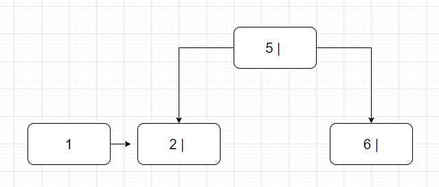

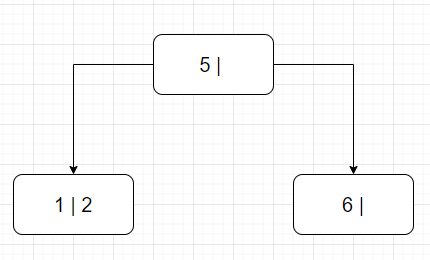

#### Case 2: Chèn vào node con có hai khóa khi node cha chỉ mới có một khóa.

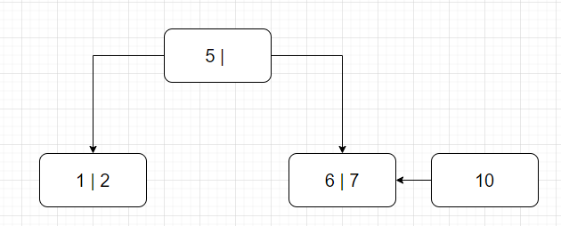

Ta đẩy khóa 7 lên trên.

Do node cha chỉ mới chứa một khóa là khóa 5, nên ta thêm khóa 7 lên node cha. Hai khóa 6 và 10 tạo thành hai node riêng biệt.

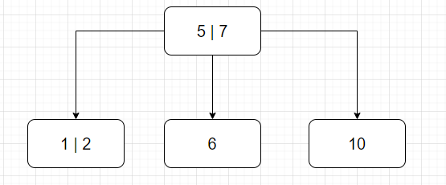

#### Case 3: Cả node con cần chèn và node cha đều có hai khóa.
Giả sử ta cần chèn node 1 vào cây 2 - 3 dưới đây:

Ta đẩy 2 lên node cha, và tách khóa 1 và khóa 4 thành hai node riêng biệt.

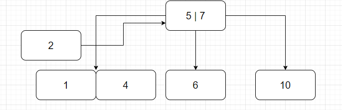

Có thể tạm cho node cha là một node 4 chứa ba khóa.

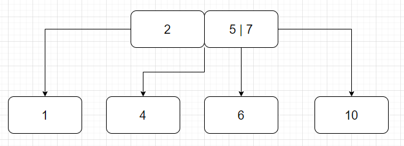

Sau đó ta đẩy khóa 5 lên tạo thành một node mới và tách khóa 2 cùng khóa 7 thành hai node riêng biệt.

### Cây 2-3-4

Đối với cây 2 - 3 - 4. Việc thêm node có đôi chút khác biệt khi mà phải tách node trước rồi mới thêm khóa. Đồng thời, việc tách node sẽ không giống với cây 2 - 3. 

Giả sử ta thêm 9 vào một node có 3 khóa như sau:

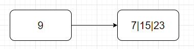

Ta sẽ tách trước, đẩy 15 lên thành một node cha, 7 và 23 thành hai node con. Sau đó cho khóa 9 vào chung node với khóa 7.

Một ví dụ khác, ta cần chèn 65 vào cây dưới đây:

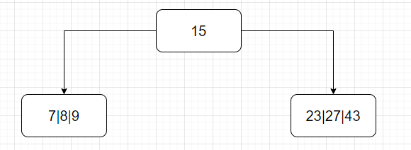

Đầu tiên, ta tách node 23|27|43 thành ba node gồm khóa 27 là khóa cha, nằm chung với khóa 15. Node 23 và 43 là hai node con. Sau đó ta thêm 65 vào chung node với khóa 43.

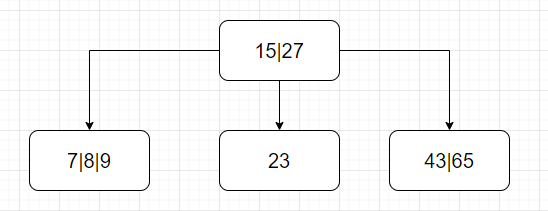

## Deletion

Một node ở trong cây 2 - 3 hoặc  2 - 3 - 4 nếu là node trong thì luôn luôn có hai con. Do đó muốn xóa node trong thì cần phải thực hiện hoán đổi cho phần tử Inorder Successor (Lớn nhất bên cây con trái) hay Preorder Predecessor (Nhỏ nhất bên cây con phải) rồi mới tiến hành xóa node trong đó.

Mà bởi vì các node trong luôn có hai cây con, việc tìm kiếm phần tử lớn nhất bên cây con trái và nhỏ nhất bên cây con phải có thể được thực hiện. Tuy nhiên các phần tử cần tìm kiếm này sẽ nằm ở node lá. Như vậy bản chất của việc xóa chính là xóa một node ở lá.

Xóa một khóa trong một node lá có hai trường hợp: node đó chỉ có một khóa và node đó có nhiều khóa. Khi node đó có một khóa, khi xóa đi thì cây trở nên mất cân bằng, do đó ta cần tái phân bố lại cây để cây cân bằng. Trong trường hợp node lá có nhiều khóa, chúng ta chỉ đơn giản là xóa khóa đó đi mà thôi.

### Case 1: Xóa và trộn

**Trường hợp này xảy ra khi các anh em của node bị xóa có vừa đủ khóa (không anh em nào bị dư).**
Giả sử ta cần xóa khóa 8 trong cây dưới đây

Sau khi xóa, node trở nên trống và không chứa giá trị nào và trở nên mất cân bằng.

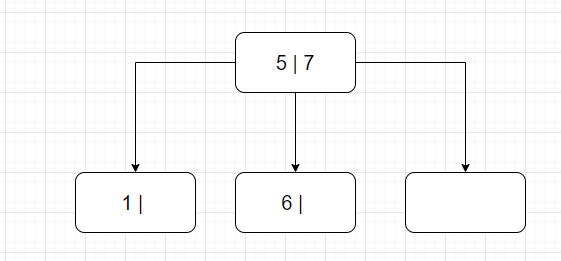

Ta cần trộn các khóa lại để tạo thành một node chứa khóa. Ở đây ta kéo khóa 7 xuống để gộp chung với khóa 6.

Cho ví dụ xóa khóa 70 trong cây 2 - 3. Đầu tiên ta tìm phần tử nhỏ nhất cây con phải hoặc lớn nhất cây con trái của 70. Ở đây ta chọn 80 và hoán vị 70 với 80. Sau đó ta tiến hành xóa 80 đi, cây trở nên mất cân bằng. 

Tuy nhiên do các anh em của nó vừa đủ không dư khóa, nên ta sẽ tiến hành trộn node bằng cách kéo khóa 80 xuống và hợp lại với khóa 60. Ngoài ra cũng có thể kéo 90 xuống và trộn với 100.

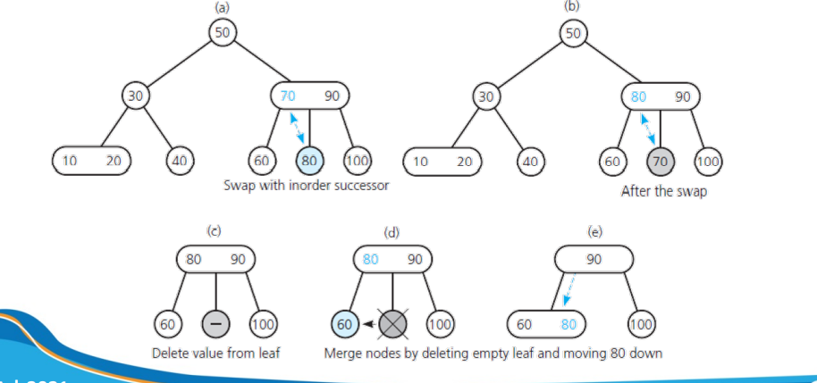

### Case 2: Mượn thêm khóa (hay tái phân bố).

**Trường hợp này xảy ra khi node anh em của node bị xóa dư khóa.**
Giả sử ta cần xóa khóa 6 ở cây bên dưới:

Sau khi xóa xong, node chứa khóa 6 trở thành rỗng. Lúc này ta sẽ mượn một khóa từ node khác để lấp vào node rỗng đó. Tuy nhiên ta không mượn trực tiếp mà sẽ kéo từ node cha xuống và đẩy khóa từ node anh em của nó lên.

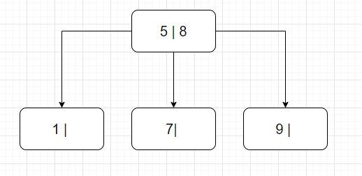

Cũng trong ví dụ xóa khóa 70 ở trên, giả sử bây giờ chúng ta tiến hành xóa khóa 100. Do là ở node lá nên ta cứ việc xóa mà không cần tìm phần tử thay thế. Sau khi xóa thì cây trở nên mất cân bằng. Nhận thấy anh em của nó dư dả khóa, ta chọn cách mượn thêm khóa (tái phân bố). 

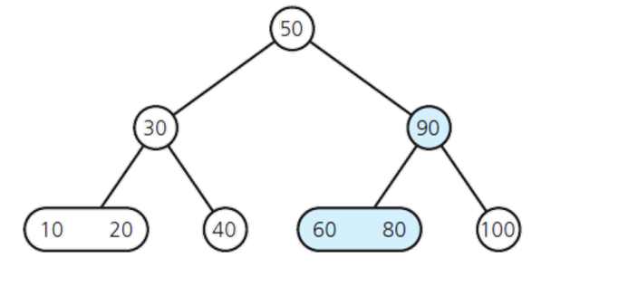

Chú ý rằng ta không thể trực tiếp đưa khóa cần mượn sang node trống, làm như vậy sẽ vi phạm tính chất của cây. Ta cần tái phân bố bằng cách đẩy khóa bị mượn lên cho node cha, rồi từ node cha đẩy xuống một khóa cho node trống

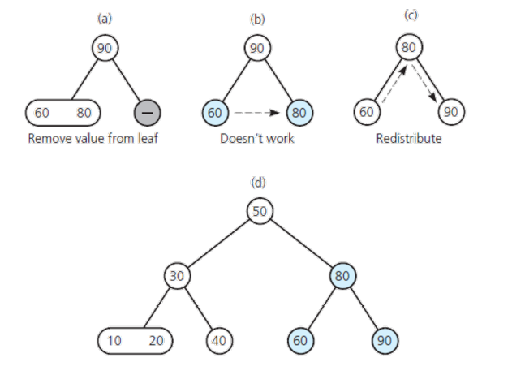

### Case 3: Xóa và cân bằng (Trường hợp khác của Case 2)
Giả sử ta xóa khóa 6 ở cây bên dưới. Sau khi xóa, node trở nên rỗng, thay vì vậy, ta sẽ tái phân bố cây để cây trở nên cân bằng bằng cách chuyển khóa 5 xuống và đẩy khóa 4 lên node ban đầu của khóa 5.

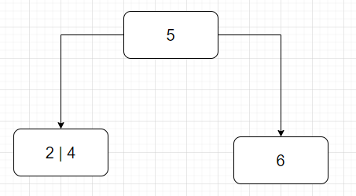

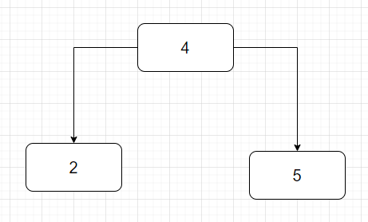

### Case 4: Cây có chứa cây con (Trường hợp đặc biệt của Case 3)
Giả sử cho cây bên dưới và ta muốn xóa node 5.

Thì như ví dụ ở case 4, ta sẽ chuyển khóa 3 lên và chuyển khóa 4 xuống. Lúc này khóa 2 chỉ có một giá trị nhưng lại có 3 con là T1, T2, T3. Ta sẽ chuyển cây con T3 sang thành con thứ nhất của node chứa khóa 4 và T4 thành con thứ hai của node chứa khóa 4.

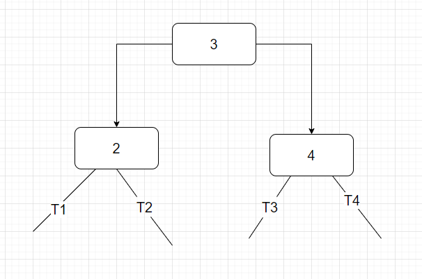

**Tương tự đối với merge các node.**

### Conclusion

Có thể tóm tắt các trường hợp như sau

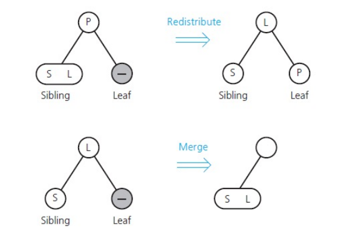

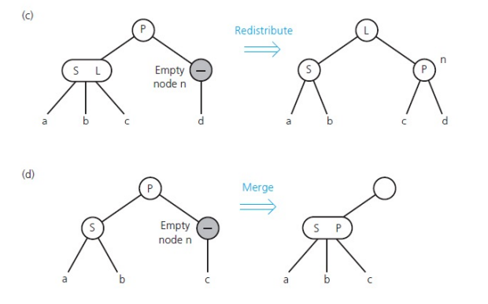

Ví dụ ta cần xóa node 80. Sau khi xóa thì cây trở nên mất cân bằng. Do node anh em của nó không dư nên tiến hành trộn 90 và 60 lại. Tuy nhiên lúc đó node của 90 hồi nãy lại bị trống. Mà node anh em của node đó lại không dư dả, nên ta phải trộn 50 và 30 lại. 

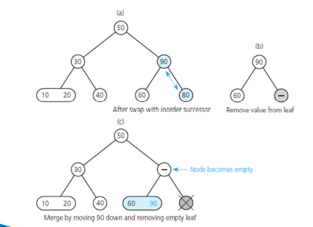

Việc này dẫn đến làm giảm chiều cao của cây.

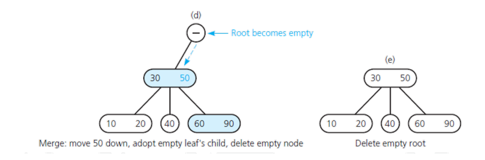

**Việc xóa node trong cây 2 - 3 - 4 cũng tương tự như cây  2 - 3.**

## Complexity

Độ phức tạp thuật toán của các thao tác là:
1. Độ phức tạp thời gian
    * Truy cập: $O(log_2n)$
    * Tìm kiếm: $O(log_2n)$
    * Thêm: $O(log_2n)$
    * Xóa: $O(log_2n)$
2. Độ phức tạp không gian: $O(n)$

