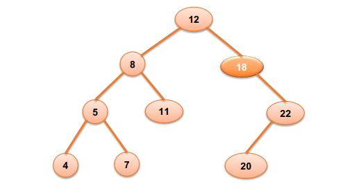

<link rel="stylesheet" href="../../main.css">
<div class="bg">
      <center><h1 class="bigtitle">AVL Tree</h1></center>
</div>

# Definition

Cây AVL là cây nhị phân tìm kiếm tự cân bằng có tính chất sau:

> Với mọi node, sự khác biệt chiều cao của cây con phải và cây con trái của node đó không vượt quá 1.

Nói cách khác, khi xét tại node i nào đó, nếu chênh lệch độ cao hai cây con của node đó là -1, 0 hoặc 1 thì node đó cân bằng. Các trường hợp còn lại đều là không cân bằng và cần được cân bằng.


Do tính chất cân bằng này mà chúng ta có thể kiểm soát chiều cao của cây (nhị phân) tìm kiếm tốt hơn, phục vụ cho các thao tác liên quan.

# Properties

Gọi `N` là số node và `H` là chiều cao của cây AVL, ta có:

- Nếu có $N$ node trong cây, chiều cao tối thiểu là
  $$
    H_{min} = int(log_2(n + 1))
  $$
- Nếu có $N$ node trong cây, chiều cao tối đa là
  $$
    H_{max} = log_2(n).\sqrt2
  $$
- Nếu chiều cao của cây AVL là $H$, thì số node tối đa mà cây có là
  $$
    N \leq 2^H - 1
  $$
- Nếu chiều cao của cây AVL là H, thì số node ít nhất của cây được biểu diễn như sau:
  $$
      N(H) = N(H - 1) + N(H - 2) + 1\ \textrm{với }  N > 2\\
      N(0) = 1\ \textrm{và } \ N(1) = 2
  $$

Ví dụ về cây AVL:


# Rotation

BST có hai thao tác quan trọng là xoay cây trái và phải. Nếu ta xoay cây theo chiều bất kỳ, rồi xoay cây theo chiều ngược lại, thì ta sẽ được một cây nhị phân tìm kiếm như ban đầu. Chẳng hạn nếu xoay trái, rồi xoay phải, cây sẽ không đối.

Thuật toán xoay cây là một thuật toán local, nó chỉ thao tác xung quanh một node nào đó và các node con của nó, chứ không ảnh hưởng đến parent hoặc sibling của nó. Vì tính chất này mà Rotation mới giữ được tính chất của BST sau khi xoay cây.

Để cân bằng cây AVL thì ta sử dụng các thuật toán xoay cây nhằm giảm chiều cao của cây nhưng vẫn duy trì được tính chất BST của cây.

## Left Rotation

Thuật toán xoay cây trái sẽ bắt đầu quanh một node nào đó. Chúng ta sẽ xét thêm cả node con phải của node đó. Ta gọi node đang xét là X, và node con phải là Y.


Nhiệm vụ của chúng ta là:

- Đẩy Y lên vị trí của X.
- X trở thành con trái của Y.
- Con trái của Y nếu có ($\beta$), sẽ là con phải của X. Vẫn duy trì được tính chất BST, do
  $$
  X < \beta < Y
  $ành - Con phải của Y ($\gamma$) và con trái của X ($\alpha$) không đổi.
  $$


> Điều kiện của phép xoay trái là node cần xoay phải có con phải.

**Code:**

```c++
void LR(NODE *&pRoot)
{
    // Lưu tạm con phải (Y)
    NODE *temp = pRoot->right;

    // Con phải của X là con trái của Y (beta)
    pRoot->right = temp->left;

    // Con trái của Y trở thành X
    temp->left = pRoot;

    // Y thành X
    pRoot = temp;
}
```

## Right Rotation

Để xoay phải cây ta cũng xét tương tự xoay trái tại một node nào đó. Và ta sẽ xét thêm node con trái của node cần xoay. Ta gọi node đang xét là X và node con trái là Y.


Tương tự phép xoay trái, ta cần:

- Đẩy X lên vị trí của Y.
- Y trở thành con phải của X.
- Con phải của X nếu có ($\alpha$) sẽ trở thành con trái của Y. Vẫn duy trì tính chất BST vì:
  $$
      X < \beta < Y
  $$
- Con trái của X ($\gamma$) và con phải của Y ($\alpha$) không đổi.


> Điều kiện của phép xoay phải là node cần xoay phải có con trái.

**Code:**

```c++
void RR(NODE *&pRoot)
{
    // Lưu tạm con trái (X)
    NODE *temp = pRoot->left;

    // Con trái của Y là con phải của X (beta)
    pRoot->left = temp->right;

    // Con trái của X thành Y
    temp->right = pRoot;

    // X thành Y
    pRoot = temp;
}
```

Độ phức tạp của các thuật toán xoay cây là $O(1)$.

# Unbalanced Cases

Các trường hợp mất cân bằng, gồm:

## Left left case


Để cân bằng cây, ta cần xoay phải tại node bị mất cân bằng, cụ thể là node 8.

## Right Right case


Ngược lại với trường hợp left left, ta chỉ cần xoay trái cây tại node bị mất cân bằng, cụ thể là node 18.

## Left Right case


Ta cần chuyển nó về trường hợp left left rồi xử lý theo trường hợp đó. Nói cách khác, xoay trái tại node con của node bị mất cân bằng. Rồi xoay phải tại node bị mất cân bằng. Cụ thể là xoay trái ở node 5 và xoay phải ở node 8.

## Right left case



Tương tự như left right, ta cần chuyển nó về trường hợp right right rồi xử lý theo trường hợp đó. Cụ thể là xoay phải ở node 22 để thành right right. Sau đó xoay trái ở node 18 để cân bằng.

## Examples

Cho ví dụ một cây nhị phân tìm kiếm dưới đây, ta thấy cây mất cân bằng ở node 32 theo trường hợp phải trái. Lý do là vì 32 có con phải bị lệch, và con phải đó lại bị lệch sang trái. Để cân bằng cây, đầu tiên ta xoay phải ở node 49 rồi tiến hành xoay trái ở node 32.


**Code cân bằng cây:**

```c++
void balanceTree(NODE *&pRoot)
{
    // Đếm chiều cao của các cây con
    int hl = Height(pRoot->left);
    int hr = Height(pRoot->right);
    int delta = hl - hr;

    // Lệch trái
    if (delta > 1)
    {
        // Lệch trái phải
        if (Height(pRoot->left->left) < Height(pRoot->left->right))
        {
            LR(pRoot->left);
        }
        RR(pRoot);
    }
    else if (delta < -1)
    {
        // Lệch phải trái
        if (Height(pRoot->right->right) < Height(pRoot->right->left))
        {
            RR(pRoot->right);
        }
        LR(pRoot);
    }
}
```
# Operation

Thao tác thêm các node vào cây AVL tương tự như BST, nhưng có thể dẫn đến mất cân bằng. Vì vậy, sau khi thêm một node, ta cần kiểm tra cây AVL đã cân bằng hay chưa, nếu chưa thì cần cân bằng. Tương tự với thao tác xóa.


Để viết code cho thuật toán thêm và xóa node trong cây AVL, ta chỉ cần tận dụng hàm thêm và xóa cây BST rồi gọi hàm cân bằng sau khi thêm hoặc xóa.

## Insert

```c++
void Insert(NODE *&pRoot, int x)
{
    if (pRoot == nullptr)
        pRoot = createNode(x);

    if (x < pRoot->key)
    {
        Insert(pRoot->left, x);
    }

    else if (x > pRoot->key)
    {
        Insert(pRoot->right, x);
    }
    else
    {
        return;
    }

    // Do sử dụng đệ quy nên khi giải phóng Stack, các node cha trên đường đi đến node vừa Insert cũng sẽ được kiểm tra cân bằng.
    balanceTree(pRoot);
}
```

Với thao tác xóa thì cần lược bỏ trường hợp node rỗng không cần cân bằng.

## Remove

```c++
void Remove(NODE *&pRoot, int x)
{
    if (pRoot == nullptr)
        return;

    if (x < pRoot->key)
        Remove(pRoot->left, x);
    else if (x > pRoot->key)
        Remove(pRoot->right, x);
    else
    {
        // Trường hợp có không hoặc một con xử lý đồng thời
        if (pRoot->left == nullptr)
        {
            pRoot = pRoot->right;
        }
        else if (pRoot->right == nullptr)
        {
            pRoot = pRoot->left;
        }

        // Trường hợp có hai con
        else
        {
            // Tìm node cha của thế mạng
            NODE *move = pRoot;
            NODE *parent = searchRightMin(move);

            // Ghi đè giá trị
            pRoot->key = move->key;

            // Xóa node con thế mạng
            if (parent->left == move)
            {
                temp = parent->left;
                parent->left = nullptr;
            }
            else if (parent->right == move)
            {
                temp = parent->right;
                parent->right = nullptr;
            }
            delete temp;
        }
    }

    // Do tính chất đệ quy nên các node cha trên đường đến node con vừa xóa cũng sẽ được kiểm tra cân bằng.
    if(root != nullptr)
        balance(root);
}
```

## Complexity

Các thao tác thêm, xóa và tìm kiếm trong AVL có độ phức tạp là $O(log_2(n))$ và không rơi vào trường hợp xấu nhất do tính chất tự cân bằng của cây.

Độ phức tạp của quá trình cân bằng là $O(1)$, bởi vì chỉ thực hiện tối đa là hai lần xoay cây và sử dụng các phép gán con trỏ.

Có một sự đánh đổi là khi ta cần tìm kiếm nhiều lần, ta chấp nhận xây dựng cây AVL. Tức là tùy mục đích sử dụng mà ta chấp nhận chi phí để Insert và cân bằng để xây dựng cây.

Thao tác duyệt cây thì vẫn cần độ phức tạp là $O(n)$.
## Example 1

Giả sử ta cần thêm các node dưới đây vào cây AVL.


Ta sẽ thêm **node 9** là node gốc, sau đó thêm **node 1** là con trái của **node 9**, **node 4** là con phải của **node 1**. Cây trở nên mất cân bằng tại **node 9** theo trường hợp trái phải.


Ta cân bằng cây bằng cách xoay trái tại **node 1** và xoay phải ở **node 9**.

Sau đó, ta thêm vào cây **node 2** là con phải của **node 1**, **node 3** là con phải của **node 2**. 

Lúc này cây mất cân bằng ở **node 4** theo kiểu trái phải, hoặc cây mất cân bằng ở **node 1** theo kiểu phải phải. Ta chọn xử lý trường hợp mất cân bằng kiểu phải phải. 

Bởi vì khi xét từ khía cạnh thêm node vào cây AVL, **node 1** là node gần node lá nhất, gần nơi mà chúng ta cần thêm node. Do đó ta cần cân bằng ở đó trước. Ta xoay trái ở **node 1** để cân bằng cây.


Tiếp theo ta thêm vào cây **node 5** và **node 8**, bỏ qua **node 9** vì bị trùng. Cây trở nên mất cân bằng tại **node 9** theo kiểu trái phải. Xử lý bằng cách xoay trái ở **node 5** và xoay phải ở **node 9**.


Tiếp tục thêm **node 6**, **node 7** và bỏ qua **node 4**, cây mất cân bằng tại **node 5**. Tái cân bằng bằng cách xoay trái ở **node 5** vì đây là trường hợp phải phải.


## Example 2

Dưới đây là một ví dụ không tốt cho cây AVL. Bởi vì trong thực tế các cây AVL không thể có độ lệch hai cây con của một node là 3 (**node 8**). Vì khi độ lệch là 2 thì cây AVL đã tự cân bằng.


# Is AVL?

Để kiểm tra một cây có phải là cây AVL hay không thì chúng ta tiến hành kiểm tra sự chênh lệch chiều cao giữa hai cây con của từng node.

**Code:**

```c++
bool isAVL(NODE *pRoot)
{
    if (pRoot != nullptr)
    {
        // Tính chiều cao của hai cây con
        int hl = Height(pRoot->left);
        int hr = Height(pRoot->right);
        int delta = hl - hr;

        // Vi phạm AVL
        if (delta > 1 || delta < -1)
            return false;
        
        // Duyệt đến hai cây con
        return isAVL(pRoot->left) && isAVL(pRoot->right);
    }
    else
        return true;
}
```
