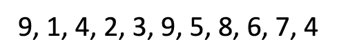

# Definition
Cây AVL là cây nhị phân tìm kiếm tự cân bằng có tính chất sau:
**Với mọi node, sự khác biệt chiều cao của cây con phải và cây con trái của node đó không vượt quá 1.** Do tính chất cân bằng này (có thể có một số dạng cây cân bằng khác) mà chúng ta có thể kiểm soát chiều cao của cây nhị phân tìm kiếm tốt hơn, phục vụ cho các thao tác liên quan.

Nói cách khác, khi xét tại node i nào đó, nếu chênh lệch độ cao  hai cây con của node đó là -1, 0 hoặc 1 thì node đó cân bằng. Các trường hợp còn lại đều là không cân bằng và cần được cân bằng.

<center>

</center>

# Properties
Cây AVL có các tính chất sau:
* Duy trì được chiều cao của cây ở mức tối thiểu, nhưng không phải luôn luôn như vậy.
* Sau khi Insert hoặc Delete, cần phải kiểm tra và tái cân bằng cây nếu cần thiết.
* Có thể search phần tử bằng cây AVL hiệu quả như cây nhị phân tìm kiếm có chiều cao tối thiểu.

# Relationship
Gọi N là số node và H là chiều cao của cây AVL, ta có:
* Nếu có N node trong cây, chiều cao tối thiểu là 
$$ 
    floor(log_2n)
$$
* Nếu có N node trong cây, chiều cao tối đa không vượt quá 
$$
    \sqrt2 * log_2n
$$
* Nếu chiều cao của cây AVL là H, thì số node tối đa mà cây có là 
$$
    2^{H + 1} - 1
$$
* Nếu chiều cao của cây AVL là H, thì số node ít nhất của cây được biểu diễn như sau:
$$
    N(H) = N(H - 1) + N(H - 2) + 1\ \textrm{với }  n > 2\\
    N(0) = 1\ \textrm{và } \ N(1) = 2
$$

Ví dụ về cây AVL:
<center>

</center>

# Rotation

Thuật toán xoay cây là

BST có hai thao tác quan trọng là xoay cây trái và phải. Nếu ta xoay cây theo chiều bất kỳ, rồi xoay cây theo chiều ngược lại, thì ta sẽ được một cây nhị phân tìm kiếm như ban đầu. Chẳng hạn nếu xoay trái, rồi xoay phải, cây sẽ không đối.

Thuật toán xoay cây là một thuật toán local, nó chỉ thao tác xung quanh một node nào đó và các node con của nó, chứ không ảnh hưởng đến parent hoặc sibling của nó. Vì tính chất này mà Rotation mới giữ được tính chất của BST sau khi xoay cây.

## Left Rotation

Thuật toán xoay cây trái sẽ bắt đầu quanh một node nào đó. Chúng ta sẽ xét thêm cả node con phải của node đó. Ta gọi node đang xét là A, và node con phải là B.

Đầu tiên, ta thay A bằng B, và A thành con trái của B. Điều này vẫn giúp chúng ta maintain được tính chất của BST. Tiếp theo, con trái của A thì vẫn là con trái của A. Con phải của B vẫn là con phải của B. Hai cây/node con này vẫn nằm ở vị trí mà nó vốn có, không vi phạm tính chất của BST. Tuy nhiên vẫn còn một con nữa chưa sắp, đó là con trái của B, gọi là C. Node này có giá trị lớn hơn A và bé hơn B.
Tức là A $<$ C $<$ B.

Do nó lớn hơn A, ta đặt nó là con phải của A trong phép xoay cây ở trên.

> Điều kiện của phép xoay trái là node cần xoay phải có con phải.


**Code:**

```c++
void LR(NODE *&pRoot)
{
    NODE *temp = pRoot->right;
    pRoot->right = temp->left;
    temp->left = pRoot;
    pRoot = temp;
}
```

## Right Rotation

Để xoay phải cây ta cũng xét tương tự xoay trái tại một node nào đó. Và ta sẽ xét thêm node con trái của node cần xoay. Ta gọi node đang xét là A và node con trái là B.

Tương tự xoay trái, ta thay A bằng B. Con trái của A vẫn là con trái của A, con phải của B vẫn là con phải của B. Tuy nhiên con phải của A sẽ trở thành con trái của B. Tức là T2 trong hình sẽ thành con trái của B.

> Điều kiện của phép xoay phải là node cần xoay phải có con trái.


**Code:**

```c++
void RR(NODE *&pRoot)
{
    NODE *temp = pRoot->left;
    pRoot->left = temp->right;
    temp->right = pRoot;
    pRoot = temp;
}
```

Độ phức tạp của các thuật toán xoay cây là $O(1)$.


# Unbalanced Cases

## Left left case
<center>

</center>

Để cân bằng cây, ta cần xoay phải tại node bị mất cân bằng, cụ thể là node 8.

## Right Right case
<center>

</center>

Ngược lại với trường hợp left left, ta chỉ cần xoay trái cây tại node bị mất cân bằng, cụ thể là node 18.

## Left Right case
<center>

</center>

Ta cần chuyển nó về trường hợp left left rồi xử lý theo trường hợp đó. Nói cách khác, xoay trái tại node con của node bị mất cân bằng. Rồi xoay phải tại node bị mất cân bằng. Cụ thể là xoay trái ở node 5 và xoay phải ở node 8.

## Right left case
<center>

</center>

Tương tự như left right, ta cần chuyển nó về trường hợp right right rồi xử lý theo trường hợp đó. Cụ thể là xoay phải ở node 22 để thành right right. Sau đó xoay trái ở node 18 để cân bằng. 


## Examples
Cho ví dụ một cây nhị phân tìm kiếm dưới đây, ta thấy được cây mất cân bằng ở node 32 theo trường hợp phải trái. Lý do là vì 32 có con phải bị lệch, và con phải đó lại bị lệch sang trái. Để cân bằng cây, đầu tiên ta xoay phải ở node 49 rồi tiến hành xoay trái ở node 32.

<center>

</center>


**Code cân bằng cây:**

```c++
void balanceTree(NODE *&pRoot)
{
    int hl = Height(pRoot->left);
    int hr = Height(pRoot->right);
    int delta = hl - hr;

    //lech trai
    if (delta > 1)
    {
        if (Height(pRoot->left->left) < Height(pRoot->left->right))
        {
            LR(pRoot->left);//Tái sử dụng các hàm xoay cây
        }
        RR(pRoot);
    }
    else if (delta < -1)
    {
        if (Height(pRoot->right->right) < Height(pRoot->right->left))
        {
            RR(pRoot->right);
        }
        LR(pRoot);
    }
    else
    {
    }
}
```


# Search and Traversal

Tương tự như BST.
# Insertion and Deletion

Thao tác thêm các node vào cây AVL tương tự như BST, nhưng có thể dẫn đến mất cân bằng. Vì vậy, sau khi thêm một node, ta cần kiểm tra cây AVL đã cân bằng hay chưa, nếu chưa thì cần cân bằng. Tương tự với thao tác xóa. Dẫn đến, mỗi lần thực hiện thao tác thêm hoặc xóa thì ta cần tốn chi phí $O(1)$ rất thấp để kiểm tra cây có cân bằng hay không. 

Nói cách khác, các thao tác Insert, Delete và Search trong AVL có độ phức tạp là $O(log_2n)$.

**Độ phức tạp của quá trình cân bằng là $O(1)$, bởi vì chỉ thực hiện tối đa là hai lần xoay cây**. Có một cái trade off là khi ta cần tìm kiếm nhiều lần, ta chấp nhận xây dựng cây AVL. Tức là tùy mục đích sử dụng mà ta chấp nhận chi phí để insert và cân bằng để xây dựng cây.

## Example 1
Giả sử ta cần thêm các node dưới đây vào cây AVL.
<center>

</center>

Ta sẽ thêm **node 9** là node gốc, sau đó thêm **node 1** là con trái của **node 9**, **node 4** là con phải của **node 1**. Cây trở nên mất cân bằng tại **node 9** theo trường hợp trái phải. 

<center>

</center>

Ta cân bằng cây bằng cách xoay trái tại **node 1** và xoay phải ở **node 9**.

Sau đó, ta thêm vào cây **node 2** là con phải của **node 1**, **node 3** là con phải của **node 2**. Lúc này cây mất cân bằng ở **node 4** theo kiểu trái phải, hoặc cây mất cân bằng ở **node 1** theo kiểu phải phải. Ta chọn xử lý trường hợp mất cân bằng kiểu phải phải. Bởi vì khi xét từ khía cạnh thêm node vào cây AVL, **node 1** là node gần node lá nhất, gần nơi mà chúng ta cần thêm node. Do đó ta cần cân bằng ở đó trước. Ta xoay trái ở **node 1** để cân bằng cây.

<center>

</center>

Tiếp theo ta thêm vào cây **node 5** và **node 8**, bỏ qua **node 9** vì bị trùng. Cây trở nên mất cân bằng tại **node 9** theo kiểu trái phải. Xử lý bằng cách xoay trái ở **node 5** và xoay phải ở **node 9**.

<center>

</center>

Tiếp tục thêm **node 6**, **node 7** và bỏ qua **node 4**, cây mất cân bằng tại **node 5**. Tái cân bằng bằng cách xoay trái ở **node 5** vì đây là trường hợp phải phải.

<center>

</center>

## Example 2
Dưới đây là một ví dụ không tốt cho cây AVL. Bởi vì trong thực tế các cây AVL không thể có độ lệch hai cây con của một node là 3 (**node 8**). Vì khi độ lệch là 2 thì cây AVL đã tự cân bằng.
<center>

</center>

Để viết code cho thuật toán thêm và xóa node trong cây AVl, ta chỉ cần tận dụng hàm thêm và xóa cây BST rồi gọi hàm cân bằng sau khi thêm hoặc xóa.

**Code Insert:**

```c++
void Insert(NODE *&pRoot, int x)
{
    if (pRoot == nullptr)
        pRoot = createNode(x);

    if (x < pRoot->key)
    {
        Insert(pRoot->left, x);
    }

    else if (x > pRoot->key)
    {
        Insert(pRoot->right, x);
    }
    else
    {
        return;
    }

    balanceTree(pRoot);
}
```
Với thao tác xóa thì cần xét trường hợp node đó rỗng thì không cần xóa.

**Code delete:**
```c++
NODE *searchRightMin(NODE *&curr)
{
    NODE *parent = curr;
    //search in right subtree
    curr = curr->right;
    while (curr->left != nullptr)
    {
        parent = curr; //parent be prev root
        curr = curr->left;
    }
    return parent;
}

void Remove(NODE *&pRoot, int x)
{
    if (pRoot == nullptr)
        return;

    if (x < pRoot->key)
        Remove(pRoot->left, x);
    else if (x > pRoot->key)
        Remove(pRoot->right, x);
    else
    {
        NODE *temp = pRoot;
        //zero and one children
        if (pRoot->left == nullptr)
        {
            pRoot = pRoot->right;
        }
        else if (pRoot->right == nullptr)
        {
            pRoot = pRoot->left;
        }
        //two children
        else
        {
            //search for IS
            NODE *move = pRoot;
            NODE *parent = searchRightMin(move);
            //overwrite on root
            pRoot->key = move->key;
            //delete old IS
            if (parent->left == move)
            {
                temp = parent->left;
                parent->left = nullptr;
            }
            else if (parent->right == move)
            {
                temp = parent->right;
                parent->right = nullptr;
            }
        }
        delete temp;
    }
    if (pRoot != nullptr)
        balanceTree(pRoot);
}
```
# Is AVL?

Để kiểm tra một cây có phải là cây AVL hay không thì chúng ta tiến hành kiểm tra sự chênh lệch chiều cao giữa hai cây con của từng node.

**Code:**

```c++
bool isAVL(NODE *pRoot)
{
    if (pRoot != nullptr)
    {
        int hl = Height(pRoot->left);
        int hr = Height(pRoot->right);
        int delta = hl - hr;

        if (delta > 1 || delta < -1)
            return false;
        return isAVL(pRoot->left) && isAVL(pRoot->right);
    }
    else
    {
        return true;
    }
}
```