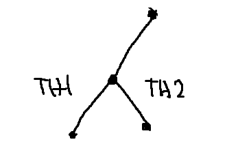
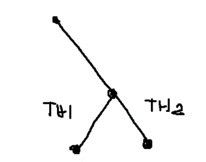
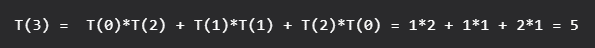
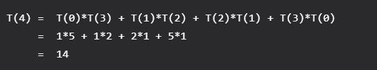
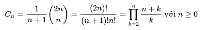
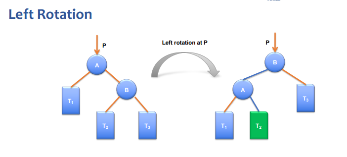
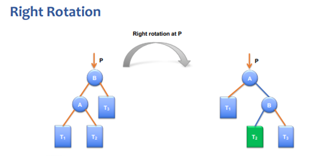
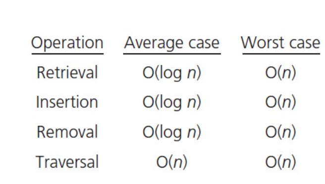

# Tree

Khái niệm về cây tương tự như cây có gốc ở toán tổ hợp. Ở đó, một node nằm ở vị trí gốc, các node còn lại được phân ra ở các mức. Ở node gốc là mức 1, tăng dần lên các mức phía dưới. Cây là một cấu trúc dữ liệu có trật tự, khác với tuyến tính như mảng và Linked List.

<center>
    
</center>

## Some definitions

**Bậc của một node** là số cây con của node đó. Degree và order trong cây là như nhau, đều chỉ số node con mà node đó có.

**Bậc của một cây** là bậc lớn nhất trong số các bậc của node.

Node gốc là node không có node cha, và node lá là node không có node con (bậc bằng 0).

**Chiều cao của cây** là số mức lớn nhất mà cây có được (định nghĩa của toán tổ hợp).

**Chiều cao của cây** khác rỗng tối thiểu là 1, để phân biệt trường hợp cây rỗng thì height là 0.

**Chiều cao của node** là số node trên đường đi dài nhất từ node gốc (node đang xét, không phải root) đến node lá. Có thể dùng cách khác để xác định: chiều cao của node là chiều cao lớn nhất của cây con mà nó có.

**Chiều cao của node lá** là 1, của cây rỗng là 0.

**Depth và level** là tương đồng.

## Properties

Cấu trúc cây là cấu trúc có tốc độ truy cập và tìm kiếm nhanh hơn Linked List nhưng chậm hơn Array. Nó còn cung cấp cho ta việc thêm và xóa các node nhanh hơn mảng và chậm hơn danh sách liên kết chưa sắp xếp. Bên cạnh đó, cấu trúc này không giới hạn số lượng phần tử như mảng.

Trong cây k – phân khi mọi node có 0 hoặc k con , thì ta có phương trình sau:

$$
L = (k\ –\ 1)*I + 1
$$

Với L là số node lá và I là số node trong (node có k con).

# Binary Tree

Là cây mà mỗi node có tối đa 2 con (bậc tối đa là 2) và các node không được trùng nhau.

<center>
    
</center>

Ứng dụng:

- Cây tổ chức thi đấu.
- Cây biểu thức số học.
- Lưu trữ và tìm kiếm thông tin.

## General

### Properties

Ta gọi số node là N, chiều cao là H, L là số node lá và I là mức.

**Số node ở mức I** bé hơn hoặc bằng $2^I - 1$

$$
N \leq 2^{I - 1}
$$

**Số node tối đa** trong cây là 2H – 1 (nhiều nhất khi là cây nhị phân hoàn hảo)

$$
N \leq 2^{H – 1}
$$

**Số node ít nhất** khi cây đó là một cây thẳng (suy biến) (như DSLK), cây có chiều cao H thì số node cũng là

$$
N = H
$$

**Chiều cao của cây lớn nhất** trong trường hợp cây thẳng (suy thoái) (như DSLK) với N node là

$$
H = N
$$

**Chiều cao của cây tối thiểu** là $log_2(N\ +\ 1)$ với n là số node trong cây.

$$
H \geq log_2(N\ +\ 1)
$$

Một cây nhị phân với **L lá** có **ít nhất $log_2(L) + 1$ mức**.

$$
I \geq log_2(L) + 1
$$

Trong cây nhị phân với mỗi node có 0 hoặc 2 con (cây nhị phân đầy đủ), số node không có con luôn lớn hơn một node so với số node có hai con. Ta gọi số node có hai con là T, số node không có con (node lá) là L.

$$
L = T + 1
$$

Tính chất này có thể chứng minh bằng bổ đề bắt tay (Handshaking Lemma), là một bổ đề nói rằng tổng số bậc của đồ thị bằng hai lần số cạnh.

### Enumerate of Binary Trees

Nếu ta xét một cây nhị phân T, gọi T(n) là số node trong cây nhị phân đó. Bài toán tìm số cây nhị phân có thể có tạo thành n node được cho các điều kiện ban đầu như sau:

<center>
    
</center>

Tức là
T(0) = 1 (chỉ có duy nhất một cây rỗng)
T(1) = 1
T(2) = 2

Để tính T(3), ta thực hiện một bài toán đếm đơn giản. Ta xét số con ở cây trái, do n = 3, nên số con cao nhất là 2. Có hai trường hợp: có 2 con hoặc có 1 con.

Với trường hợp số con bên trái là 1 và con bên phải là 0, có hai cách chọn con tiếp theo cho nhánh này, hoặc là con trái hoặc là con phải. Tương tự cây con bên phải cũng có hai trường hợp.

<center>
    
</center>

<center>
    
</center>

Với trường hợp số con bên trái và bên phải là 1, tức là cây không có mức 3. Thì vẫn tạo nên một cây.

Vậy có 5 cách để tạo cây từ n node với n = 3.

Viết lại dưới dạng công thức:

<center>
    
</center>

Tương tự cho T(4):

<center>
    
</center>

Đây là một dãy số đặc biệt có tên là dãy Catalan. Công thức để tính số Catalan thứ n là:

<center>
    
</center>

Dãy số này có thể dùng đệ quy để tính toán.

Vậy ta rút ra từ công thức ở trên cách tính T(n) tổng quát là:

<center>
    
</center>

Vì vậy, số loại cây có thể lập nên từ n node là T(n) ở trên.

### Classification

**Full Binary Tree** – cây nhị phân đầy đủ. Là một cây nhị phân mà các node trong luôn có bậc là 2. Tức là nếu node đó có node con, thì phải có đầy đủ 2 node con. Nói cách khác, số bậc của các node sẽ là 0 hoặc là 2.

<center>
    
</center>

**Perfect Binary Tree** – cây nhị phân hoàn hảo: là một cây nhị phân mà các node lá của nó cùng nằm trên một mức.

<center>
    
</center>

_Perfect Binary Tree là một Full Binary Tree và cũng là một Complete Binary Tree._

Có thể tính số node dựa vào chiều cao và tính chiều cao dựa vào số node. Nếu cây có chiều cao h, tổng số node của cây sẽ là:

$$
N = 2^H – 1
$$

Ngược lại, khi biết tổng số node của cây nhị phân hoàn hảo, ta có thể lấy log2 để tìm được độ cao của cây. Do đó độ cao của cây sẽ là:

$$
H = log_2(N + 1) = log_2(N)
$$

**Complete Binary Tree** – cây nhị phân hoàn chỉnh: là cây nhị phân mà mọi mức đều được lấp đầy, trừ mức cuối. Tất cả các nốt lá của mức cuối dồn hết qua bên trái hết mức có thể

<center>
    
</center>

Cấu trúc Heap chính là một ứng dụng của CBT (cây nhị phân hoàn chỉnh). Có hai dạng là Max Heap và Min Heap.

**Max Heap** là cây nhị phân mà ở đó mỗi node đều lớn hơn các node con của nó (node con trực tiếp, không phải hậu duệ).

**Min Heap** là ngược lại, mỗi node luôn bé hơn các node con của nó.

Khi nói về cấu trúc Heap, chúng ta nói về ứng dụng của nó trong Heap Sort. Ở trong Heap Sort, phần Heapify (vun đống) chính là phần mấu chốt và phức tạp nhất. Để vun đống một node sau khi swap root và phần tử cuối, chúng ta tốn một lượng các bước đi bằng chiều cao của node đó. Mà ở đây ta luôn vun đống ở node gốc, nên có thể nói khi thực hiện vun đống, ta phải thực hiện H bước, với H là chiều cao của cây.

Mà ở trên ta đã có chiều cao của cây (xét với nhánh bên trái), chính là

$$
H = log_2(N + 1) = log_2(N)
$$

Suy ra thuật toán vun đống của chúng ta sẽ có độ phức tạp là $O(log_2(n))$.

Trong tất cả các BT có N node, thì CBT là cây có chiều cao thấp nhất.

Balanced Binary Tree – Cây nhị phân cân bằng là cây nhị phân mà chiều cao của nó luôn duy trì là $O(log_2(n))$.

## Implementation

### Tree Representation

Chúng ta có thể biểu diễn cây theo cách tường minh. Tức là một nút sẽ lưu giữ giá trị của bản thân nó đồng thời lưu giữ các con trỏ trỏ đến các nút con.

<center>
    
</center>

Xây dựng code:

```c++
struct node{
    int key;
    node* pFirstChild;
    node* pSecondChild;
    node* pThirdChild;
    ...
};
```

Hoặc cấp phát sẵn một mảng các con trỏ với số lượng cố định.

```c++
#define N 10

struct node{
    int key;
    node* child[N];
};
```

Cách này có một hạn chế là chúng ta luôn phải tạo ra các con trỏ đủ số lượng theo dạng cây của nó. Ví dụ nếu là cây tam phân, mỗi node sẽ phải có ba con trỏ, mặc dù vậy, các con trỏ này có thể không được sử dụng.

Để giải quyết vấn đề lãng phí này, ta có thể xây dựng cấu trúc cây với các node như sau:

<center>
    
</center>

```c++
struct node{
    int key;
    node* eldestChild;
    node* nextSibling;
};
```

Tức là một node luôn chỉ có hai con trỏ, bất kể là cây nhị phân hay k – phân. Con trỏ đầu tiên trỏ đến con đầu tiên của node đó, con trỏ thứ hai sẽ trỏ đến anh em kế tiếp cùng mức với node đó.

### Binary Tree Structure

```c++
struct NODE{
    int key;
    NODE* left;
    NODE* right;
};
```

### Binary Tree Traversal

Duyệt cây là đi qua tất cả các node, mỗi node một lần.

Có ba phép duyệt cây là:

- **Pre-order** (Duyệt trước)
- **In-order** (Duyệt giữa)
- **Post-order** (Duyệt sau)

Duyệt trước là thăm (visit) node gốc trước, sau đó tới các node con từ trái sang phải.

Duyệt sau là thăm cái node con từ trái sang phải trước, rồi mới tới node gốc.

Duyệt giữa là thứ tự thăm node gốc không phải đầu cũng không phải cuối. Tức là sau khi duyệt con đầu tiên, ta mới duyệt đến node gốc, rồi duyệt tiếp các con còn lại. Nếu không tồn tại node con đầu tiên, thì ta node gốc mới ở vị trí đầu tiên trong danh sách kết quả, mặc dù thứ tự duyệt của nó là thứ 2.

Kết quả duyệt giữa của Search Tree (không chỉ có BST – Binary Search Tree) sẽ có dạng dãy số được sắp xếp tăng dần.

Chẳng hạn ta có cây như hình dưới.

**Duyệt trước** : 2-7-2-6-5-11-5-9-4

**Duyệt giữa** : 2-7-5-6-11-2-5-4-9

**Duyệt sau** : 2-5-11-6-7-2-5-4-9

<center>
    
</center>

Ngoài ra còn có một cách duyệt khác là duyệt theo mức (Level Order Traveral). Chúng ta duyệt cây bằng cách duyệt theo thứ tự từ trên xuống, từ trái qua. Ở cây trên, kết quả sau khi duyệt là:

$$
2 – 7 – 5 – 2 – 6 – 9 – 5 – 11 – 4
$$

Xây dựng các hàm duyệt cây:

**Tiền thứ tự**

```c++
void PreTraversal(node *root)
{
    if (root == nullptr)
    {
        return;
    }

    //!Xử lý root tùy theo nhu cầu
    PreTraversal(root->pLeft);
    PreTraversal(root->pRight);
}
```

**Trung thứ tự**

```c++
void inTraversal(node *root)
{
    if (root == nullptr)
    {
        return;
    }

    preTraversal(root->pLeft);
    //!Xử lý root tùy theo nhu cầu
    preTraversal(root->pRight);
}
```

**Hậu thứ tự**

```c++
void postTraversal(node *root)
{
    if (root == nullptr)
    {
        return;
    }

    preTraversal(root->pLeft);
    preTraversal(root->pRight);
    //Xử lý root tùy theo nhu cầu
}
```

### Counting

**Đếm số node trong cây**

```c++
int countNode(NODE *pRoot)
{
    //base case
    if (pRoot == nullptr)
        return 0;

    //counting nodes of subtree
    return 1 + countNode(pRoot->left) + countNode(pRoot->right);
}
```

**Đếm số node lá trong cây**

```c++
int countLeaf(NODE *pRoot)
{
    if (pRoot == nullptr)
        return 0;
    if (pRoot->left == pRoot->right)
        return 1;
    return countLeaf(pRoot->left) + countLeaf(pRoot->right);
}
```

**Đo chiều cao của cây**

```c++
int height(NODE *pRoot)
{
    //base case
    if (pRoot == nullptr)
        return 0;
    //compare subtree's height
    int leftHeight = Height(pRoot->left);
    int rightHeight = Height(pRoot->right);
    if (leftHeight > rightHeight)
        return 1 + leftHeight;
    else
        return 1 + rightHeight;
}
```

# Binary Search Tree

## General

Cây tìm kiếm:

Cây nhị phân tìm kiếm là cây có các tính chất sau:

- Node con trái của một node n bất kỳ luôn có khóa nhỏ hơn node n đó.
- Node con phải của một node n bất kỳ luôn có khóa lớn hơn node n đó.
- Node con trái và phải của node bất kỳ, nếu là một cây nhị phân, thì cây đó cũng phải là cây nhị phân tìm kiếm (thỏa hai tính chất trên). Và mọi key của cả cây con trái, sẽ bé hơn root, cũng như mọi key của cả cây con phải sẽ lớn hơn root.

Ngoài ra, nó còn là một Full Binary Tree.

Không được có hai node có khóa trùng nhau. (Giống như là khóa chính trong SQL, chúng là unique và có thể có nhiều trường).

Cây nhị phân tìm kiếm phụ thuộc vào dữ liệu đầu vào, nếu như dữ liệu ấy là xấu thì sẽ dẫn đến các operation thực hiện trên nó sẽ có chi phí cao.

<center>
    
</center>

Do nó được sắp xếp theo thứ tự như vậy mà các công việc như tìm kiếm, tìm max, min được thực hiện nhanh chóng hơn trong đa số các trường hợp. Nếu không được sắp xếp, mỗi lần tìm kiếm khóa nào đó ta phải đi so sánh rất mất thời gian.

Fact thú vị: khi duyệt giữa cây nhị phân tìm kiếm, do cấu trúc của nó được sắp theo thứ tự là left root right nên kết quả của phép duyệt sẽ là một danh sách các số có thứ tự.

Tìm kiếm một phần tử trong cây nhị phân cũng tương tự như tìm kiếm nhị phân trên mảng. Chúng ta sẽ so sánh phần tử root so với phần tử cần tìm, nếu nó bằng thì tại root chính là phần tử ta đang tìm kiếm. Nếu nó bé hơn thì ta duyệt cây con bên trái, ngược lại ta duyệt cây con bên phải. Mỗi lần so sánh là chúng ta chọn đi sang trái hoặc phải, có nghĩa là ta bỏ một trong hai cây con và các bước duyệt qua chúng. Điều này làm giảm đáng kể số lần duyệt và so sánh của thuật toán tìm kiếm.

**Question** : Nếu nó giống nhau vậy thì tìm kiếm trên BST và tìm kiếm nhị phân trên mảng cái nào nhanh hơn cho một danh sách dữ liệu giống nhau.

**Answer:** BST sẽ nhanh hơn trong đa số trường hợp, nhưng đôi khi vẫn có trường hợp xấu.

## Implementation

### Search

```c++
NODE *search(NODE *pRoot, int x)
{
    //base case
    if (pRoot == nullptr)
        return nullptr;

    if (x < pRoot->key)
        Search(pRoot->left, x);
    else if (x > pRoot->key)
        Search(pRoot->right, x);
    else
        return pRoot;
}
```

Ta bắt đầu duyệt từ node gốc nào đó (thường thì ta sẽ giữa một node làm node giữa của BST). Nếu giá trị cần tìm nhỏ hơn nút gốc, tìm bên cây con trái. Ngược lại tìm bên cây con phải. Trường hợp suy biến là trả về giá trị node gốc khi node đó rỗng (node lá) hoặc là node cần tìm.

Độ phức tạp dễ thấy là $O(log_2n)$. Worst cây là khi nó là một cây thẳng, dẫn đến $O(n)$.

### Insert

Ý tưởng của thuật toán là ta sẽ luôn thêm node ở các lá. Do đó mà ta sẽ đào cây đến khi gặp một node rỗng (node lá) thì ta thêm tại đó. Mỗi lần duyệt ta sẽ kiểm tra node cần thêm, nếu nó nhỏ hơn node gốc thì ta duyệt cây con bên trái, ngược lại duyệt cây con bên phải. Nếu tại node đó rỗng, ta sẽ tạo một node mới. Cuối cùng, sau khi duyệt xong node, ta trả về node gốc để quay ngược lại node bắt đầu.
**Code:**

```c++
void Insert(NODE *&pRoot, int x)
{
    //base case
    if (pRoot == nullptr)
    {
        pRoot = createNode(x);
        return;
    }

    //traverse to sub left tree
    if (x < pRoot->key)
    {
        Insert(pRoot->left, x);
    }
    //traverse to right left tree
    else if (x > pRoot->key)
    {
        Insert(pRoot->right, x);
    }
}
```

Để implement một cách tự nhiên nhất, giá trị trả về nên là int. Với 1 là thêm thành công và 0 là thêm thất bại.

**Question** : hàm trong slide HCMUS không trả về root.

**Answer** : Một số phiên bản return về root để hoàn trả lại node hiện tại hoặc node vừa được thêm.

Độ phức tạp của thuật toán này là $O(n)$ cho trường hợp xấu nhất. Trường hợp xấu nhất xảy ra khi cây là một cây thẳng tuyến tính. Trong trường hợp thông thường thì độ phức tạp là $O(log_2n)$.

### Delete

Có ba khả năng xảy ra khi delete một node trong BST:

#### Node đó là một lá

Chúng ta chỉ đơn giản xóa nó ra khỏi cây.

<center>
    
</center>

#### Node đó có duy nhất một con

Sao chép con đó cho node cần xóa và xóa node con.

<center>
    
</center>

#### Node có 2 con.

Ta đi tìm node con nhỏ nhất trong cây con phải của node cần xóa hoặc node con lớn nhất trong cây con trái. Sau đó swap node cần xóa với node con vừa tìm, rồi xóa node con.

Về độ phức tạp thuật toán, trường hợp thường gặp là $O(h)$ với h là chiều cao của cây và có giá trị $\geq log_2(n + 1)$, khi đó ta phải duyệt qua mọi node để đến node lá. Nếu cây là một cây thẳng, thì độ phức tạp trở thành $O(n)$.

**Code tìm phần tử nhỏ nhất cây con phải:**

```c++
NODE *searchRightMin(NODE *&curr)
{
    NODE *parent = curr;
    //search in right subtree
    curr = curr->right;
    while (curr->left != nullptr)
    {
        parent = curr; //parent be prev root
        curr = curr->left;
    }
    return parent;
}
```

**Code tìm phần tử lớn nhất cây con trái:**

```c++
NODE *searchLeftMax(NODE *&curr)
{
    NODE *parent = curr;
    //search in left subtree
    curr = curr->left;
    while (curr->right != nullptr)
    {
        parent = curr; //parent be prev root
        curr = curr->right;
    }
    return parent;
}
```

**Code xóa một node trong BST:**

```c++
void Remove(NODE *&pRoot, int x)
{
    if (pRoot == nullptr)
        return;

    if (x < pRoot->key)
        Remove(pRoot->left, x);
    else if (x > pRoot->key)
        Remove(pRoot->right, x);
    else
    {
        NODE *temp = pRoot;
        //zero and one children
        if (pRoot->left == nullptr)
        {
            pRoot = pRoot->right;
        }
        else if (pRoot->right == nullptr)
        {
            pRoot = pRoot->left;
        }
        //two children
        else
        {
            //search for min in right subtree
            NODE *move = pRoot;
            NODE *parent = searchRightMin(move);
            //overwrite on root
            pRoot->key = move->key;
            //delete old IS
            if (parent->left == move)
            {
                temp = parent->left;
                parent->left = nullptr;
            }
            else if (parent->right == move)
            {
                temp = parent->right;
                parent->right = nullptr;
            }
        }
        delete temp;
    }
}
```

### Rotation

BST có hai thao tác quan trọng là xoay cây trái và phải. Mỗi khi ta xoay cây theo chiều nào, rồi xoay cây theo chiều ngược lại, thì ta sẽ được một cây nhị phân tìm kiếm như ban đầu. Tức là nếu xoay trái, rồi xoay phải, cây sẽ không đối.

Thuật toán xoay cây là một thuật toán local, nó chỉ thao tác xung quanh một node nào đó và các node con của nó, chứ không ảnh hưởng đến parent hoặc sibling của nó. Vì tính chất này mà Rotation mới giữ được tính chất của BST sau khi xoay cây.

#### Left Rotation

Thuật toán xoay cây trái sẽ bắt đầu quanh một node nào đó. Chúng ta sẽ xét thêm cả node con phải của node đó. Ta gọi node đang xét là A, và node con phải là B.

Đầu tiên, ta thay A bằng B, và A thành con trái của B. Điều này vẫn giúp chúng ta maintain được tính chất của BST. Tiếp theo, con trái của A thì vẫn là con trái của A. Con phải của B vẫn là con phải của B. Hai cây/node con này vẫn nằm ở vị trí mà nó vốn có, không vi phạm tính chất của BST. Tuy nhiên vẫn còn một con nữa chưa sắp, đó là con trái của B, gọi là C. Node này có giá trị lớn hơn A và bé hơn B.
Tức là A $<$ C $<$ B.

Do nó lớn hơn A, ta đặt nó là con phải của A trong phép xoay cây ở trên.

> Điều kiện của phép xoay trái là node cần xoay phải có con phải.

<center>
    
</center>

**Code:**

```c++
void LR(NODE *&pRoot)
{
    NODE *temp = pRoot->right;
    pRoot->right = temp->left;
    temp->left = pRoot;
    pRoot = temp;
}
```

#### Right Rotation

Để xoay phải cây ta cũng xét tương tự xoay trái tại một node nào đó. Và ta sẽ xét thêm node con trái của node cần xoay. Ta gọi node đang xét là A và node con trái là B.

Tương tự xoay trái, ta thay A bằng B. Con trái của A vẫn là con trái của A, con phải của B vẫn là con phải của B. Tuy nhiên con phải của A sẽ trở thành con trái của B. Tức là T2 trong hình sẽ thành con trái của B.

> Điều kiện của phép xoay phải là node cần xoay phải có con trái.

<center>
    
</center>

**Code:**

```c++
void RR(NODE *&pRoot)
{
    NODE *temp = pRoot->left;
    pRoot->left = temp->right;
    temp->right = pRoot;
    pRoot = temp;
}
```

Độ phức tạp của các thuật toán xoay cây là $O(1)$.

### Is BST ?

Thuật toán chứng minh một cây là cây nhị phân tìm kiếm có hai phần.

Phần đầu tiên là chứng minh nó là cây nhị phân tìm kiếm cục bộ, tức là xét với mỗi node thì nó đều nhỏ hơn con phải và lớn hơn con trái.

Phần thứ hai là xét toàn cục, với mỗi node thì tìm node nhỏ nhất của cây con bên phải so với nó, nếu lớn hơn thì là BST. Tương tự tìm node lớn nhất của cây con bên trái, nếu nhỏ hơn thì là BST.

**Code:**

```c++
bool isBST(NODE *pRoot)
{
    if (pRoot != nullptr)
    {
        NODE *rightMin = pRoot;
        NODE *leftMax = pRoot;

        if (pRoot->left != nullptr)
            searchLeftMax(leftMax);
        else if (pRoot->right != nullptr)
            searchRightMin(rightMin);

        if ((pRoot->left != nullptr && pRoot->left->key > pRoot->key)
        || (pRoot->right != nullptr && pRoot->right->key < pRoot->key))
            return false;
        else if (rightMin->key < pRoot->key || leftMax->key > pRoot->key)
            return false;
        else
            return isBST(pRoot->left) && isBST(pRoot->right);
    }
    //if it's null, it means it's parent is satisfy BST
    else
        return true;
}
```

Ngoài ra cũng còn một cách kiểm tra nữa sử dụng một mảng phụ. Ta tiến hành duyệt giữa cây, mỗi lần đến một node thì lưu node đó vào mảng. Nếu mảng của chúng ta giảm dần (đệ quy cho ra mảng ngược) hoặc tăng dần (duyệt mảng ngược) thì là BST. Cách này cũng có thể kiểm tra phần tử trùng trong cây bằng cách xét hai phần tử liền kề.

**Code duyệt giữa và thêm vào mảng phụ:**

```c++
void inorderToArray(NODE *pRoot, int *a, int &n)
{
    if (pRoot == nullptr)
        return;

    inorderToArray(pRoot->left, a, n);
    a[--n] = pRoot->key;
    inorderToArray(pRoot->right, a, n);
}
```

**Code chứng minh BST:**

```c++
bool isBST2(NODE *pRoot)
{
    int n = countNode(pRoot);
    int temp = n;
    int *a = new int[n];
    inorderToArray(pRoot, a, temp);

    for (int i = 0; i < n; i++)
    {
        if (a[i] <= a[i + 1])
            return false;
    }
    return true;
}
```

### Is Full BST ?

Để chứng minh một cây nhị phân tìm kiếm là đầy đủ thì cần hai điều kiện: nó là BST và nó là cây nhị phân đầy đủ.

Để chứng minh nó là BST thì ta gọi hàm isBST ở trên. Để chứng minh nó là cây nhị phân đầy đủ thì cần viết hàm kiểm tra xem mỗi node có thỏa mãn tính chất sở hữu 0 hoặc 2 con không. Nếu node nào có 1 con thì không phải là cây nhị phân đầy đủ.

**Code:**

```c++
bool isFull(NODE* pRoot)
{
    if(pRoot != nullptr)
    {
        if((pRoot->left == pRoot->right) || (pRoot->left != nullptr && pRoot->right != nullptr))
            return isFull(pRoot->left) && isFull(pRoot->right);
        else
            return false;
    }
    else
    {
        return true;
    }
}
```

### Count less

Đếm số node mà bé hơn một giá trị cho trước trong cây.

```c++
int countLess(NODE* pRoot, int x)
{
    if(pRoot == nullptr)
        return 0;
    if(x > pRoot->key)
        return 1 + countNode(pRoot->left) + countLess(pRoot->right,x);
    else if (x < pRoot->key)
        return countLess(pRoot->left,x);
    else
        return countNode(pRoot->left);
}
```

### Count Greater

Đếm số node lớn hơn một giá trị cho trước

```c++
int countGreater(NODE *pRoot, int x)
{
    if (pRoot == nullptr)
        return 0;
    if (x < pRoot->key)
        return 1 + countNode(pRoot->right) + countGreater(pRoot->left,x);
    else if (x > pRoot->key)
        return countGreater(pRoot->right, x);
    else
        return countNode(pRoot->right);
}

```

# Complexity

<center>
    
</center>
