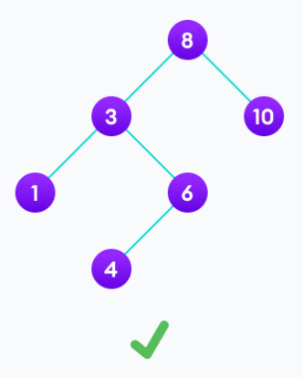

<link rel="stylesheet" href="main.css">

# Search Tree

Cây tìm kiếm có tính chất sau:

> Giá trị của key bất kỳ luôn lớn hơn giá trị của các key trong node bên trái và nhỏ hơn giá trị của các key trong node bên phải.



Ở đây dùng từ "key" (khóa) bởi vì key và node là khác nhau, một node có thể có nhiều key (sẽ được nhắc lại trong phần cây 2 - 3 - 4).

Không được có hai node có key trùng nhau. (Giống như là khóa
chính trong SQL, chúng là unique và có thể có nhiều trường).

# Binary Search Tree

Cây nhị phân tìm kiếm là cây nhị phân mà thỏa tính chất của cây tìm kiếm ở trên. Tức là:

- Mỗi node phải có giá trị lớn hơn giá trị của node con bên trái và bé hơn giá trị của node con bên phải.
- Hai cây con của một node bất kỳ cũng phải là cây nhị phân tìm kiếm.

Cây nhị phân tìm kiếm phụ thuộc vào dữ liệu đầu vào, nếu như dữ liệu ấy là xấu thì các thao tác thực hiện sẽ có chi phí cao.


**Fact thú vị**: khi duyệt giữa cây nhị phân tìm kiếm, do cấu trúc của nó được sắp theo thứ tự là left root right nên kết quả của phép duyệt sẽ là một danh sách các số có thứ tự.

# Operation

## Search

### Idea

Ta bắt đầu duyệt từ node gốc. Nếu giá trị cần tìm nhỏ hơn node gốc, tìm bên cây con trái. Ngược lại tìm bên cây con phải. Trường hợp node đó rỗng hoặc là node cần tìm thì trả về.

### Implementation

```c++
NODE *Search(NODE *root, int x)
{
    if (root == nullptr)
        return root;
    if (x < root->key)
        return Search(root->left, x);
    else if (x > root->key)
        return Search(root->right, x);
    else
        return root;
}
```

## Insert

### Idea

Tiến hành duyệt trước qua các phần tử trong cây. Mỗi lần duyệt ta sẽ kiểm tra node cần thêm, nếu nó nhỏ hơn node gốc thì ta duyệt cây con bên trái, ngược lại duyệt cây con bên phải. Nếu tại node đó rỗng, ta sẽ tạo một node mới và thêm vào cây.

Giá trị trả về nên là int. Với 1 là thêm thành công và 0 là thêm thất bại.

### Implementation

```c++
void Insert(NODE *&root, int x)
{
    if (root == nullptr)
        root = createNODE(x);

    if (x < root->key)
        Insert(root->left, x);
    else if (x > root->key)
        Insert(root->right, x);
    else
        return;
}
```

## Remove

### Idea

Có ba khả năng xảy ra khi remove một node trong BST.

1. Node đó là một lá:
   Chúng ta chỉ đơn giản xóa nó ra khỏi cây.


2. Node đó có duy nhất một con:
   Sao chép con đó cho node cần xóa và xóa node con.


3. Node có 2 con:

- Tìm node lớn nhất cây con trái hoặc node nhỏ nhất cây con phải của node hiện tại, tạm gọi là C.
- Tạo một node tạm để lưu node cha của C.
- Hoán đổi giá trị của node cần xóa với C.
- Nếu C là node lớn nhất cây con trái thì xóa con phải của node cha. Ngược lại nếu C là node nhỏ nhất cây con phải thì xóa con trái của node cha.

### Implement

**Code tìm node cha của node nhỏ nhất bên cây con phải:**

```c++
NODE *searchRightMin(NODE *&curr)
{
    NODE *parent = curr;
    // Search in right subtree
    curr = curr->right;
    while (curr->left != nullptr)
    {
        parent = curr; // Parent be prev root
        curr = curr->left;
    }
    return parent;
}
```

**Code tìm node cha của node lớn nhất bên cây con trái:**

```c++
NODE *searchLeftMax(NODE *&curr)
{
    NODE *parent = curr;
    // Search in left subtree
    curr = curr->left;
    while (curr->right != nullptr)
    {
        parent = curr; // Parent be prev root
        curr = curr->right;
    }
    return parent;
}
```

**Code xóa một node trong BST:**

```c++
void Remove(NODE *&pRoot, int x)
{
    if (pRoot == nullptr)
        return;

    if (x < pRoot->key)
        Remove(pRoot->left, x);
    else if (x > pRoot->key)
        Remove(pRoot->right, x);
    else
    {
        // Trường hợp có không hoặc một con xử lý đồng thời
        if (pRoot->left == nullptr)
        {
            pRoot = pRoot->right;
        }
        else if (pRoot->right == nullptr)
        {
            pRoot = pRoot->left;
        }

        // Trường hợp có hai con
        else
        {
            // Tìm node cha của thế mạng
            NODE *move = pRoot;
            NODE *parent = searchRightMin(move);

            // Ghi đè giá trị
            pRoot->key = move->key;

            // Xóa node con thế mạng
            NODE *temp = parent->left;
            parent->left = nullptr;
            delete temp;
        }
    }
}
```

## Complexity of Search, Insert and Remove

- Độ phức tạp thời gian:
  Best case: $O(log_2(n))$, xảy ra khi cây có chiều cao tối thiểu.
  Worst case: $O(n)$, xảy ra khi nó là một cây lệch.
  Average case: $O(log_2(n))$.
- Độ phức tạp không gian: $O(n)$ (Các lời gọi đệ quy).


# Counting
## Count less

Đếm số node mà bé hơn một giá trị cho trước trong cây.

```c++
int countLess(NODE* pRoot, int x)
{
    if(pRoot == nullptr)
        return 0;
    if(x > pRoot->key)
        return 1 + countNode(pRoot->left) + countLess(pRoot->right,x);
    else if (x < pRoot->key)
        return countLess(pRoot->left,x);
    else
        return countNode(pRoot->left);
}
```

## Count Greater

Đếm số node lớn hơn một giá trị cho trước

```c++
int countGreater(NODE *pRoot, int x)
{
    if (pRoot == nullptr)
        return 0;
    if (x < pRoot->key)
        return 1 + countNode(pRoot->right) + countGreater(pRoot->left,x);
    else if (x > pRoot->key)
        return countGreater(pRoot->right, x);
    else
        return countNode(pRoot->right);
}

```

# Is BST ?

Thuật toán chứng minh một cây là cây nhị phân tìm kiếm có hai phần.

Phần đầu tiên là chứng minh nó là cây nhị phân tìm kiếm cục bộ, tức là xét với mỗi node thì nó đều nhỏ hơn con phải và lớn hơn con trái.

Phần thứ hai là xét toàn cục, với mỗi node thì tìm node nhỏ nhất của cây con bên phải so với nó, nếu lớn hơn thì là BST. Tương tự tìm node lớn nhất của cây con bên trái, nếu nhỏ hơn thì là BST.

**Code:**

```c++
bool isBST(NODE *pRoot)
{
    if (pRoot != nullptr)
    {
        NODE *rightMin = pRoot;
        NODE *leftMax = pRoot;

        if (pRoot->left != nullptr)
            searchLeftMax(leftMax);
        else if (pRoot->right != nullptr)
            searchRightMin(rightMin);

        if ((pRoot->left != nullptr && pRoot->left->key > pRoot->key)
        || (pRoot->right != nullptr && pRoot->right->key < pRoot->key))
            return false;
        else if (rightMin->key < pRoot->key || leftMax->key > pRoot->key)
            return false;
        else
            return isBST(pRoot->left) && isBST(pRoot->right);
    }
    //if it's null, it means it's parent is satisfy BST
    else
        return true;
}
```

Ngoài ra cũng còn một cách kiểm tra nữa sử dụng một mảng phụ. Ta tiến hành duyệt giữa cây, mỗi lần đến một node thì lưu node đó vào mảng. Nếu mảng của chúng ta giảm dần (đệ quy cho ra mảng ngược) hoặc tăng dần (duyệt mảng ngược) thì là BST. Cách này cũng có thể kiểm tra phần tử trùng trong cây bằng cách xét hai phần tử liền kề.

**Code duyệt giữa và thêm vào mảng phụ:**

```c++
void inorderToArray(NODE *pRoot, int *a, int &n)
{
    if (pRoot == nullptr)
        return;

    inorderToArray(pRoot->left, a, n);
    a[--n] = pRoot->key;
    inorderToArray(pRoot->right, a, n);
}
```

**Code chứng minh BST:**

```c++
bool isBST2(NODE *pRoot)
{
    int n = countNode(pRoot);
    int temp = n;
    int *a = new int[n];
    inorderToArray(pRoot, a, temp);

    for (int i = 0; i < n; i++)
    {
        if (a[i] <= a[i + 1])
            return false;
    }
    return true;
}
```

# Is Full BST ?

Để chứng minh một cây nhị phân tìm kiếm là đầy đủ thì cần hai điều kiện: nó là BST và nó là cây nhị phân đầy đủ.

Để chứng minh nó là BST thì ta gọi hàm isBST ở trên. Để chứng minh nó là cây nhị phân đầy đủ thì cần viết hàm kiểm tra xem mỗi node có thỏa mãn tính chất sở hữu 0 hoặc 2 con không. Nếu node nào có 1 con thì không phải là cây nhị phân đầy đủ.

**Code:**

```c++
bool isFull(NODE* pRoot)
{
    if(pRoot != nullptr)
    {
        if((pRoot->left == pRoot->right) || (pRoot->left != nullptr && pRoot->right != nullptr))
            return isFull(pRoot->left) && isFull(pRoot->right);
        else
            return false;
    }
    else
    {
        return true;
    }
}
```
