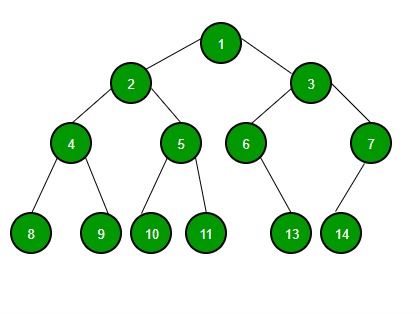
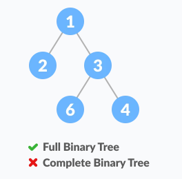
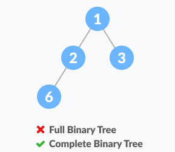

<link rel="stylesheet" href="main.css">
<div class="bg">
      <center><h1 class="bigtitle">Binary Tree</h1></center>
</div>

# Definition

> Là cây mà mỗi đỉnh có tối đa 2 con (bậc tối đa là 2) và các giá trị của đỉnh không được trùng nhau.



# Application

- Lưu trữ và tìm kiếm thông tin hiệu quả và dễ dàng.
- Xây dựng cấu trúc Heap.
- Cây tổ chức thi đấu.
- Cây biểu thức số học, cây cú pháp
- Sử dụng trong các thuật toán định tuyến.

# General Properties

Ta gọi số đỉnh là `N`, chiều cao là `H`, `L` là số đỉnh lá và `i` là mức. Thuật ngữ "node" đôi khi dùng thay thế cho "đỉnh". Có các loại cây nhị phân phổ biến sau:

**Số đỉnh ở mức i** tối đa là $2^i$, tối thiểu là 1.

$$
\begin{align*}
    1 \leq N_i &\leq 2^i\\
\end{align*}
$$

Một cây nhị phân với **L lá** có **ít nhất $log_2(L) + 1$ mức**.

$$
    i \geq log_2(L) + 1
$$

**Số đỉnh tối đa của cây** là $2^H –\ 1$ (nhiều nhất khi là cây nhị phân hoàn hảo)

$$
    N \leq 2^H -\ 1
$$

**Số đỉnh tối thiểu của cây** là $H$ trong trường hợp cây đó là một cây thẳng (suy thoái trở thành DSLK). Với một cây có $N$ đỉnh thì:

$$
    N \geq H
$$

**Chiều cao của cây tối đa** trong trường hợp cây thẳng (suy thoái trở thành DSLK). Vối một cây có $N$ đỉnh thì:

$$
    H \leq N
$$

**Chiều cao của cây tối thiểu** là $log_2(N\ +\ 1)$ với $N$ là số đỉnh trong cây.

$$
    H \geq log_2(N\ +\ 1)
$$

Trong cây nhị phân đầy đủ, số đỉnh có 0 con luôn lớn hơn một đỉnh so với số đỉnh có 2 con. Ta gọi số đỉnh có 2 con là `T`. Ta có:

$$
L = T + 1
$$

Tính chất này có thể chứng minh bằng bổ đề bắt tay (Handshaking Lemma), là một bổ đề nói rằng tổng số bậc của đồ thị bằng hai lần số cạnh.

(Tham khảo [geeksforgeeks](https://www.geeksforgeeks.org/binary-tree-set-2-properties/?ref=lbp))

# Types of Binary Tree

## Pathological or Degenerate Tree

> Cây nhị phân suy thoái, là một cây chỉ có một con trái hoặc con phải.


## Skewed Binary Tree

> Cây nhị phân lệch hay thẳng, là cây nhị phân suy thoái mà các đỉnh con của nó toàn bộ là con trái hoặc con phải.


## Full Binary Tree

> Cây nhị phân đầy đủ. Là một cây nhị phân mà các đỉnh trong luôn có bậc là 2.

Tức là nếu đỉnh đó có đỉnh con, thì phải có đầy đủ 2 đỉnh con. Nói cách khác, số bậc của các đỉnh sẽ là 0 hoặc là 2.


### Properties

Gọi `I` là tổng số đỉnh trong. Số đỉnh:

- $L = I + 1$
- $L = (n + 1) / 2$
- $I = L - 1$
- $I = (n - 1) / 2$
- $N = 2I + 1$
- $N = 2L - 1$

### Check Full Binary Tree

```c++
bool isFull(NODE *root)
{
    if (root != nullptr)
    {
        // Nếu hai con khác nhau thì có root có thể có 1 hoặc 2 con
        if (root->left != root->right)
        {
            // Nếu một trong hai bằng null thì là 1 con
            // Không thể có trường hợp cả hai đều null do đã xét ở trên
            if (root->left == nullptr or root->right == nullptr)
                return false;
        }

        return isFull(root->left) && isFull(root->right);
    }
    else
        return true;
}
```

Độ phức tạp thời gian $O(n)$, không gian $O(n)$ (lưu giữ các lời gọi đệ quy).

## Perfect Binary Tree

> Cây nhị phân hoàn hảo: là một cây nhị phân mà các đỉnh lá của nó cùng nằm trên một mức. Hay nói cách khác, số bậc của đỉnh luôn là 2.


### Properties

**Tổng số đỉnh** của cây nhị phân hoàn hảo là:

$$
N = 2^H –\ 1
$$

Khi biết được tổng số đỉnh, ta lấy $log_2$ sẽ có được **chiều cao** của cây:

$$
H = log_2(N + 1)
$$

**Tổng số đỉnh lá** của cây nhị phân hoàn hảo chiều cao H là

$$
L = 2^{H - 1}
$$

**Độ sâu trung bình** của một đỉnh trong cây nhị phân hoàn hảo là $O(log_2(n))$.

### Check Perfect Binary Tree

```c++
bool isPerfect(NODE *root)
{
    // Đếm số node trong cây O(n)
    int nodes = countNode(root);

    // Tính chiều cao của cây O(n)
    int h = height(root);

    // Dùng biểu thức liên hệ giữa chiều cao và số node
    return (nodes == power(2,h) - 1);
}
```

Độ phức tạp thời gian $O(n)$, không gian $O(n)$ (lưu giữ các lời gọi đệ quy).

## Complete Binary Tree

> Cây nhị phân hoàn chỉnh: là cây nhị phân mà mọi mức đều được lấp đầy, trừ mức cuối. Tất cả các đỉnh lá của mức cuối dồn hết qua bên trái hết mức có thể.


**So sánh giữa FBT và CBT**:



Do bị dồn sang phải nên không phải CBT.



Do node 2 chỉ có một con nên không phải FBT.


Thỏa mãn điều kiện mỗi node có 0 hoặc 2 con đồng thời các node được dồn sang trái hết mức có thể.

> Perfect Binary Tree là một Full Binary Tree và cũng là một Complete Binary Tree.

### Check Complete Binary Tree

```c++
bool isComplete(NODE *root)
{
    if (root == nullptr)
        return false;

    queue<NODE *> q;
    q.push(root);
    bool end = false;

    while (q.size() > 0)
    {
        NODE *curr = q.front();
        q.pop();

        if (curr->left != nullptr)
            q.push(curr->left);

        // Nếu có con trái bị null thì đánh dấu
        else
            end = true;
        if (curr->right != nullptr)
        {
            // Con phải khác null mà con trái null
            // Thì không phải là CBT
            if (end == true)
                return false;
            q.push(curr->right);
        }
    }

    // Pass hết sau khi duyệt thì là CBT
    return true;
}
```

### The story behind

Nếu một node có con trái là null, thì con phải của nó bắt buộc phải null. Hoặc con trái không null thì con phải có thể null hoặc không.

Nói cách khác, node null phải là node cuối cùng trong cây khi duyệt theo mức. Nếu tồn tại node khác null sau khi có node null, thì là vi phạm CBT.

Áp dụng tính chất này chúng ta sử dụng duyệt theo mức để xét hai node con của một node bất kỳ để kiểm tra CBT.

(Tham khảo [Nick White](https://www.youtube.com/watch?v=j16cwbLEf9w&t=191s) )

### Complexity

Độ phức tạp thời gian $O(n)$.
Độ phức tạp không gian $O(n)$.

- Bởi vì kích thước Queue phụ thuộc vào số node lá của cây . Mà số node lá của cây tối đa là
  $$
  L  \leq 2^{H - 1}
  $$
- Cây CBT có chiều cao tiệm cận chiều cao nhỏ nhất, nên
  $$
  H = log_2(N + 1)
  $$
- Suy ra số node lá của cây tối đa là
  $$
  L \leq (N + 1)/2
  $$
- Thay vào ta có độ phức tạp không gian cho Queue là
  $$
  O((N + 1)/2) \sim O(n)
  $$
- Ngoài ra còn có độ phức phức tạp không gian cho các lời gọi đệ quy: $O(n)$. Tính tổng vẫn được kết quả $O(n)$.

### Heap

Cấu trúc Heap chính là một ứng dụng của cây nhị phân hoàn chỉnh (CBT). Có hai dạng: Max Heap và Min Heap.

**Max Heap** là cây nhị phân hoàn chỉnh mà ở đó mỗi đỉnh đều lớn hơn các đỉnh con của nó.

**Min Heap** là ngược lại, mỗi đỉnh luôn bé hơn các đỉnh con của nó.

> Trong tất cả các cây nhị phân có N đỉnh, thì CBT là cây có chiều cao thấp nhất và SBT (Skewed Binray Tree) là cây có chiều cao cao nhất.

## Balanced Binary Tree

Cây nhị phân cân bằng là cây nhị phân mà mỗi đỉnh có sự khác biệt giữa chiều cao cây con trái và cây con phải không quá 1. Đồng thời cây con trái và cây con phải đều phải là cây nhị phân cân bằng.

### Check Balanced Binary Tree

```c++
bool isBalanced(NODE *root)
{
    if (root != nullptr)
    {
        // Tính chiều cao của hai cây con
        int leftHeight = height(root->left);
        int rightHeight = height(root->right);
        int delta = leftHeight - rightHeight;

        // Nếu chênh lệch quá 1 thì không cân bằng
        if (delta > 1 or delta < -1)
            return false;

        // Tiếp tục xét cho các cây con
        return isBalanced(root->left) and isBalanced(root->right);
    }
    // Nếu pass hết sau khi duyệt thì là cân bằng
    else
        return true;
}
```


(Hình ảnh tham khảo từ [programmingquiz](https://www.programiz.com/dsa/binary-tree))

# Enumerate the Binary Tree

(Liệt kê các cấu hình có thể có của cây)

Nếu ta xét một cây nhị phân T, gọi $T(n)$ là số đỉnh trong cây nhị phân đó. Bài toán tìm số cây nhị phân có thể có tạo thành từ N đỉnh tồn tại các trường hợp cơ bản sau:


Tức là
$T(0) = 1$ (chỉ có duy nhất một cây rỗng)
$T(1) = 1$
$T(2) = 2$

Để tính $T(3)$, ta thực hiện một bài toán đếm đơn giản. Ta xét số đỉnh con ở cây trái, do $N = 3$, nên số đỉnh con tối đa là 2. Có hai trường hợp: có 2 con hoặc có 1 con.

Với trường hợp số đỉnh con bên trái là 1 và con bên phải là 0, có hai cách chọn con tiếp theo cho nhánh này, hoặc là con trái hoặc là con phải. Tương tự cây con bên phải cũng có hai trường hợp.


Trường hợp số đỉnh con bên trái và bên phải là 1, tức là cây không có mức 3. Thì vẫn có thể tạo nên một cây.

Vậy có 5 cách để tạo cây từ N đỉnh với N = 3.

Viết lại dưới dạng công thức:


Tương tự cho $T(4)$:


Đây là một dãy số đặc biệt có tên là dãy Catalan. Công thức để tính số Catalan thứ n là:


Dãy số này có thể dùng đệ quy để tính toán.

Vậy ta rút ra từ công thức ở trên cách tính $T(n)$ tổng quát là:


Cũng là số cấu hình cây nhị phân có thể có tạo thành từ N đỉnh cho trước.

(Tham khảo [geeksforgeeks](https://www.geeksforgeeks.org/enumeration-of-binary-trees/))

# Traversal

## Idea

Duyệt cây là đi qua tất cả các node, mỗi node một lần.

Có ba phép duyệt cây là:

- Pre-order (Duyệt trước)
- Post-order (Duyệt sau)
- In-order (Duyệt giữa)

**Duyệt trước** là duyệt node gốc trước, sau đó tới các node con từ trái sang phải.

**Duyệt sau** là duyệt các node con từ trái sang phải, rồi mới tới node gốc.

**Duyệt giữa** là duyệt node gốc sau khi duyệt node đầu và trước khi duyệt node cuối.

Tức là sau khi duyệt con đầu tiên, ta mới duyệt đến node gốc, rồi duyệt tiếp các con còn lại.
Nếu không tồn tại node con đầu tiên, thì node gốc sẽ ở vị trí đầu tiên trong danh sách kết quả, mặc dù thứ tự duyệt của nó là thứ 2.

Chẳng hạn ta có cây như hình dưới.


**Duyệt trước** : $2-7-2-6-5-11-5-9-4$

**Duyệt giữa** : $2-7-5-6-11-2-5-4-9$

**Duyệt sau** : $2-5-11-6-7-2-5-4-9$

> Kết quả duyệt giữa của Search Tree (không chỉ có BST – Binary Search Tree) sẽ có dạng dãy số được sắp xếp tăng dần.

**Duyệt theo mức** (Level Order Traveral). Chúng ta duyệt cây bằng cách duyệt theo thứ tự từ trên xuống, từ trái qua. Ở cây trên, kết quả sau khi duyệt là: $2–7–5–2–6–9–5–11–4$

## Code

**Duyệt trước**

```c++
void preOrder(node *root)
{
    if (root == nullptr)
    {
        return;
    }

    //!Xử lý root tùy theo nhu cầu
    preOrder(root->pLeft);
    preOrder(root->pRight);
}
```

**Duyệt sau**

```c++
void postOrder(node *root)
{
    if (root == nullptr)
    {
        return;
    }

    postOrder(root->pLeft);
    postOrder(root->pRight);
    //Xử lý root tùy theo nhu cầu
}
```

**Duyệt giữa**

```c++
void inOrder(node *root)
{
    if (root == nullptr)
    {
        return;
    }

    inOrder(root->pLeft);
    //!Xử lý root tùy theo nhu cầu
    inOrder(root->pRight);
}
```

# Counting

**Đếm tổng số node trong cây**

```c++
int countNode(NODE *pRoot)
{
    // Trường hợp cơ bản
    if (pRoot == nullptr)
        return 0;

    // Đếm node hiện tại và số node của các cây con
    return 1 + countNode(pRoot->left) + countNode(pRoot->right);
}
```

**Đếm số node lá trong cây**

```c++
int countLeaf(NODE *pRoot)
{
    if (pRoot == nullptr)
        return 0;

    //Chỉ bằng nhau khi cả hai đều là null
    if (pRoot->left == pRoot->right)
        return 1;
    return countLeaf(pRoot->left) + countLeaf(pRoot->right);
}
```

**Đo chiều cao của cây**

```c++
int height(NODE *root)
{
    if (root == nullptr)
        return 0;

    int leftHeight = height(root->left);
    int rightHeight = height(root->right);
    if (leftHeight > rightHeight)
        return 1 + leftHeight;
    else
        return 1 + rightHeight;
}
```

**Đo chiều cao của node**

```c++
int heightNode(NODE *root, int value)
{
    if (root == nullptr)
        return -1;

    if (value < root->key)
        return heightNode(root->left, value);
    else if (value > root->key)
        return heightNode(root->right, value);

    // Xem node đó như một cây nhị phân và tính chiều cao của cây
    // Bởi vì chiều cao của node gốc chính là chiều cao của cây.
    else
        return height(root);
}
```
