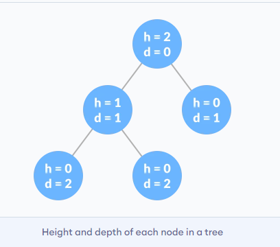
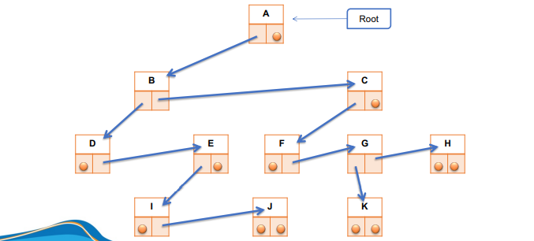

<link rel="stylesheet" href="../../../main.css">
<div class="bg">
      <center><h1 class="bigtitle">Tree Data Structures</h1></center>
</div>

> Cây là một cấu trúc không tuyến tính có thứ bậc bao gồm nhiều đỉnh liên kết với nhau bằng các cạnh.

Cấu trúc tuyến tính ở đây là các cấu trúc không rẽ nhánh như mảng hoặc danh sách liên kết.


# Terminologies

**Đỉnh** (Vertex ~ Node)
Đỉnh (hay node) là một thành phần trong cây nắm giữ giá trị nào đó và một cạnh hoặc nhiều cạnh nối đến đỉnh khác. Cấu trúc cây không giống như đồ thị, không thể có đỉnh cô lập.

**Đỉnh gốc** (Root node)
Trong cấu trúc cây, một đỉnh nằm ở vị trí gốc gọi là đỉnh gốc. Đỉnh này không có đỉnh cha.

**Đỉnh lá** (Leaf node)
Đỉnh không có đỉnh con gọi là đỉnh lá, đỉnh treo hay đỉnh ngoài.

Các đỉnh chỉ có duy nhất một đỉnh cha và có thể có nhiều đỉnh con. Đỉnh có ít nhất một đỉnh con gọi là đỉnh trong.

**Mức** (Level) của một node bất kỳ là số đỉnh tính từ đỉnh gốc đến đỉnh đó. Chúng ta quy ước mức của đỉnh gốc là 1. Các đỉnh nằm phía dưới có mức tăng dần lên.

**Độ sâu** (Depth) của một đỉnh bất kỳ là số cạnh đi từ đỉnh gốc đến đỉnh đó.

`depth = level - 1` và `level = depth + 1`

**Bậc của đỉnh** (Order of node) là số đỉnh con của một đỉnh. Degree và Order trong cây là như nhau.

**Bậc của cây** (Order of tree) là bậc lớn nhất trong số các bậc của đỉnh trong cây.

**Chiều cao của đỉnh** (Height of node) là số đỉnh trên đường đi dài nhất tính từ đỉnh đang xét đến đỉnh lá. Chiều cao của đỉnh lá là 0.



**Chiều cao của cây** là số mức lớn nhất mà cây có được. Chiều cao của cây khác rỗng tối thiểu là 1, để phân biệt trường hợp cây rỗng thì height là 0.

> Chiều cao của đỉnh và chiều cao của cây là khác nhau. Chiều cao của đỉnh dựa vào số đỉnh đi từ đỉnh đó đến đỉnh lá. Còn chiều cao của cây dựa vào mức, là số đỉnh lớn nhất  đi từ đỉnh gốc đến đỉnh nào đó trong cây.

**Rừng** (Forest) là một tập hợp nhiều cây. Có thể cắt đỉnh gốc ra để tạo thành một rừng từ một cây.


Tham khảo các khái niệm và thuật ngữ khác bằng [Tiếng Việt](https://vi.wikipedia.org/wiki/Thu%E1%BA%ADt_ng%E1%BB%AF_l%C3%BD_thuy%E1%BA%BFt_%C4%91%E1%BB%93_th%E1%BB%8B) hoặc [Tiếng Anh](https://en.wikipedia.org/wiki/Glossary_of_graph_theory).

# Application

- Một phiên bản khác của cây gọi là Tries được dùng để lưu các thông tin định tuyến trong Router.
- Đa số các cơ sở dữ liệu sử dụng B - Tree và T - Tree để tổ chức dữ liệu.
- Compilers sử dụng _Syntax Tree_ để kiểm tra cú pháp khi chúng ta biên dịch chương trình

(Hình ảnh ở trên và phần ứng dụng tham khảo của [programmingquiz](https://www.programiz.com/dsa/trees))

# Properties

Trong cây k – phân khi mọi đỉnh có 0 hoặc k con , thì ta có phương trình sau:

$$
L = (k\ –\ 1)*I + 1
$$

Với L là số đỉnh lá và I là số đỉnh trong (mỗi đỉnh có k con).

# Representation

Chúng ta có thể biểu diễn cây theo cách tường minh. Tức là một node sẽ lưu giữ giá trị của bản thân nó đồng thời lưu giữ các con trỏ trỏ đến các node con.


```c++
struct node{
    int key;
    node* pFirstChild;
    node* pSecondChild;
    node* pThirdChild;
    ...
};
```

Cấu trúc node của cây nhị phân:

```c++
struct NODE{
    int key;
    NODE* left;
    NODE* right;
};
```

Hoặc cấp phát sẵn một mảng các con trỏ với số lượng node con cố định.

```c++
#define N 10

struct node{
    int key;
    node* child[N];
};
```

Cách này có một hạn chế là chúng ta luôn phải tạo ra các con trỏ đủ số lượng theo dạng cây của nó. Ví dụ nếu là cây tam phân, mỗi node sẽ phải có ba con trỏ, mặc dù vậy, các con trỏ này có thể không được sử dụng.

Để giải quyết vấn đề lãng phí này, ta có thể xây dựng cấu trúc cây với các node như sau:



```c++
struct node{
    int key;
    node* eldestChild;
    node* nextSibling;
};
```

Tức là một node luôn chỉ có hai con trỏ, bất kể là cây nhị phân hay k – phân. Con trỏ đầu tiên trỏ đến con đầu tiên của node đó, con trỏ thứ hai sẽ trỏ đến anh em kế tiếp cùng mức với node đó.


