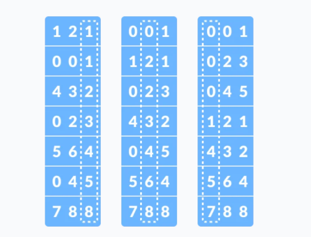
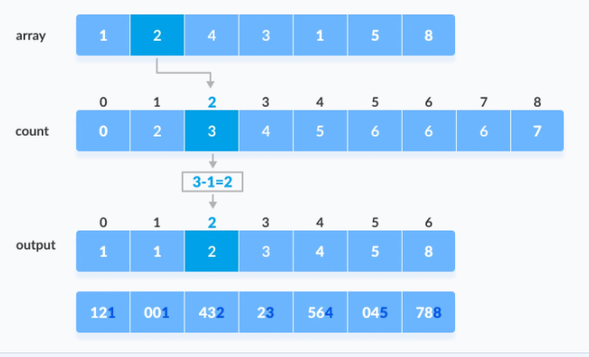
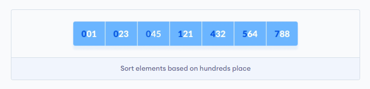

<link rel="stylesheet" href="../../main.css">
<div class="bg">
     <center><h1 class="bigtitle">Radix Sort</h1></center>
</div>

# Table of contents

- [Table of contents](#table-of-contents)
- [Idea](#idea)
- [Properties](#properties)
- [Complexity Analysis](#complexity-analysis)
- [Complexity](#complexity)
- [Code](#code)
  - [Modified Counting Sort](#modified-counting-sort)
  - [Radix Sort](#radix-sort)

**Radix – cơ số**: Thuật toán này sắp xếp dựa trên cơ số (2, 8, 10, 16), mỗi cơ số có một cách biểu diễn riêng cho các giá trị phụ thuộc vào số lượng ký số (số ký tự để biểu diễn giá trị). Do đó nếu giá trị không thể hiện dưới dạng một số cơ số nhất định nào đó (chẳng hạn số thực hoặc số âm) thì việc sắp xếp sẽ khá khó khăn.

# Idea

Radix sort gồm hai bước là phân loại và sắp xếp. Đầu tiên phân loại các phần tử về đúng phân lớp, sau đó tiến hành sắp xếp các phần tử trong cùng một phân lớp. Hai bước này được thực hiện song song nhau. Radix Sort có thể sử dụng Counting Sort (là một Stable Sort) làm hàm con của nó.

Ví dụ cho mảng dưới đây

$$
121, 432, 564, 23, 1, 45, 788
$$



Ở vòng lặp 1 thực hiện phân các giá trị vào 6 lớp (1, 2, 3, 4, 5, 8) dựa trên các giá trị của hàng đơn vị (luôn có 9 lớp đối với cơ số 10). Vòng lặp hai thì cũng phân vào 6 lớp (0, 2, 3, 4, 6, 8). Cuối cùng phân vào 5 lớp (0, 1, 4, 5, 7). Và chính việc cho vào các phân lớp như vậy cũng làm cho dữ liệu được sắp xếp.

**Các bước thực hiện**:

1. Tìm phần tử lớn nhất `max`. Ở đây `max = 788` và nó có 3 ký tự tương ứng với 3 vòng lặp.
2. Gọi Counting Sort cho từng hàng số. (Ví dụ này có hàng đơn vị, hàng chục và hàng trăm).
3. Lặp lại bước hai đến khi nào xét hết mọi ký tự.

Vòng lặp đầu tiên ta gọi Counting Sort cho hàng đơn vị.



Chúng ta có thể thấy thứ tự giữa các số có cùng hàng đơn vị vẫn không đổi (Stable).

Tiếp theo cho hàng chục


Cuối cùng là hàng trăm và kết thúc thuật toán



(Hình ảnh tham khảo từ [programmingquiz](https://www.programiz.com/dsa/radix-sort))

# Properties

**Điểm mạnh**

- Stable Sort.
- Không phụ thuộc vào dãy đầu vào.
- Tốc độ nhanh khi số lượng ký số nhỏ. Chẳng hạn có n phần tử nhưng phần tử có chiều dài ký số lớn nhất là 7, thì chỉ cần 7 lần sắp xếp.
- Tiết kiệm bộ nhớ hơn Counting Sort nếu `b` là một cơ số đủ nhỏ.

**Điểm yếu**

- Kém hiệu quả nếu số lượng ký số lớn hoặc cơ số lớn.
- Kém linh hoạt hơn các loại Sort khác do phụ thuộc vào số lượng ký số và cơ số.

**Ứng dụng**

- Sắp xếp thư từ dựa trên mã bưu chính (Postal Code hoặc ZIP Code)

> Khi nào nên sử dụng?

- Tập dữ liệu lớn có khoảng giá trị nhỏ lặp lại liên tục, chẳng hạn như một triệu phần tử có giá trị từ 0 đến 100.
- Tập dữ liệu không lặp lại nhưng lại có cùng số ký số (Best case), chẳng hạn như sắp xếp một triệu tài khoản ngân hàng đều có 14 ký số.

(Tham khảo [quora](https://www.quora.com/When-should-we-use-radix-sort-Counting-sort-and-bucket-sort-for-sorting-purpose)).

# Complexity Analysis

Bước tìm Max luôn được thực hiện, có chi phí $O(n)$.

Bước gọi Counting Sort thì được thực hiện `d` lần tương ứng với số chữ số của `max`. Số chữ số `d` là $O(log_b(max))$. Mỗi lần lặp tốn chi phí của Counting Sort là $O(n + k)$.

Với `k` ở đây là giá trị lớn nhất của các phần tử trong một lần gọi Counting Sort. Nhưng do ta sort theo từng hàng số nên giá trị `k` chỉ có trong khoảng `[0;9]` (nếu chọn hệ cơ số thập phân). Tổng quát hơn, giá trị `k` phụ thuộc vào hệ cơ số, nên ta thay nó thành `b` (base).

Kết luận tổng chi phí cho Radix Sort sẽ là $O(d*(n + b))$

**Worst case**
Trường hợp xấu nhất xảy ra khi tất cả phần tử đều có cùng số chữ số nhưng có một phần tử có số chữ số cực kỳ lớn so với phần còn lại. Nếu số chữ số của số này là n, độ phức tạp có thể tăng thành $O(n^2)$.

Worst case của Counting Sort là $O(n + b)$. Nếu $b = O(n)$, độ phức tạp thời gian của Counting Sort sẽ là $O(n)$.

**Best case**
Trường hợp tốt nhất xảy ra khi mọi phần tử đều có cùng số chữ số. Độ phức tạp lúc này vẫn là $O(d*(n + b))$.

**Average case**
Phân tích dựa vào phân bố của số chữ số, chi tiết ở [opengenus](https://iq.opengenus.org/time-and-space-complexity-of-radix-sort/).

**Độ phức tạp không gian**: Thuật toán sử dụng mảng phụ có `b` phần tử dựa trên cơ số và mảng phụ `n` phần tử để lưu tạm giá trị. Đôi khi `b` có thể lớn hơn `n`, không phải lúc nào `n` cũng lớn nhất.

# Complexity

| Cases        | Complexity       |
| :----------- | :--------------- |
| Best case    | $O(d * (n + b))$ |
| Worst case   | $O(d * (n + b))$ |
| Average case | $O(d * (n + b))$ |

Space Complexity: $O(n + b)$.

# Code

## Modified Counting Sort

```c++
void countingSort(int array[], int size, int place)
{
    const int max = 10; // Cơ số mặc định là 10
    int output[size];
    int count[max];

    for (int i = 0; i < max; ++i)
        count[i] = 0;

    for (int i = 0; i < size; i++)
        count[(array[i] / place) % 10]++;

    for (int i = 1; i < max; i++)
        count[i] += count[i - 1];

    for (int i = size - 1; i >= 0; i--)
    {
        output[count[(array[i] / place) % 10] - 1] = array[i];
        count[(array[i] / place) % 10]--;
    }

    for (int i = 0; i < size; i++)
        array[i] = output[i];
}
```

## Radix Sort

```c++
int getMax(int arr[], int n)
{
    int max = arr[0];
    for (int i = 1; i < n; i++)
        if (arr[i] > max)
            max = arr[i];
    return max;
}

void radixsort(int arr[], int n)
{
    int max = getMax(arr, n);

    for (int place = 1; max / place > 0; place *= 10)
        countingSort(arr, n, place);
}
```
